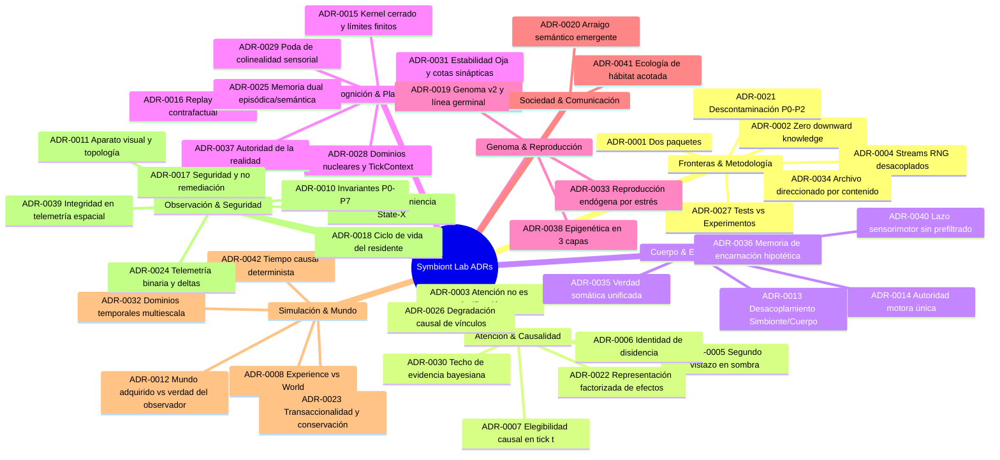

# Registro de Decisiones de Arquitectura (`docs/adr/`)

Este directorio contiene los **Architecture Decision Records (ADR)** canónicos de Symbiont y Symbiont Lab. Cada documento registra una decisión arquitectónica fundamental, su contexto, motivación, alternativas descartadas y consecuencias para la integridad experimental.

---

## Mapa Arquitectónico de Decisiones

---

## Catálogo de Decisiones Aceptadas por Dominio

### 1. Fronteras & Metodología

| ADR | Título | Estado | Invariante Central |
| :--- | :--- | :--- | :--- |
| **[ADR-0001](ADR-0001-two-package-boundary.md)** | Two-Package Architecture Boundary | Aceptado | Desacoplamiento estricto: `symbiont` jamás importa `symbiont_lab`. |
| **[ADR-0002](ADR-0002-ground-truth-isolation.md)** | Synthetic Ground Truth Isolation | Aceptado | Cero conocimiento descendente (*zero downward knowledge*): el organismo solo observa señales opacas. |
| **[ADR-0004](ADR-0004-separated-rng-streams.md)** | Separated RNG Streams | Aceptado | Flujos pseudoaleatorios desacoplados vía SHA-256 (SplitMix64) para garantizar independencia causal entre rasgos, anfitriones e intervenciones. |
| **[ADR-0021](ADR-0021-experimental-decontamination-innate-constitution-vs-discovered-meaning.md)** | Experimental Decontamination: Innate Constitution vs Discovered Meaning | Aceptado | Delimitación estricta entre constitución innata permitida y significado descubierto; prohibición de inyección semántica y recompensas cognitivas. |
| **[ADR-0027](ADR-0027-structural-segregation-tests-versus-scientific-campaigns.md)** | Structural Segregation: Mechanical Test Verification vs Scientific Campaign Execution | Aceptado | Segregación estricta entre contratos de software verificados por `pytest` (`tests/`) y campañas empíricas reproducibles (`experiments/`). |
| **[ADR-0034](ADR-0034-content-addressed-immutable-scientific-archive.md)** | Content-Addressed Immutable Scientific Archive | Aceptado | Archivo científico direccionado por contenido criptográfico (SHA-256) de solo adición; inmutabilidad estricta de artefactos experimentales. |

### 2. Atención & Causalidad

| ADR | Título | Estado | Invariante Central |
| :--- | :--- | :--- | :--- |
| **[ADR-0003](ADR-0003-attention-is-not-classification.md)** | Attention is Not Classification | Aceptado | La atención es asignación causal de presupuesto finito, nunca un juicio de amenaza o detección de intrusiones. |
| **[ADR-0005](ADR-0005-shadow-only-second-look.md)** | Shadow-Only Second-Look Evidence Probes | Aceptado | El segundo vistazo (*second look*) profundiza en resolución de muestreo sin alterar el estado del anfitrión ni ejecutar remediación. |
| **[ADR-0006](ADR-0006-evidence-revision-identity.md)** | Evidence Revision Identity | Aceptado | La contradicción se preserva en registros de disidencia (`DissentRecord`); el sistema nunca suaviza discrepancias estadísticas significativas. |
| **[ADR-0007](ADR-0007-common-causal-eligibility.md)** | Common Causal Eligibility for Attention Allocation | Aceptado | Elegibilidad previa al muestreo basada exclusivamente en información causal disponible en el tick actual ($t$). |
| **[ADR-0022](ADR-0022-factorized-effect-representation-and-agency-attribution.md)** | Factorized Effect Representation & Causal Agency Attribution | Aceptado | Descomposición de efectos en átomos direccionales y aislamiento de consecuencias causales respecto a la deriva pasiva del entorno. |
| **[ADR-0026](ADR-0026-statistical-binding-degradation-via-wilson-intervals.md)** | Statistical Binding Degradation via Wilson Intervals | Aceptado | Invalidación causal fundada en intervalos de confianza de Wilson (99%, $z=2.576$) comparando ejecuciones frente a la línea base histórica propia. |
| **[ADR-0030](ADR-0030-bayesian-evidence-saturation-and-anti-fossilization-cap.md)** | Bayesian Evidence Saturation and Anti-Fossilization Cap | Aceptado | Techo estricto a la acumulación de evidencia bayesiana (`max_evidence = 32.0`) para prevenir la fosilización cognitiva ante cambios de régimen. |

### 3. Cuerpo & Encarnación

| ADR | Título | Estado | Invariante Central |
| :--- | :--- | :--- | :--- |
| **[ADR-0013](ADR-0013-longitudinal-reembodiment-and-body-decoupling.md)** | Longitudinal Re-embodiment and Symbiont/Body Decoupling | Aceptado | Separación entre la identidad persistente (`Symbiont`) y el cuerpo efímero (`Body`); muerte corporal sin pérdida ontogenética. |
| **[ADR-0014](ADR-0014-single-motor-authority-and-executive-action.md)** | Single Motor Authority and Executive Action Contract | Aceptado | Puerta de enlace motora única: arbitraje ejecutivo estricto, copia de eferencia inmutable y prohibición de actuadores directos. |
| **[ADR-0035](ADR-0035-canonical-somatic-physiology-unified-physical-truth.md)** | Canonical Somatic Physiology: Single Unified Physical Truth | Aceptado | Unificación de la verdad fisiológica y metabólica en el cuerpo vivo (`LivingBody`); eliminación de ledgers paralelos de supervivencia. |
| **[ADR-0036](ADR-0036-hypothesis-driven-reactivation-of-embodiment-memory.md)** | Hypothesis-Driven Reactivation of Embodiment Memory | Aceptado | Recuperación de esquemas corporales históricos como hipótesis no operativas que requieren re-validación empírica ante la re-encarnación. |
| **[ADR-0040](ADR-0040-sensorimotor-loop-closure-and-prohibition-of-action-prefiltering.md)** | Sensorimotor Loop Closure and Prohibition of Action Pre-Filtering | Aceptado | Cierre simétrico del bucle motor sin pre-filtrado de acciones por obstáculos; derecho al fallo y aprendizaje causal por consecuencias. |

### 4. Cognición & Plasticidad

| ADR | Título | Estado | Invariante Central |
| :--- | :--- | :--- | :--- |
| **[ADR-0015](ADR-0015-immutable-mathematical-kernel-and-data-plasticity.md)** | Immutable Mathematical Kernel and Data Plasticity Limits | Aceptado | Cero código dinámico (`eval`/AST); adaptación restringida a plasticidad numérica sobre límites cerrados (`KernelLimits`). |
| **[ADR-0016](ADR-0016-bounded-counterfactual-replay-and-mental-isolation.md)** | Bounded Counterfactual Replay and Mental Isolation | Aceptado | Aislamiento epistémico del replay contrafactual; parada autónoma por progreso de aprendizaje y cero fuga de estados simulados. |
| **[ADR-0025](ADR-0025-dual-memory-architecture-episodic-traces-vs-consolidated-semantics.md)** | Dual Memory Architecture: Bounded Episodic Traces vs Consolidated Semantics | Aceptado | Separación entre buffer episódico acotado con excreción metabólica obligatoria y atlas cognitivo semántico consolidado. |
| **[ADR-0028](ADR-0028-domain-architecture-and-sequential-tick-choreography.md)** | Domain Architecture and Sequential Tick Choreography | Aceptado | Partición en siete dominios desacoplados sin invocaciones directas entre pares; mediación exclusiva por `TickContext` inmutable. |
| **[ADR-0029](ADR-0029-collinearity-pruning-and-sensory-manifold-selection.md)** | Collinearity Pruning and Sensory Manifold Selection | Aceptado | Poda de canales redundantes con correlación de Pearson $|r_{xy}| \ge 0.97$ preservando el presupuesto finito de atención para dimensiones independientes. |
| **[ADR-0031](ADR-0031-synaptic-normalization-and-plasticity-stability-via-ojas-rule.md)** | Synaptic Normalization and Plasticity Stability via Oja's Rule | Aceptado | Normalización intrínseca de pesos plásticos mediante la regla de Oja y saturación cerrada en $[-2.0, 2.0]$ para evitar divergencia numérica. |
| **[ADR-0037](ADR-0037-reality-authority-and-epistemic-demarcation-of-imagination.md)** | Reality Authority and Epistemic Demarcation of Imagination | Aceptado | Axioma de autoridad de la realidad: la imaginación puede proponer estados pero jamás declarar verdad factual empírica. |

### 5. Genoma & Reproducción

| ADR | Título | Estado | Invariante Central |
| :--- | :--- | :--- | :--- |
| **[ADR-0019](ADR-0019-genome-v2-germline-immutability-and-epigenetics.md)** | Genome v2 Germline Immutability and Epigenetic Demarcation | Aceptado | Inmutabilidad de la línea germinal durante la vida del organismo; adaptaciones somáticas confinadas a capas epigenéticas metaplásticas. |
| **[ADR-0033](ADR-0033-endogenous-stress-induced-reproduction-and-clonal-lineage.md)** | Endogenous Stress-Induced Reproduction and Clonal Lineage | Aceptado | Reproducción disparada endógenamente por estrés fisiológico persistente (8 ticks) con transferencia metabólica real y extinción irreversible. |
| **[ADR-0038](ADR-0038-endogenous-metaplastic-regulation-three-layer-epigenetic-model.md)** | Endogenous Metaplastic Regulation: Epigenetic Three-Layer Expression Model | Aceptado | Desacoplamiento epigenético en tres estratos (base germinal, expresión de nacimiento, expresión actual) regulado por señales cognitivas endógenas. |

### 6. Sociedad & Comunicación

| ADR | Título | Estado | Invariante Central |
| :--- | :--- | :--- | :--- |
| **[ADR-0020](ADR-0020-emergent-grounding-over-semantic-imposition.md)** | Emergent Grounding over Semantic Imposition | Aceptado | Canales comunicativos opacos sin semántica a priori impuesta por el simulador; significado emergente por predicción mutua y confianza. |
| **[ADR-0041](ADR-0041-bounded-population-ecology-and-authorized-local-interaction.md)** | Bounded Population Ecology and Authorized Local Peer Interaction | Aceptado | Orquestación de hábitats con capacidad de población acotada, contacto peer local sin mediación semántica y poda atómica de bajas. |

### 7. Simulación & Mundo

| ADR | Título | Estado | Invariante Central |
| :--- | :--- | :--- | :--- |
| **[ADR-0008](ADR-0008-experience-versus-world-execution.md)** | Experience versus World Execution (EW-001) | Aceptado | Cada ejecución declara un `RunKind`; la adquisición termina antes de la pérdida irreversible de viabilidad; el World no rescata el cuerpo. |
| **[ADR-0012](ADR-0012-acquired-world-versus-observer-truth.md)** | Acquired World versus Observer Truth (EW-005) | Aceptado | El mundo adquirido deriva solo de evidencia del organismo; prohibida la inyección de entidades físicas del simulador. |
| **[ADR-0023](ADR-0023-atomic-transactional-step-and-ecological-conservation.md)** | Atomic Transactional Step and Ecological Conservation Laws | Aceptado | Transaccionalidad atómica reversible (`IntegratedWorldTickTransaction`) y leyes de conservación de materia/fertilidad sin generación *ex nihilo*. |
| **[ADR-0032](ADR-0032-multi-scale-temporal-domains-and-biological-rhythms.md)** | Multi-Scale Temporal Domains and Biological Rhythms | Aceptado | Jerarquía temporal desacoplada (micro/meso/macro) para aislar el ruido sensorial rápido de la aclimatación lenta y ciclos circadianos. |
| **[ADR-0042](ADR-0042-deterministic-causal-time-and-sensor-cost.md)** | Deterministic Causal Time and Sensor Cost (EW-006) | Aceptado | El reloj del host y la velocidad de la CPU nunca determinan estado causal: coste de adquisición declarado por el aparato y fase rítmica interna derivada del tick. |

### 8. Observación & Seguridad

| ADR | Título | Estado | Invariante Central |
| :--- | :--- | :--- | :--- |
| **[ADR-0009](ADR-0009-state-x-immutable-run-provenance.md)** | State-X and Immutable Run Provenance (EW-002) | Aceptado | Cada ejecución referencia un checkpoint inicial y final inmutable y direccionado por contenido. |
| **[ADR-0010](ADR-0010-observer-architecture-preservation.md)** | Observer Architecture Preservation (EW-003) | Aceptado | P0–P7 son normativos: sin proyecciones por tick, sin bus paralelo, independencia de observabilidad. |
| **[ADR-0011](ADR-0011-visual-apparatus-and-perceptual-topology.md)** | Visual Apparatus and Perceptual Topology (EW-004) | Aceptado | La adyacencia física de receptores es del aparato; la agrupación en fuentes se adquiere. Visión como nuevo tipo de cuerpo; v6 intacto. |
| **[ADR-0017](ADR-0017-host-least-privilege-and-non-remediation-safety.md)** | Host Least-Privilege and Non-Remediation Safety Boundary | Aceptado | Observación de solo lectura agregada y sin PII en anfitrión real; prohibición absoluta de remediación, escaneo o acciones lesivas. |
| **[ADR-0018](ADR-0018-transparent-resident-lifecycle-supervision.md)** | Transparent Resident Lifecycle Supervision | Aceptado | Ciclo de vida transparente bajo consentimiento del operador (`systemd --user`), parada limpia (SIGINT/SIGTERM) y cero evasión. |
| **[ADR-0024](ADR-0024-high-frequency-binary-telemetry-and-decimated-transport.md)** | High-Frequency Binary Telemetry and Decimated Observation Transport | Aceptado | Telemetría binaria empaquetada de alta frecuencia en el bucle causal, desacoplada de la cadencia decimada de observación y transporte SSE. |
| **[ADR-0039](ADR-0039-epistemic-integrity-in-visual-and-spatial-telemetry.md)** | Epistemic Integrity in Visual and Spatial Telemetry | Aceptado | Demarcación estricta entre la colocación visual del observador y la ausencia de coordenadas espaciales o mapas alocéntricos en el organismo. |
| **[ADR-0044](ADR-0044-host-safety-and-lifecycle-invariants-in-the-constitution.md)** | Host-Safety and Lifecycle Invariants in the Constitution | Aceptado | Incorporar a la Constitución los invariantes permanentes de seguridad del anfitrión y de identidad del ciclo de vida (restore rechaza `DEAD`, clonar crea identidad nueva). |

### 9. Governance

| ADR | Título | Estado | Invariante Central |
| :--- | :--- | :--- | :--- |
| **[ADR-0043](ADR-0043-agent-governance-and-repository-authority.md)** | Agent Governance and Repository Authority | Aceptado | Autoridad L0-L4 y separación entre capacidad técnica y autoridad científica. |
| **[ADR-0045](ADR-0045-owner-root-grants-scientific-execution-and-validation.md)** | Owner-root Grants, Scientific Execution Authority and Validation Receipts | Aceptado | Emisión root de grants, auditoría completa, ejecución científica autorizada y validación ligada al árbol staged. |

### 10. Agent governance

| ADR | Título | Estado | Invariante Central |
| :--- | :--- | :--- | :--- |
| **[ADR-0046](ADR-0046-proportional-governance-equivalence-and-pinned-runs.md)** | Proportional Governance, Causal-Equivalence Evidence and Pinned Runs | Aceptado | El trabajo ordinario usa agentctl publish; los cambios científicos requieren aprobación o equivalencia causal cubierta; los runs fijan commit e input inmutable. |

| **[ADR-0047](ADR-0047-agent-scope-input-authority-and-validation-responsibility.md)** | Agent Scope, Input Authority and Validation Responsibility | Aceptado | Scope acotado, contenido leído como evidencia no autoridad, fallos de validación investigables y responsabilidad del candidato hasta su resolución. |\n| **[ADR-0048](ADR-0048-remove-operational-granting-and-use-external-review.md)** | Remove Operational Granting and Use External Review | Aceptado | Elimina grants/L0-L4 del flujo activo; solo ORDINARY se autopromociona, SCIENTIFIC/CONSTITUTIONAL requieren revisión externa. |
| **[ADR-0049](ADR-0049-token-efficient-agent-context.md)** | Token-efficient Agent Context and Read-on-demand Governance | Aceptado | Un único `agentctl context` inicia la tarea; la lectura profunda es bajo demanda y `publish` conserva la clasificación final. |
