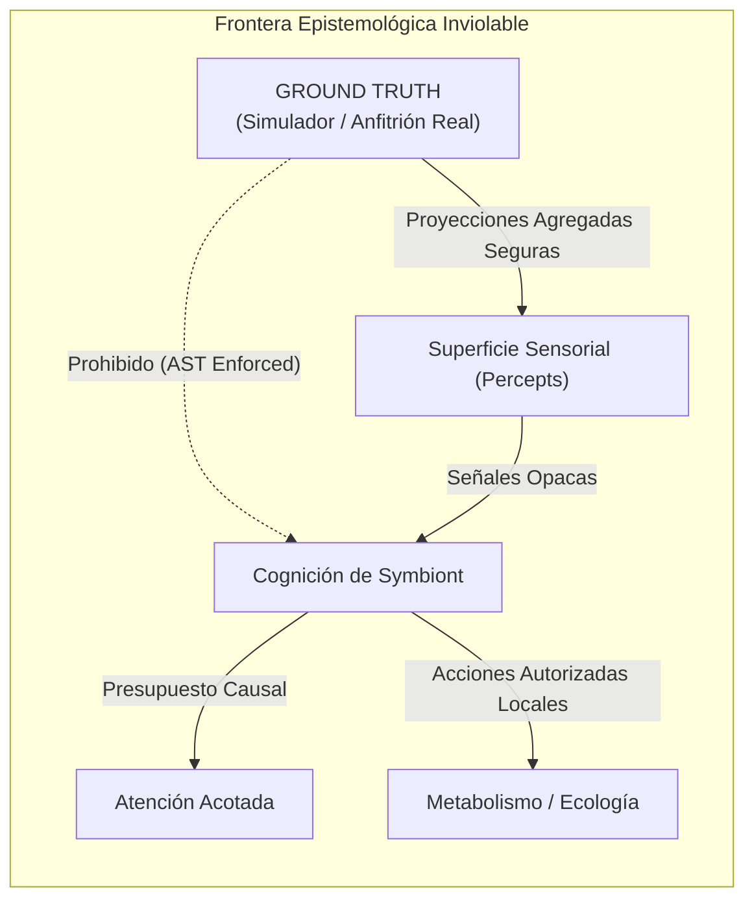
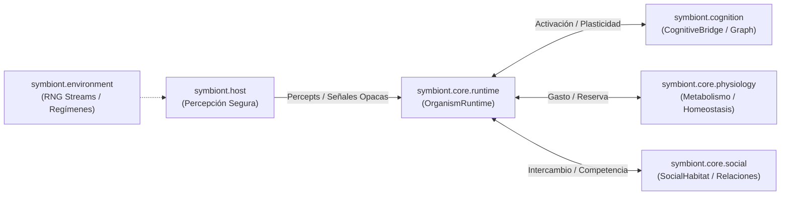
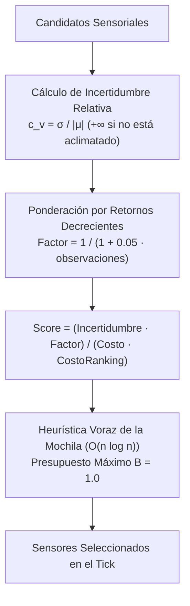
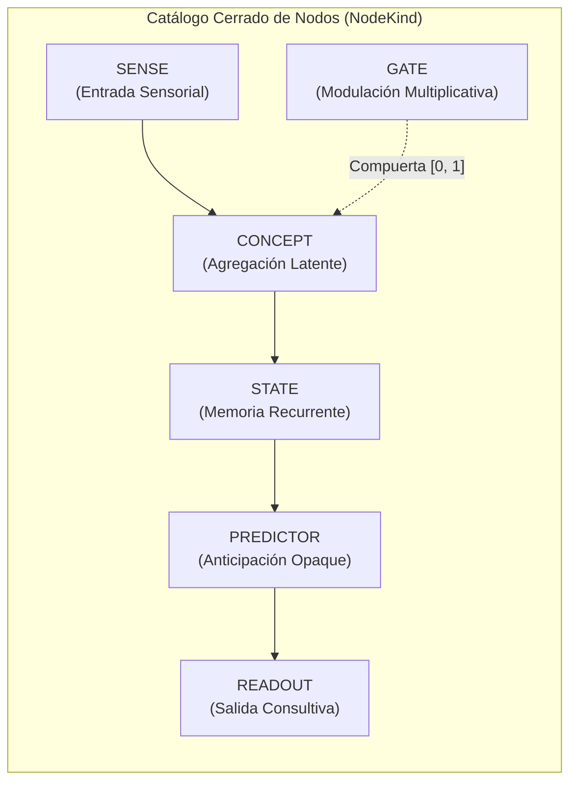
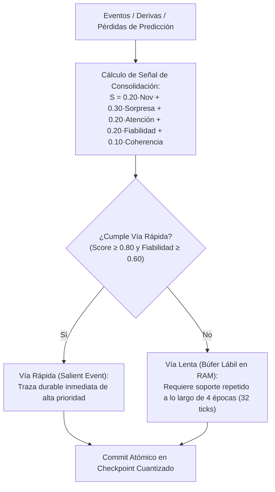
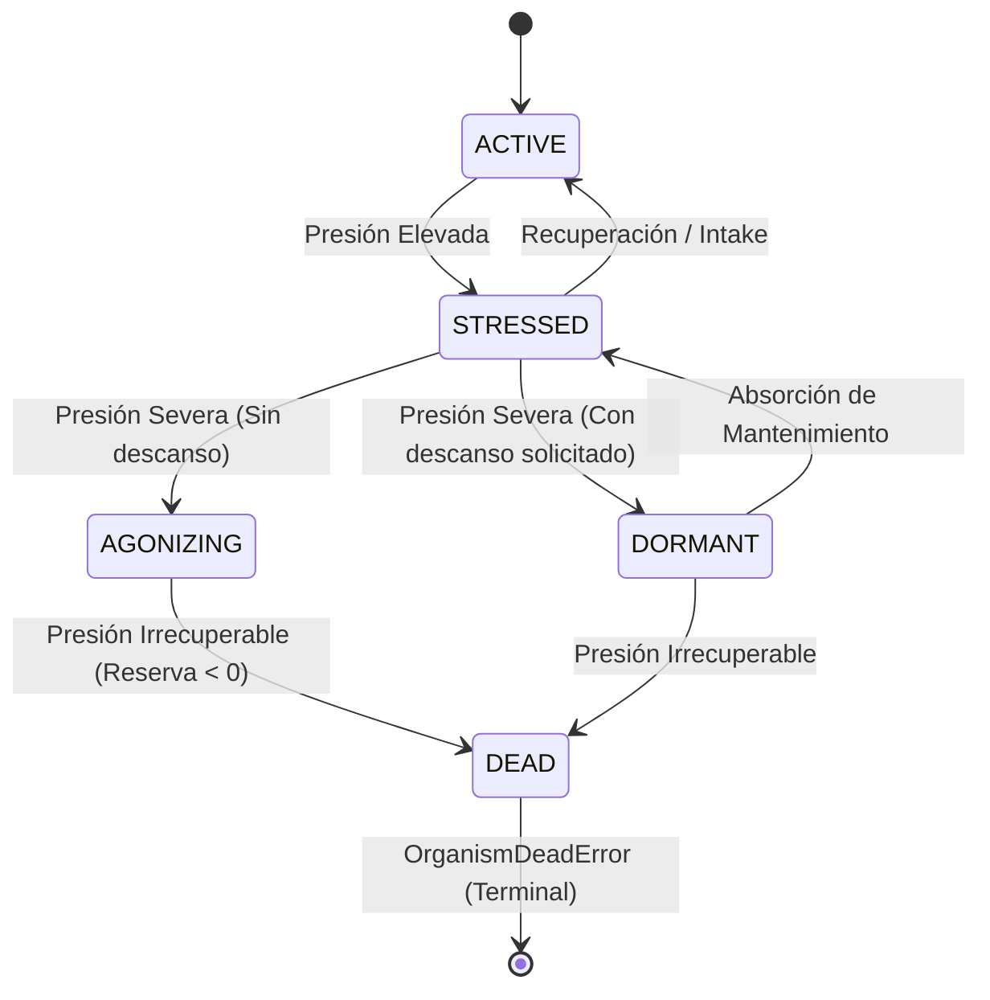
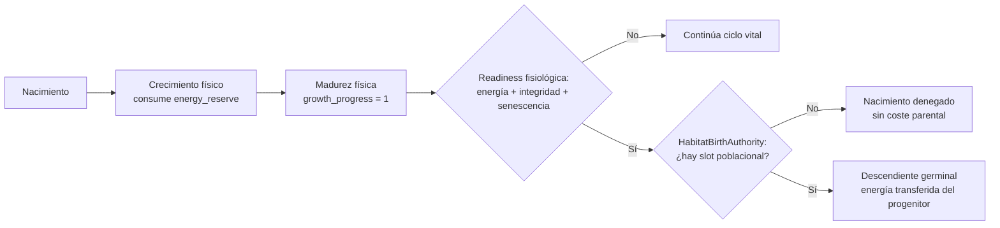
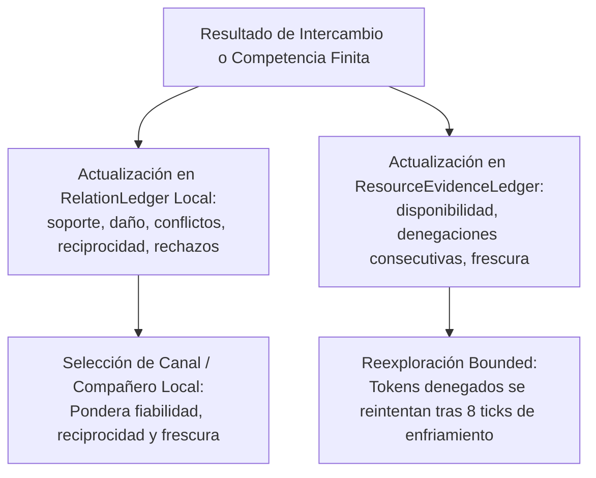
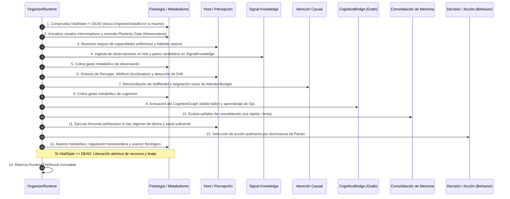

# Arquitectura del Sistema: Symbiont y Symbiont Lab

El repositorio Symbiont Lab está estructurado como un monorepo de investigación organizado en torno a dos paquetes de Python estrictamente desacoplados, con una separación epistemológica fundamental entre el **sujeto experimental** y el **aparato científico**:

1. **`symbiont`** (Sujeto Experimental):  
   El organismo autónomo de vida artificial, sustrato cognitivo recurrente, metabolismo digital, aclimatación en anfitrión y motor de simulación.
2. **`symbiont_lab`** (Aparato Científico):  
   Especificaciones experimentales, estudios de replicación, protocolos estadísticos, archivo inmutable de artefactos, CLI y panel pasivo de visualización.

---

## 1. Jerarquía Epistemológica y Dirección de la Información

```text
GROUND TRUTH (Simulador / Anfitrión Real)
       │
       ▼
EVALUATION EVENTS (Verdad exclusiva del simulador)
       │
       ├────────────────────────────────┐
       ▼                                ▼
OBSERVACIONES (Superficie sensorial)     EVALUADOR (Métricas de Lab / Simulador)
       │                                │
       ▼                                ▼
ORGANISMO (Agente / Cognición)          APARATO CIENTÍFICO (Estudios / Lab)
```

### Invariantes Estructurales Inviolables

1. **Cero Conocimiento Descendente (*Zero Downward Knowledge*):**  
   La verdad fundamental pertenece exclusivamente al simulador y al evaluador. Los componentes cognitivos (`symbiont.core`, `symbiont.cognition`) solo observan señales sintéticas u hostales opacas, memoria estadística local, reportes colectivos de pares y confianza derivada.
2. **Desacoplamiento Estructural Unidireccional:**  
   El sujeto experimental debe poder existir conceptual y estructuralmente en aislamiento absoluto del laboratorio.

   ```text
   symbiont_lab ───► symbiont        [PERMITIDO]
   symbiont     ───► symbiont_lab    [ESTRICTAMENTE PROHIBIDO - AST Enforced]
   ```

3. **Visualización Pasiva:**  
   La visualización en panel recibe métricas calculadas por el aparato de laboratorio; jamás define, calcula ni retroalimenta métricas a los organismos.

---

## 2. Mapa Arquitectónico de Documentación

| Documento | Enfoque | Alcance |
| :--- | :--- | :--- |
| **[`architecture.md`](architecture.md)** | **Tratado Técnico Integral del Organismo** | Especificación exhaustiva de `symbiont.core`, `symbiont.cognition`, `symbiont.host`, `symbiont.environment` y `symbiont.simulation`. Análisis profundo de código, fórmulas y ciclo de vida de ticks. |
| **[`adr/README.md`](adr/README.md)** | **Decisiones de Arquitectura (ADR)** | Catálogo de decisiones estructurales permanentes (ADR-0001 a ADR-0007). |
| **[`safety/README.md`](safety/README.md)** | **Límites de Seguridad y Consentimiento** | Restricciones operativas sobre telemetría de solo lectura y ciclo de vida supervisado del residente. |
| **[`design/README.md`](design/README.md)** | **Diseños de Ingeniería por Hito** | Especificaciones técnicas del desarrollo ontogenético (Hitos E al K). |
| **[`math/README.md`](math/README.md)** | **Compendio Matemático Formal** | Demostraciones analíticas, estabilidad de Welford, EWMA, Oja y optimización de Pareto. |

---

## Tratado Técnico y Epistemológico del Organismo `symbiont`

> **Rol del Documento:** Compendio canónico del sujeto de investigación (`symbiont`).  
> **Alcance:** Exclusivo a la entidad organísmica y su sustrato computacional directo (`symbiont.core`, `symbiont.cognition`, `symbiont.host`, `symbiont.environment`, `symbiont.simulation`). Se excluye deliberadamente el aparato de laboratorio (`symbiont_lab`) y la interfaz pasiva (`observatory`).  
> **Versión Canónica Analizada:** 1.0.0 / `experimental-organism-v1`
> (sustrato congelado; Hitos A al K y runtime integrado consolidados).

---

## 1. Marco Epistemológico y Fundamento de Vida Artificial

La entidad **Symbiont** no constituye un programa de monitoreo ni un modelo de aprendizaje automático convencional. Es un **organismo de Vida Artificial (ALife)** circunscrito a un anfitrión digital local o a un entorno sintético.



### 1.1 Invariantes Epistemológicos Fundamentales

1. **Aislamiento Estricto de la Verdad Fundamental (*Zero Downward Knowledge*):**  
   El organismo jamás tiene acceso a la "verdad fundamental" (*ground truth*). No conoce etiquetas externas de amenaza, clasificación de intrusiones ni estados ocultos del simulador. Sus procesos cognitivos operan únicamente a partir de:
   - Lecturas sensoriales agregadas y no identificables ([`SensorReading`](../src/symbiont/host/readings.py#L30-L37)).
   - Memoria estadística consolidada y firmas locales.
   - Reportes distribuidos de pares y confianza derivada empíricamente.
2. **Desacoplamiento Estructural Unidireccional:**  
   El paquete `symbiont` jamás importa ni depende de `symbiont_lab`. Esta regla es absoluta y está respaldada por verificación estática de AST en integración continua:
   $$\text{symbiont\_lab} \longrightarrow \text{symbiont} \quad [\text{PERMITIDO}]$$
   $$\text{symbiont} \longrightarrow \text{symbiont\_lab} \quad [\text{ESTRICTAMENTE PROHIBIDO}]$$
3. **Plasticidad de Datos bajo un Kernel Inmutable:**  
   Symbiont **no genera código dinámico**, no ejecuta cadenas mediante `eval`, no compila ejecutables ni escala privilegios. Toda su adaptación ontogenética y filogenética opera como **plasticidad de datos sobre un kernel matemático estricto y cerrado** ([`KernelLimits`](../src/symbiont/cognition/limits.py#L7-L34)).
4. **Analogía Funcional frente a Metáfora Decorativa:**  
   Cada término biológico empleado en el código corresponde a un invariante computacional con consecuencias mensurables:
   - *Metabolismo:* Balance estricto de consumo de ciclos y mantenimiento de memoria bajo recursos finitos; no simple uso de CPU.
   - *Homeostasis:* Modulación dinámica de la actividad y congelación de plasticidad para preservar integridad estructural ante escasez.
   - *Excreción:* Destrucción irreversible de estado de bajo valor epistemológico para evitar acumulación infinita de memoria.
   - *Muerte:* Cierre irreversible de la continuidad de identidad de un organismo ([`OrganismDeadError`](../src/symbiont/core/runtime.py#L117-L119)) con liberación atómica de recursos.

---

## 2. Topología Arquitectural del Sujeto Experimental

El paquete se organiza en cinco subsistemas modulares:

```text
src/symbiont/
├── core/           # Núcleo ontogenético: ciclo de vida, metabolismo, atención, creencias
├── cognition/      # Sustrato conexionista: grafo neuronal recurrente, Oja, Huber, genoma
├── host/           # Aparato de adquisición: fuentes, muestras, Welford/EWMA
├── sensory/        # Aparato perceptivo organism-owned: modalidades y sensores
├── environment/    # Entornos sintéticos deterministas: RNG desacoplado SplitMix64
└── simulation/     # Motor de avance estocástico y captura de eventos del sujeto
```



---

## 3. Exploración Profunda del Código por Subsistemas

### 3.1 Percepción Segura y Aclimatación en el Anfitrión (`symbiont.host`)

El subsistema de percepción garantiza la recolección no invasiva y no identificable de telemetría de la máquina anfitriona.

#### Contratos y Clases de Privacidad

En [`contracts.py`](../src/symbiont/host/contracts.py#L37-L60) y [`readings.py`](../src/symbiont/host/readings.py#L30-L37):

- [`Capability`](../src/symbiont/host/contracts.py#L37-L60) prohíbe explícitamente cualquier metadato que contenga claves de identidad del sistema:

  ```python
  forbidden = {"hostname", "username", "user", "home", "cwd", "ip", "mac"}
  if forbidden.intersection(key.lower() for key in keys):
      raise ValueError("capability detail must not contain host identity")
  ```

- [`ReadingPrivacyClass`](../src/symbiont/host/readings.py#L32) está restringido a `AGGREGATE` y `NON_IDENTIFYING`. Por diseño, **no existe ninguna variante que permita telemetría identificable**.

#### Aclimatación Estadística de Welford en Línea

Para construir líneas base sin almacenar historial de muestras brutas ($O(1)$ en memoria), [`RunningStats`](../src/symbiont/host/acclimation.py#L51-L76) implementa el algoritmo de Welford:

$$\mu_n = \mu_{n-1} + \frac{x_n - \mu_{n-1}}{n}$$
$$M_{2, n} = M_{2, n-1} + (x_n - \mu_{n-1})(x_n - \mu_n)$$
$$\sigma_n^2 = \frac{M_{2, n}}{n} \quad (n > 1)$$

La clase [`CapabilityBaseline`](../src/symbiont/host/acclimation.py#L12-L48) expone únicamente `count`, `mean`, `variance` y `stdev`. Oculta cualquier indicador de anomalía para evitar que la percepción usurpe funciones de juicio cognitivo.

#### Detección de Rupturas de Régimen y Arrastre Lento (*Creep*)

El módulo [`DriftAwareBaseline`](../src/symbiont/host/drift.py#L28-L93) resuelve fallos empíricos de los filtros adaptativos continuos:

1. **Cuarentena de Picos Aislados (*Spike Buffering*):**  
   Si una señal se desvía más allá del umbral $z_{\text{regime}} = 2.0$, las observaciones no se mezclan de inmediato con la media. Se almacenan en un búfer temporal. Solo si la desviación se mantiene durante $K_{\text{regime}} = 3$ ticks consecutivos en la misma dirección, se confirma un `REGIME_SHIFT` y se recalcula la media exclusivamente desde el búfer. Si la racha se interrumpe, las muestras se descartan sin contaminar la línea base.
2. **Detección de Arrastre Lento (*Slow Creep*) con Suelo de Ruido Congelado:**  
   Una deriva incremental constante puede pasar por debajo de $z_{\text{regime}}$ en cada tick individual. Si se utiliza la varianza móvil tradicional, esta se infla al mismo ritmo que la rampa de deriva, haciendo indetectable el cambio. Para resolverlo, [`DriftAwareBaseline`](../src/symbiont/host/drift.py#L65-L76) mantiene un EWMA rápido ($\lambda_{\text{fast}} = 0.30$) contrastado contra la media comprometida, pero normalizado contra una desviación estándar congelada ($\sigma_{\text{frozen}}$) fijada en el momento de aclimatación. Tras $K_{\text{creep}} = 8$ ticks superando $z_{\text{creep}} = 1.0$, se confirma `DriftKind.CREEP`.

#### Selección Adaptativa y Poda de Colinealidad Sensorial

En [`AdaptiveSenseModel`](../src/symbiont/host/adaptive.py#L28-L701):

- **Función de Utilidad Dinámica:** Evalúa si un sensor aporta información variable frente a un costo de muestreo:
  $$U = A \cdot (0.65 \cdot V + 0.35 \cdot M)$$
  donde $A$ es la disponibilidad, $V = \frac{\sigma}{\text{escala}}$ es la variabilidad y $M = \frac{\Delta_{\text{ewma}}}{\text{escala}}$ es el movimiento medio.
- **Poda por Colinealidad de Pearson:** [`PairAccumulator`](../src/symbiont/host/adaptive.py#L114-L140) acumula co-momentos en línea mediante Welford bivariado:
  $$C_{xy, n} = C_{xy, n-1} + (x_n - \mu_{x, n-1})(y_n - \mu_{y, n})$$
  $$r_{xy} = \frac{C_{xy}}{\sqrt{M_{2, x} \cdot M_{2, y}}}$$
  Si $|r_{xy}| \ge 0.97$, se declara redundancia colineal y uno de los sensores se desactiva para ahorrar presupuesto.

---

### 3.1b Aparato Sensorial Adaptativo (`symbiont.sensory`)

La extensión experimental separa el dato observable del órgano que lo
transforma:

```text
ObservableSource -> RawSample -> SensorySystem
                               ├─ SensoryModality
                               └─ Sensor -> Percept -> SENSE -> CognitiveGraph
```

`Capability`/`SensorReading` permanecen temporalmente como nombres de
compatibilidad de fuente/muestra. `SensorState` pertenece al individuo y
posee identidad estable, modalidad, inputs, transducción, madurez, health,
confidence, utility, redundancy, coste y lineage. En modo adaptativo el nombre
cognitivo del receptor es su `sensor_id`; los aliases humanos no atraviesan
esa frontera.

Las modalidades `alpha`, `beta` y `gamma` delimitan familias distintas de
transducción sin significado humano. La plasticidad abierta incluye adaptación
paramétrica, duplicación/divergencia bounded, pruning y exploración multisource.
La mutación estructural general de DAGs permanece cerrada hasta validar las
etapas anteriores.

El runtime separa **source sampling** de **perceptual attention**. El selector
sensorial organism-side mantiene evidencia predictiva lag-1 bounded entre
perceptos y concede `selection_credit` únicamente cuando un receptor supera al
mejor baseline trivial local (media o persistencia). La evidencia usa olvido
exponencial para responder a cambios de régimen; el crédito demostrado reduce
el rank-cost perceptivo tras una ventana mínima de evaluación.

El checkpoint v8 contiene un sensory checkpoint v2 con estadísticos agregados
de selección, constitución, fenotipo y genealogía, pero no telemetría cruda ni
el último valor perceptivo. Un transductor temporal restaurado marca su primer
output como `cold_start`; la evidencia predictiva reinicia la dependencia del
valor inmediatamente anterior sin reconstruirlo.

### 3.2 Atención Causal y Presupuesto Finito (`symbiont.core.attention`)

Conforme a [ADR-0003](adr/ADR-0003-attention-is-not-classification.md), la **atención es un mecanismo de optimización de recursos limitados, no un juicio de clasificación ni detección de amenazas**.



En [`attention.py`](../src/symbiont/core/attention.py#L49-L97):

- **Cálculo de Incertidumbre:** Emplea el coeficiente de variación adimensional:
  $$c_v = \frac{\sigma}{|\mu|}$$
  Si el sensor no ha completado el mínimo de muestras de aclimatación, su incertidumbre se fija en $+\infty$, garantizando que la exploración de señales desconocidas priorice sobre señales establecidas.
- **Puntuación de Asignación:**
  $$\text{score}(c) = \frac{u_c \cdot \left(1 + 0.05 \cdot \text{obs}_c\right)^{-1}}{k_c \cdot r_c}$$
  donde $u_c$ es la incertidumbre, $k_c$ es el costo físico de consumo y $r_c$ es el costo de ordenamiento (*rank cost* proveniente del automodelo).
- **Desacoplamiento entre $r_c$ y $k_c$:** Un sensor puede ser penalizado en el ranking por alta latencia sin que se altere la cantidad exacta de presupuesto físico ($k_c$) que resta al presupuesto total $B = 1.0$.

---

### 3.3 El Sustrato Cognitivo Endógeno (`symbiont.cognition`)

El módulo `cognition` implementa una red neuronal recurrente plástica gobernada por tipos y límites estrictos.



#### Tipos Cerrados y Límites Inmutables

- [`NodeKind`](../src/symbiont/cognition/types.py#L6-L17): `SENSE`, `CONCEPT`, `STATE`, `PREDICTOR`, `GATE`, `READOUT`.  
  *Nota de diseño:* **No existe un nodo `ACTION`**. Las lecturas de `READOUT` alimentan circuitos deliberativos externos; el grafo neuronal jamás ejecuta acciones de sistema de forma autónoma.
- [`EdgeKind`](../src/symbiont/cognition/types.py#L19-L26): `EXCITATORY`, `INHIBITORY`, `PREDICTIVE`, `GATING`.
- Rangos canónicos:
  - Pesos: $w \in [-2.0, 2.0]$
  - Plasticidad: $\eta_{\text{edge}} \in [0.0, 1.0]$
  - Escala de tiempo de nodo: $\tau \in [0.1, 10.0]$
  - Retardo temporal: $\delta \in \{0, 1\}$ (el retardo $\delta=0$ solo se autoriza si la fuente es de tipo `SENSE`).
- [`KernelLimits`](../src/symbiont/cognition/limits.py#L7-L34): Fija topes infranqueables (máximo 128 nodos, 32 conceptos, 1024 aristas, 8 mutaciones estructurales por consolidación).

#### Dinámica de Activación Síncrona de Doble Búfer

En [`CognitiveGraph.activate()`](../src/symbiont/cognition/graph.py#L150-L195):
Para evitar dependencias circulares y variabilidad dependiente del orden de cálculo, cada nodo lee exclusivamente de las entradas sensoriales del tick actual ($t$) o del marco previo congelado ($t-1$):

1. **Modulación por Compuerta (*Gating*):**
   $$\text{gate}_i = \prod_{e \in \text{incoming}_{\text{gating}}(i)} \text{clip}\left(w_e \cdot s_e, 0.0, 1.0\right)$$
2. **Suma Ponderada e Inyección de Bias:**
   $$\text{total}_i = \text{bias}_i + \text{gate}_i \cdot \sum_{e \in \text{incoming}_{\text{direct}}(i)} w_e \cdot s_e$$
3. **Función de Activación No Lineal Acotada:**
   $$a_i(t) = \tanh\left(\frac{\text{total}_i}{\tau_i}\right) \in (-1.0, 1.0)$$

#### Aprendizaje Plástico Libre de Etiquetas

En [`learning.py`](../src/symbiont/cognition/learning.py#L1-L100):

- **Pérdida de Huber para Predictores:**  
  Para calcular el error entre la predicción previa $p_i(t-1)$ y el valor real del nodo objetivo $y_j(t)$:
  $$e = y_j(t) - p_i(t-1)$$
  $$L_\delta(e) = \begin{cases} \frac{1}{2} e^2 & \text{si } |e| \le 1.0 \\ |e| - 0.5 & \text{en caso contrario} \end{cases}$$
- **Trazas de Elegibilidad Acotadas:**
  $$\epsilon_{e}(t) = \text{clip}\left(\lambda_{\text{decay}} \cdot \epsilon_e(t-1) + a_{\text{source}}(t-1) \cdot a_{\text{target}}(t), -10.0, 10.0\right)$$
- **Regla de Oja Modulada:**  
  Previene la explosión no acotada de pesos hebbianos sin normalización global explícita:
  $$\Delta w_e = \eta \cdot m \cdot \left(a_{\text{source}} \cdot a_{\text{target}} - a_{\text{target}}^2 \cdot w_e\right)$$
  donde $m = \text{disponibilidad} \cdot \text{salud} \in [0, 1]$ modula el aprendizaje según la integridad sensorial.
- **Predicciones en la Sombra (*Shadow Predictions*, Hito J):**  
  [`ShadowPrediction`](../src/symbiont/cognition/learning.py#L71-L100) evalúa candidatos predictivos fuera del grafo activo. Compara la pérdida del modelo contra una línea base de persistencia trivial ($y_t \approx y_{t-1}$):
  $$\text{Ganancia} = \frac{L_{\text{persistencia}} - L_{\text{modelo}}}{N}$$
  Un candidato pasa a estado `supported` solo si acumula $\ge 8$ muestras con ganancia estrictamente positiva. Si tras 16 muestras su desempeño es inferior a la persistencia, pasa a `retired`. **Nunca se promueve un predictor automáticamente sin una decisión explícita y acotada del runtime.**

#### Metaplasticidad y Optimización de Pareto

[`metaplasticity.py`](../src/symbiont/cognition/metaplasticity.py#L10-L82) evalúa adaptaciones mediante un vector de 5 objetivos ([`LearningObjective`](../src/symbiont/cognition/metaplasticity.py#L10-L23)):

- A minimizar: `prediction_error`, `representation_cost`, `instability`.
- A maximizar: `information_retained`, `calibration`.

Una mutación metaplástica solo se consolida si domina en sentido de Pareto a la ventana anterior. Si se registran 3 fallos consecutivos, [`SafetyState.frozen`](../src/symbiont/cognition/metaplasticity.py#L66-L82) se activa en modo seguro, congelando cualquier cambio en hiperparámetros.

---

### 3.4 Creencias Bayesianas y Registro de Disidencia (`symbiont.core`)

#### Actualización Bayesiana con Pseudo-Observaciones

En [`BeliefModel`](../src/symbiont/core/beliefs.py#L36-L113), las creencias sobre patrones de entrada se modelan como probabilidades revisables:

$$P_{\text{posterior}} = \frac{P_{\text{prior}} \cdot E + P_{\text{obs}} \cdot w}{E + w}, \quad w = \max(0.05, c)$$
$$E \leftarrow \min(E_{\max}, E + w) \quad (E_{\max} = 32.0)$$

El tope $E_{\max} = 32.0$ previene la parálisis epistémica (*epistemic fossilization*), garantizando que el agente siempre conserve capacidad de revisar sus creencias si la evidencia cambia drásticamente.

El conflicto interno se amortigua mediante un filtro exponencial:
$$C \leftarrow \min(1.0, 0.75 \cdot C + 0.25 \cdot |P_{\text{obs}} - P_{\text{prior}}|)$$
$$\text{Certeza} = \left(1 - e^{-E / 4.0}\right) \cdot (1 - 0.60 \cdot C)$$

#### Preservación de la Disidencia

En [`EvidenceRevisionLedger`](../src/symbiont/core/evidence.py#L29-L137), cuando un lote de lecturas sensoriales discrepa significativamente de la línea base previa ($|Z| \ge \theta_{\text{conflict}} = 2.0$):

- Se genera un registro inmutable [`DissentRecord`](../src/symbiont/core/evidence.py#L11-L20).
- La contradicción **no se suaviza ni se descarta**.
- En checkpoints persistentes entre reinicios, se almacenan únicamente los contadores acotados de conflictos por capacidad. Esto previene que los valores numéricos históricos se filtren fuera de la frontera de privacidad del anfitrión, conservando a la vez el hecho epistémico de que la creencia fue refutada.

---

### 3.5 Consolidación Biológica de Memoria (`symbiont.core.consolidation`)

Inspirado en los principios neurobiológicos de consolidación sináptica y de sistemas, [`MemoryConsolidator`](../src/symbiont/core/consolidation.py#L1-L140) sustituye la simple serialización de estados en memoria RAM por una arquitectura de doble vía:



- **Cuantización Antidiferenciación:** Para impedir ataques de inferencia que reconstruyan la telemetría exacta a partir del diferencial entre dos checkpoints sucesivos, los pesos y estadísticas se guardan en clases logarítmicas gruesas y escalonadas:
  - 8 clases de madurez de épocas.
  - 16 clases discretas de traza y fuerza.
  - 5 clases de recencia en el automodelo ([`RecencyClass`](../src/symbiont/core/selfmodel.py#L12-L21): `CURRENT`, `SHORT_IDLE`, `IDLE`, `LONG_IDLE`, `DORMANT`).
- **Invariante Atómico por Nodo:** En [`WeightStabilityTracker`](../src/symbiont/core/weight_stability.py), todas las aristas entrantes a un nodo se consolidan juntas tras demostrar estabilidad sostenida, o ninguna lo hace.

---

### 3.6 Fisiología Digital Integrada (Hitos F e I)

La fisiología establece la economía de recursos computacionales de la entidad.



#### Contabilidad Metabólica (`MetabolicLedger`)

En [`metabolism.py`](../src/symbiont/core/metabolism.py#L34-L145), se gestionan 4 recursos vitales finitos:

1. `observation`: Consumo por lectura de sensores externos e interoceptivos.
2. `cognition`: Gasto por activación y aprendizaje del grafo recurrente.
3. `persistence`: Costo de asimilación y consolidación de memoria.
4. `maintenance`: Gasto basal continuo para preservar la estructura viva.

La presión fisiológica se determina por el ratio mínimo:
$$\text{ratio} = \min_{k} \left(\frac{\text{reserva}[k]}{\text{capacidad}[k]}\right)$$

- $\text{ratio} \ge 0.5 \implies \text{NORMAL}$
- $0.2 \le \text{ratio} < 0.5 \implies \text{ELEVATED}$
- $0.0 \le \text{ratio} < 0.2 \implies \text{SEVERE}$
- $\text{ratio} < 0.0 \implies \text{UNRECOVERABLE}$

#### Estados Vitales y Muerte Irreversible (`PhysiologyController`)

En [`physiology.py`](../src/symbiont/core/physiology.py#L7-L58):

- La muerte (`VitalState.DEAD`) es terminal e irreversible. Si el runtime intenta ejecutar un tick tras la muerte, lanza [`OrganismDeadError`](../src/symbiont/core/runtime.py#L117-L119).
- En el momento de la muerte, el runtime libera atómicamente y una sola vez:
  - Asignaciones en el hábitat compartido ecológico ([`SharedHabitat.release`](../src/symbiont/core/ecology.py#L52-L56)).
  - Cupo de membresía en el hábitat social ([`SocialHabitat.release`](../src/symbiont/core/social.py#L1-L100)).
  - Registro de defunción en la autoridad de linaje ([`HabitatBirthAuthority.death`](../src/symbiont/core/birth_authority.py#L83-L90)).

#### Regulación Homeostática y Reparación (`HomeostaticController`)

En [`homeostasis.py`](../src/symbiont/core/homeostasis.py#L27-L105):

- Presión `ELEVATED`: Reduce la escala de actividad al 90% (mínimo 0.5).
- Presión `SEVERE`: Reduce la actividad al 75% (mínimo 0.2) y **deshabilita la plasticidad cognitiva** (`plasticity_enabled = False`).
- Presión `UNRECOVERABLE` o integridad $\le 0.1$: Entra en `SAFE_MODE` (actividad 0.1, plasticidad bloqueada).
- `repair_with_resources`: Realiza reparaciones incrementales de integridad consumiendo unidades de reserva de mantenimiento. Intentar reparar cuando la integridad ya está al 100% consume el recurso igualmente sin beneficio gratuito, obligando al organismo a aprender la pertinencia contextual de la reparación.

#### Cola de Degradación y Excreción Irreversible (`DegradationQueue`)

En [`degradation.py`](../src/symbiont/core/degradation.py#L24-L70):
El estado retenido de bajo valor pasa por el ciclo:
$$\text{ACTIVE} \xrightarrow{16\text{ ticks}} \text{AGING} \xrightarrow{8\text{ ticks}} \text{WASTE} \xrightarrow{\text{age\_tick()}} \text{EXCRETED}$$
Al alcanzar `EXCRETED`, el elemento se purga definitivamente de la memoria y se incrementa el contador `excreted_units`.

---

### 3.7 Ontogenia, Reproducción, Linaje y Población

La reproducción canónica pertenece al **Living Body**, no a la saturación
cognitiva.



- **Ontogenia física:** `OntogenyController` transforma el único
  `LivingBodyState`. El crecimiento consume energía; la senescencia aparece
  por edad constitucional y produce desgaste.
- **Readiness reproductiva:** depende sólo de madurez física, energía,
  integridad, estado vital y senescencia. No consulta topología cognitiva,
  adaptación, predicción ni crecimiento estructural bloqueado.
- **Nacimiento conservativo:** `OrganismRuntime.materialize_clonal_bud()`
  crea un hijo sólo después de obtener un slot. La energía inicial del hijo se
  descuenta exactamente del progenitor.
- **Autoridad de hábitat:** `HabitatBirthAuthority` gestiona identidad,
  linaje, generación y capacidad máxima. No posee una moneda material paralela.
- **Herencia:** el descendiente recibe constitución heredable y una identidad
  nueva, pero nace con ontogenia física inicial y fenotipo cognitivo germinal;
  no hereda memoria, conceptos ni pesos adquiridos.

La reproducción pareada histórica y `ReproductivePressure` han sido retiradas
del núcleo canónico. Cualquier futura reproducción sexual deberá respetar la
misma conservación física y separación germinal.

---

### 3.8 Sociabilidad Emergente y Evidencia Contextual (Hito K)

El Hito K dota al organismo de capacidades para interactuar en un hábitat multi-residente ([`SocialHabitat`](../src/symbiont/core/social.py#L1-L100)) sin imponer objetivos sociales ni funciones de recompensa colectiva centralizadas.



#### Memoria Relacional Direccional (`RelationLedger`)

Cada organismo mantiene su propio registro [`SocialRelation`](../src/symbiont/core/social.py#L13-L48) por cada par y por cada canal opaco:

- **Valencia:**
  $$\text{Valencia} = \begin{cases} \text{POSITIVE} & \text{si } \text{soporte} - \text{daño} \ge 0.1 \\ \text{NEGATIVE} & \text{si } \text{daño} - \text{soporte} \ge 0.1 \\ \text{UNKNOWN} & \text{en caso de equilibrio o sin observaciones} \end{cases}$$
- **Frescura Exponencial:**
  $$\text{frescura}(\Delta t) = e^{-\ln(2) \cdot \frac{\Delta t}{t_{1/2}}}, \quad t_{1/2} = 32.0\text{ ticks}$$
- **Fiabilidad Local con Presión de Conflicto:**
  $$\text{fiabilidad} = \left(\frac{\text{obs}}{\text{obs} + \text{conflictos}}\right) \cdot \text{frescura}$$

#### Evidencia de Recursos Opacos (`ResourceEvidenceLedger`)

En [`ResourceEvidenceLedger`](../src/symbiont/core/social.py#L75-L156):

- Al competir por recursos finitos o intercambiar tokens, el organismo evalúa la disponibilidad local:
  $$\text{score} = \text{disponibilidad} \cdot \text{frescura} - \min(0.75, 0.15 \cdot \text{denegaciones\_consecutivas}) + \frac{0.25}{1 + \text{observaciones}}$$
- **Reexploración Acotada:** Si un recurso ha sido denegado repetidamente pero permanece inactivo durante $\ge 8$ ticks, se le concede una oportunidad de reexploración. Esto impide que una escasez temporal genere una lista negra permanente, manteniendo al organismo adaptable a cambios de régimen ecológico.

---

### 3.9 Desarrollo físico y desarrollo cognitivo

El sistema separa dos conceptos que antes estaban mezclados:

- **`OntogenyController`:** desarrollo físico real del Living Body
  (`growth_progress`, madurez, senescencia y readiness fisiológica).
- **`DevelopmentalTracker`:** telemetría descriptiva del desarrollo
  cognitivo. Puede etiquetar fases funcionales para análisis, pero no determina
  fertilidad ni edad biológica.

Esta separación evita que “tener más conceptos”, “estar adaptativo” o “haber
intentado suficientes acciones” se conviertan accidentalmente en mecanismos
biológicos.

El ciclo físico canónico es:

```text
birth -> growth -> maturity -> senescence -> death
```

y su estado persistente vive únicamente en `LivingBodyState`.

---

## 4. El Ciclo Vital Unificado: Anatomía de un Tick en `OrganismRuntime`

El método [`OrganismRuntime.tick()`](../src/symbiont/core/runtime.py#L1399-L1955) constituye el latido cognitivo y fisiológico del organismo. La secuencia causal exacta es la siguiente:



---

## 5. Tabla Comparativa de Límites Canónicos e Invariantes

| Parámetro / Límite | Valor Canónico | Módulo de Definición | Significado y Propósito Epistémico |
| :--- | :--- | :--- | :--- |
| `KernelLimits.max_nodes` | `128` | [`limits.py`](../src/symbiont/cognition/limits.py#L13) | Límite estricto al tamaño del cerebro neuronal. |
| `KernelLimits.max_concepts` | `32` | [`limits.py`](../src/symbiont/cognition/limits.py#L14) | Techo a la creación de abstracciones latentes. |
| `KernelLimits.max_edges` | `1024` | [`limits.py`](../src/symbiont/cognition/limits.py#L15) | Techo de conectividad sináptica plástica. |
| `WEIGHT_RANGE` | `[-2.0, 2.0]` | [`types.py`](../src/symbiont/cognition/types.py#L28) | Rango cerrado de saturación de pesos en Oja. |
| `TAU_RANGE` | `[0.1, 10.0]` | [`types.py`](../src/symbiont/cognition/types.py#L32) | Constantes temporales de integración neuronal. |
| `ELIGIBILITY_BOUND` | `10.0` | [`learning.py`](../src/symbiont/cognition/learning.py#L9) | Cota estricta para evitar divergencia en trazas de elegibilidad. |
| `AttentionBudget.budget` | `1.0` | [`attention.py`](../src/symbiont/core/attention.py#L131) | Presupuesto físico duro por ciclo de atención. |
| `BeliefModel.max_evidence` | `32.0` | [`beliefs.py`](../src/symbiont/core/beliefs.py#L44) | Saturación para evitar fosilización bayesiana. |
| `conflict_z` | `2.0` | [`evidence.py`](../src/symbiont/core/evidence.py#L40) | Desviación $Z$ para registrar una disidencia. |
| `Collinearity Threshold` | `0.97` | [`adaptive.py`](../src/symbiont/host/adaptive.py#L114) | Umbral de correlación de Pearson para podar sensores idénticos. |
| `IDLE_GRACE_TICKS` | `20` | [`selfmodel.py`](../src/symbiont/core/selfmodel.py#L47) | Margen antes del decaimiento temporal de confianza. |
| `Reproductive Threshold` | `8` ticks | [`reproduction.py`](../src/symbiont/core/reproduction.py#L18) | Persistencia de estrés necesaria para inducir brote clonal. |

---

## 6. Síntesis Pedagógica y Conclusión

El organismo `symbiont` representa una implementación rigurosa de vida artificial que rechaza explícitamente el uso de metáforas decorativas:

1. **Su cognición es endógena:** No necesita un supervisor externo ni recompensas calculadas desde un oráculo omnisciente; aprende mediante coherencia interna, predicción de Huber, reglas de Oja y convergencia bayesiana.
2. **Su cuerpo es computacional y fisiológicamente finito:** Cada observación, cálculo y persistencia consume recursos; la inanición conduce a la dormancia o a la agonía, y la muerte es irreversible.
3. **Su relación con el anfitrión es simbiótica y no lesiva:** Solo observa métricas agregadas y no identificables; carece de capacidades de ataque, escalada de privilegios o ejecución arbitraria de comandos.
4. **Su sociabilidad es un resultado ecológico emergente:** No se le instruye para cooperar o competir; los vínculos nacen de la memoria relacional local, la reciprocidad observada y la gestión de recursos limitados en un hábitat compartido.

---

## The artificial life model

This document expands two parts of the project's framing that are referenced but not fully explained in [`README.md`](../README.md): why Symbiont is described in biological vocabulary at all, and what "endogenous cognition" means as a computational substrate.

It distinguishes the functional analogues implemented through Milestone H from capabilities that remain outside the current roadmap. Biological language in this project is a research model, not a claim of biological equivalence.

---

## Artificial life, not simulated biology

Symbiont does not attempt to reproduce a biological organism literally in software.

There is no simulated cell, brain, stomach, DNA chemistry or nervous system that the implementation tries to imitate anatomically.

Instead, the project explores whether principles associated with living systems can have useful digital counterparts:

| Biology / life function | Symbiont counterpart | State |
| --- | --- | --- |
| Environment | Local digital host, synthetic world or future bounded habitat | implemented / expanding |
| Receptors | Developed senses | implemented |
| Sensory development | Adaptive sense selection | implemented |
| Neural activity | Cognitive activation | implemented |
| Synapses | Plastic graph edges | implemented |
| Plasticity | Weight and structural adaptation | implemented |
| Attention | Bounded allocation of observation effort | implemented |
| Memory | Consolidated learned state | implemented |
| Forgetting | Aging, pruning and bounded retention | implemented |
| Development | Lifetime change of phenotype | implemented |
| Genome | Declarative developmental constraints | implemented |
| Phenotype | Developed cognitive and sensory structure | implemented |
| Metaplasticity | Adaptation of learning behavior | implemented |
| Homeostasis | Resource regulation, rollback, repair and viability control | implemented |
| Nutrition | Acquisition of potentially useful information | implemented |
| Metabolism | Transformation and maintenance of information under finite compute | implemented |
| Waste / excretion | Degradation and irreversible disposal of low-value state | implemented |
| Dormancy | Minimal viable maintenance under pressure | implemented |
| Death | Explicit irreversible closure of organism continuity | implemented |
| Asexual reproduction | Habitat-authorized clonal budding from developmental pressure | implemented |
| Sexual / paired reproduction | Genome recombination between compatible parents | implemented |
| Heredity | Genetic, bounded epigenetic and cultural inheritance channels | implemented |
| Ecology | Shared bounded habitats with finite resources and multiple organisms | implemented |

These are **functional analogies**, not claims of biological equivalence.

Symbiont is therefore best understood as a research organism within the field of **Artificial Life** — a piece of software whose development, maintenance, inheritance and eventual ecology are themselves objects of study.

---

## Functional analogy, not decorative vocabulary

A biological term is useful in Symbiont only when it points to a computational role with measurable consequences.

For example:

- **metabolism** must mean more than "the program uses CPU"; it must regulate intake, transformation, maintenance cost and resource pressure;
- **excretion** must mean more than garbage collection; it must represent deliberate irreversible disposal of state whose continued maintenance is no longer justified;
- **homeostasis** must mean more than hard limits; the organism must alter activity to remain viable under changing internal pressure;
- **reproduction** must mean more than copying a directory; it must create a new organism identity with explicit heredity and lineage semantics;
- **death** must mean more than process exit; it must irreversibly close one organism identity's continuity;
- **ecology** must mean more than message passing; multiple organisms must share finite resources and be able to affect one another through declared ecological channels.

This criterion is intended to prevent biological language from becoming metaphorical decoration around conventional software features.

---

## Endogenous cognition

Symbiont contains a plastic cognitive graph whose structure can change during the lifetime of an organism.

The graph uses a closed vocabulary of node and edge types defined by an immutable kernel.

```text
SENSE
  │
  ▼
CONCEPT / STATE / PREDICTOR / GATE
  │
  ▼
READOUT
```

Experience can affect:

- activation,
- eligibility,
- edge weights,
- prediction error,
- metaplastic parameters,
- bounded structural creation,
- pruning,
- lifecycle state.

Learning is label-free.

External experimental ground truth is not supplied to cognition as a teaching signal.

The organism changes its **phenotype**, not its implementation.

### Plastic data under an immutable kernel

This distinction is fundamental:

```text
immutable kernel
      │
      ├── legal node kinds
      ├── legal edge kinds
      ├── hard resource limits
      ├── safety invariants
      └── mutation rules
              │
              ▼
           genome
              │
              ▼
       initial phenotype
              │
              ▼
           experience
              │
              ▼
      developed phenotype
```

Symbiont does **not** generate source code, edit its executable implementation, dynamically create permissions, invent commands, or learn its way around kernel limits.

Self-development happens inside a deliberately closed computational substrate.

For the full technical specification of this kernel — node/edge types, hard limits, learning rules, structural plasticity and safe mode — see [`docs/design/cognicion-y-plasticidad.md`](design/cognicion-y-plasticidad.md).

---

## Digital physiology

The next developmental stage adds an explicit internal economy around existing learning and memory mechanisms.

The intended functional loop is:

```text
environment
    │
    ▼
information intake
    │
    ▼
valuation
    │
    ├── useful ─────► assimilation ─► activity / learning / memory
    │
    └── low value ──► rejection

retained state
    │
    ▼
maintenance cost
    │
    ├── justified ──► retain / repair
    │
    └── unjustified ► degrade ─► waste ─► excrete
```

The purpose is not to identify a literal digital calorie. It is to make finite computational resources part of organism physiology rather than an external deployment concern only.

---

## Death and continuity

A future Symbiont life cycle distinguishes process state from organism continuity.

Stopping a process is not death. Restarting a valid durable state is not birth. Death is an explicit terminal transition that closes one organism identity irreversibly.

A dead organism may leave an archival final record, but normal restore must not silently resume it. Any later reconstruction from historical material creates a new organism identity.

Death also participates in population ecology: live habitat resources are released when continuity closes, while bounded lineage/history records may remain.

---

## Reproduction and heredity

Resident reproduction is intentionally distinct from existing laboratory evolution.

Two primary reproductive mechanisms are implemented:

1. **clonal budding** — one viable parent remains alive while a new descendant receives the same genome, a new organism identity and a canonical empty germinal phenotype;
2. **paired reproduction** — two compatible organisms contribute declared genome loci to a new validated offspring genome.

Clonal budding does not copy the parent's developed CognitiveGraph, beliefs, sensory baselines, learned weights or lifetime memory. The purpose is to transmit genotype while allowing phenotype to develop independently.

Reproductive readiness is not triggered merely by age or by touching a node limit. It is intended to arise when a viable adaptive organism persistently accumulates valid developmental evidence that cannot be expressed because its bounded phenotype has exhausted relevant capacity.

A successful birth consumes the accumulated reproductive pressure that justified it and, once physiology exists, carries an explicit reproduction cost. This prevents one saturation event from becoming permanently reusable credit for repeated births.

The implementation keeps genetic inheritance, optional bounded epigenetic inheritance and post-birth cultural transfer separate so their effects can be measured independently.

Organism lineage is also separate from genome lineage. Two clonal descendants can share the exact same `genome_id` while having different `organism_id` values and independent life histories. A new genome identity is required only when heritable genome material changes.

Reproduction is distinct from propagation. A Symbiont may express reproductive readiness, but materializing descendants remains an authorized habitat operation with explicit carrying capacity, resource allocation and transactional lineage registration. A full habitat blocks birth rather than silently killing another organism to make room.

The detailed design is in [`docs/design/fisiologia-y-reproduccion.md`](design/fisiologia-y-reproduccion.md).

---

## Ecology

A digital ecology begins only after individual organisms have their own physiology and heredity.

A habitat provides finite shared resources, population bounds and declared interaction channels. Within those constraints the project can study whether organisms compete, coexist, specialize, cooperate, exchange knowledge, form mutual dependencies or fail to persist.

Carrying capacity is a hard habitat invariant, not an organism-controlled parameter. Births require habitat authorization, and death releases live allocation. Population dynamics therefore arise from bounded birth, resource pressure, survival and death rather than unrestricted process multiplication.

Cooperation is therefore a possible ecological outcome, not a required behavior encoded into the organism in advance.
