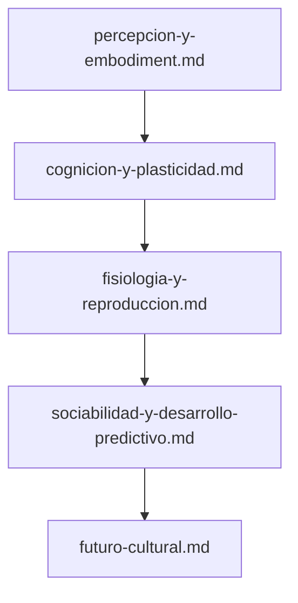

# Índice de Diseños Técnicos (`docs/design/`)

Este directorio contiene las especificaciones arquitectónicas, contratos de datos y diseños de ingeniería que rigen el desarrollo ontogenético y filogenético del organismo **Symbiont**.

---

## Relación entre Diseño e Implementación

> [!IMPORTANT]
> Un documento de diseño en `docs/design/` establece contratos e hipótesis formales. Para verificar el estado real de implementación en el código fuente, la fuente canónica es [`../roadmap.md`](../roadmap.md) y [`../../ORGANISM.md`](../../ORGANISM.md).

---

## Catálogo de Diseños

### [`percepcion-y-embodiment.md`](percepcion-y-embodiment.md) — Embodiment Sensorial y Descubrimiento
*Descubrimiento autónomo de señales en el host:* Vetting de superficies seguras del sistema operativo, asignación de identificadores opacos y poda de colinealidad. *Esquema corporal digital y morfología emergente:* Representación interna de la superficie de receptores, estratificación de sensores (activos, prueba, latentes) y automodelo de costos/salud. *Contrato de restauración recurrente:* Semántica estricta de reinicio y checkpoints sin invención de microestados transitorios inexistentes.

### [`cognicion-y-plasticidad.md`](cognicion-y-plasticidad.md) — Plasticidad Endógena, Memoria Biológica y Nacimiento Cognitivo
*Especificación canónica del kernel cognitivo:* Catálogo cerrado de nodos (`NodeKind`) y aristas (`EdgeKind`), límites infranqueables del kernel (`KernelLimits`), aprendizaje de Oja y optimización multiobjetivo de Pareto. *Consolidación biológica de memoria:* Transición de estado lábil en RAM a memoria durable consolidada, estabilidad sináptica atómica por nodo y cuantización antidiferenciación. *Nacimiento canónico del sustrato cognitivo:* Materialización inicial de genoma a fenotipo sin contaminación de pesos o memoria aprendida del progenitor.

### [`fisiologia-y-reproduccion.md`](fisiologia-y-reproduccion.md) — Fisiología Digital, Cierre Terminal, Reproducción y Linaje
*Fisiología integrada e irreversibilidad:* Contabilidad metabólica en cuatro cuadrantes (`observation`, `cognition`, `persistence`, `maintenance`), control homeostático, estados vitales y frontera terminal de defunción (`OrganismDeadError`). *Dinámica de poblaciones, brote clonal y defunción:* Presión reproductiva acumulada, brote clonal con genotipo heredado y fenotipo germinal vacío, y transacciones atómicas de capacidad de carga mediante la autoridad de hábitat.

### [`sociabilidad-y-desarrollo-predictivo.md`](sociabilidad-y-desarrollo-predictivo.md) — Desarrollo Predictivo y Sociabilidad Emergente
*Desarrollo predictivo autónomo:* Formación de hipótesis, predicciones en la sombra (*shadow predictions*), contraste contra persistencia trivial y promoción deliberada de predictores. *Sociabilidad celular emergente:* Hábitat social autorizado, registro relacional direccional (`RelationLedger`), memoria de recursos opacos (`ResourceEvidenceLedger`), reciprocidad y reexploración acotada sin imposición de objetivos sociales globales.

### [`futuro-cultural.md`](futuro-cultural.md) — Private SLM y Fundamento Cultural
*Modelo privado entrenado por el propio organismo:* Proyección de experiencia con procedencia, corpus y tokenizer nativos, entrenamiento bounded, ciclo candidate→shadow→active, comparación contra baselines y salida exclusivamente como predicciones/hipótesis tipadas. *Claims sociales bounded:* DAG de genealogía causal, raíces de evidencia independientes, ledger social separado, transporte local autorizado, confirmación/contradicción, freshness, olvido y gates preregistrados sin transferencia de modelos ni corpus. *Composición cultural versionada:* composites bounded, provenance multi-contributor, generaciones, reemplazo/retirada, persistencia intergeneracional y utilidad evaluator-side sin transferencia de pesos, corpus ni evidencia del laboratorio.
