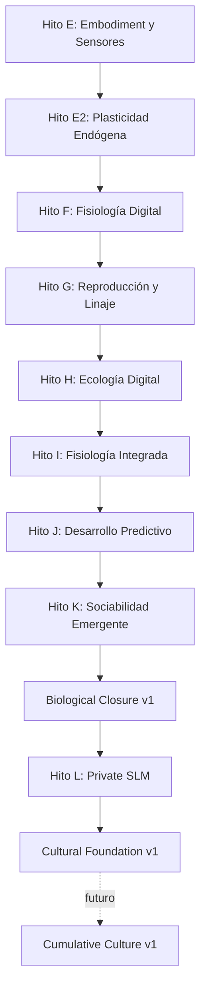

# Índice de Diseños Técnicos (`docs/design/`)

Este directorio contiene las especificaciones arquitectónicas, contratos de datos y diseños de ingeniería que rigen el desarrollo ontogenético y filogenético del organismo **Symbiont**.

---

## Relación entre Diseño e Implementación

> [!IMPORTANT]
> Un documento de diseño en `docs/design/` establece contratos e hipótesis formales. Para verificar el estado real de implementación en el código fuente, la fuente canónica es [`../roadmap.md`](../roadmap.md) y [`../../ORGANISM.md`](../../ORGANISM.md).

---

## Catálogo de Diseños por Hito

### Hito E — Embodiment Sensorial y Descubrimiento
- [`diseno-descubrimiento-senales-symbiont.md`](diseno-descubrimiento-senales-symbiont.md)  
  *Descubrimiento autónomo de señales en el host:* Vetting de superficies seguras del sistema operativo, asignación de identificadores opacos y poda de colinealidad.
- [`digital-body-schema-and-emergent-morphology.md`](digital-body-schema-and-emergent-morphology.md)  
  *Esquema corporal digital y morfología emergente:* Representación interna de la superficie de receptores, estratificación de sensores (activos, prueba, latentes) y automodelo de costos/salud.

### Hito E2 — Plasticidad Endógena y Memoria Biológica
- [`endogenous-plasticity.md`](endogenous-plasticity.md)  
  *Especificación canónica del kernel cognitivo:* Catálogo cerrado de nodos (`NodeKind`) y aristas (`EdgeKind`), límites infranqueables del kernel (`KernelLimits`), aprendizaje de Oja y optimización multiobjetivo de Pareto.
- [`biological-memory-consolidation.md`](biological-memory-consolidation.md)  
  *Consolidación biológica de memoria:* Transición de estado lábil en RAM a memoria durable consolidada, estabilidad sináptica atómica por nodo y cuantización antidiferenciación.
- [`recurrent-restoration-contract.md`](recurrent-restoration-contract.md)  
  *Contrato de restauración recurrente:* Semántica estricta de reinicio y checkpoints sin invención de microestados transitorios inexistentes.

### Hitos F e I — Fisiología Digital y Cierre Terminal
- [`milestone-i-fisiologia-integrada.md`](milestone-i-fisiologia-integrada.md)  
  *Fisiología integrada e irreversibilidad:* Contabilidad metabólica en cuatro cuadrantes (`observation`, `cognition`, `persistence`, `maintenance`), control homeostático, estados vitales y frontera terminal de defunción (`OrganismDeadError`).

### Hito G — Reproducción, Población y Linaje
- [`reproduction-death-population.md`](reproduction-death-population.md)  
  *Dinámica de poblaciones, brote clonal y defunción:* Presión reproductiva acumulada, brote clonal con genotipo heredado y fenotipo germinal vacío, y transacciones atómicas de capacidad de carga mediante la autoridad de hábitat.
- [`canonical-birth-cognition.md`](canonical-birth-cognition.md)  
  *Nacimiento canónico del sustrato cognitivo:* Materialización inicial de genoma a fenotipo sin contaminación de pesos o memoria aprendida del progenitor.

### Hitos J y K — Desarrollo Predictivo y Sociabilidad Emergente
- [`milestone-j-desarrollo-predictivo.md`](milestone-j-desarrollo-predictivo.md)  
  *Desarrollo predictivo autónomo:* Formación de hipótesis, predicciones en la sombra (*shadow predictions*), contraste contra persistencia trivial y promoción deliberada de predictores.
- [`milestone-k-sociabilidad-emergente.md`](milestone-k-sociabilidad-emergente.md)  
  *Sociabilidad celular emergente:* Hábitat social autorizado, registro relacional direccional (`RelationLedger`), memoria de recursos opacos (`ResourceEvidenceLedger`), reciprocidad y reexploración acotada sin imposición de objetivos sociales globales.

### Hito L — Private SLM y fundamento cultural
- [`private-slm-and-cultural-foundation.md`](private-slm-and-cultural-foundation.md)  
  *Modelo privado entrenado por el propio organismo:* Proyección de experiencia con procedencia, corpus y tokenizer nativos, entrenamiento bounded, ciclo candidate→shadow→active, comparación contra baselines y salida exclusivamente como predicciones/hipótesis tipadas. La transmisión cultural queda deliberadamente diferida hasta cerrar la utilidad del modelo individual.
- [`cultural-foundation-v1.md`](cultural-foundation-v1.md)  
  *Claims sociales bounded:* DAG de genealogía causal, raíces de evidencia independientes, ledger social separado, transporte local autorizado, confirmación/contradicción, freshness, olvido y gates preregistrados sin transferencia de modelos ni corpus.
