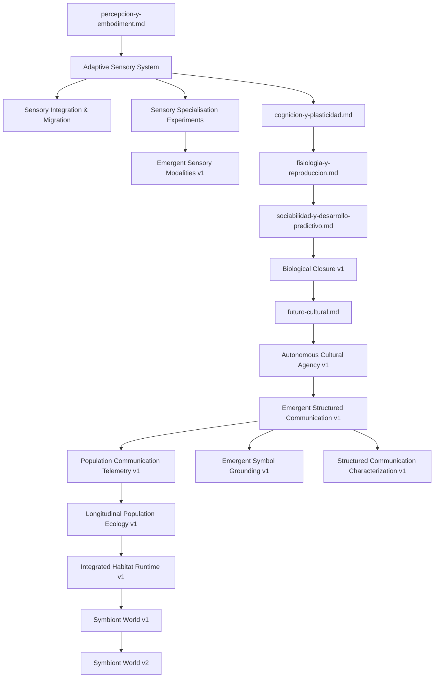

# Índice de Diseños Técnicos (`docs/design/`)

Este directorio contiene las especificaciones arquitectónicas, contratos de datos y diseños de ingeniería que rigen el desarrollo ontogenético y filogenético del organismo **Symbiont**.

---

## Relación entre Diseño e Implementación

> [!IMPORTANT]
> Un documento de diseño en `docs/design/` establece contratos e hipótesis formales. Para verificar el estado real de implementación en el código fuente, la fuente canónica es [`../roadmap.md`](../roadmap.md) y [`../../ORGANISM.md`](../../ORGANISM.md).

---

## Catálogo de Diseños

### [`percepcion-y-embodiment.md`](percepcion-y-embodiment.md) — Embodiment Sensorial y Descubrimiento

*Descubrimiento autónomo de señales en el host:* Vetting de superficies seguras del sistema operativo, asignación de identificadores opacos y poda de colinealidad. *Esquema corporal digital y morfología emergente:* Representación interna de la superficie de receptores, estratificación de sensores (activos, prueba, latentes) y automodelo de costos/salud. *Contrato de restauración recurrente:* Semántica estricta de reinicio y checkpoints sin invención de microestados transitorios inexistentes.

### Adaptive Sensory System

- [`adaptive-sensory-system.md`](adaptive-sensory-system.md)
  *Arquitectura perceptiva organismo-owned:* separación explícita entre fuente, señal, sensor, percepto y nodo cognitivo; modalidades sensoriales heterogéneas, transducción bounded, fenotipo sensorial, lifecycle, duplicación/divergencia y frontera con `SignalKnowledge`, `BodySchema` y cognición.
- [`adaptive-sensory-system-integration.md`](adaptive-sensory-system-integration.md)
  *Integración y migración:* introducción de un `SensorySystem` identidad sin cambio funcional, separación entre sampling y atención, migración de `SensorReading`/`SenseState`, checkpoint, fingerprint, BodySchema, Observatory y secuencia de rollout.
- [`adaptive-sensory-specialisation-experiments.md`](adaptive-sensory-specialisation-experiments.md)
  *Validación científica:* preregistro de equivalencia, descubrimiento adaptativo, especialización temporal y modal, duplicación/divergencia, ablaciones causales, controles negativos, multisource y divergencia fenotípica.
- [`emergent-sensory-modalities-v1.md`](emergent-sensory-modalities-v1.md)
  *Siguiente frontera científica:* elimina las modalidades constitucionales prefijadas, introduce geometría genérica y programas receptores bounded, y define los gates M01–M08.

### [`cognicion-y-plasticidad.md`](cognicion-y-plasticidad.md) — Plasticidad Endógena, Memoria Biológica y Nacimiento Cognitivo

*Especificación canónica del kernel cognitivo:* Catálogo cerrado de nodos (`NodeKind`) y aristas (`EdgeKind`), límites infranqueables del kernel (`KernelLimits`), aprendizaje de Oja y optimización multiobjetivo de Pareto. *Consolidación biológica de memoria:* Transición de estado lábil en RAM a memoria durable consolidada, estabilidad sináptica atómica por nodo y cuantización antidiferenciación. *Nacimiento canónico del sustrato cognitivo:* Materialización inicial de genoma a fenotipo sin contaminación de pesos o memoria aprendida del progenitor.

### [`fisiologia-y-reproduccion.md`](fisiologia-y-reproduccion.md) — Fisiología Digital, Cierre Terminal, Reproducción y Linaje

*Fisiología integrada e irreversibilidad:* Contabilidad metabólica en cuatro cuadrantes (`observation`, `cognition`, `persistence`, `maintenance`), control homeostático, estados vitales y frontera terminal de defunción (`OrganismDeadError`). *Dinámica de poblaciones, brote clonal y defunción:* Presión reproductiva acumulada, brote clonal con genotipo heredado y fenotipo germinal vacío, y transacciones atómicas de capacidad de carga mediante la autoridad de hábitat.

### [`sociabilidad-y-desarrollo-predictivo.md`](sociabilidad-y-desarrollo-predictivo.md) — Desarrollo Predictivo y Sociabilidad Emergente

*Desarrollo predictivo autónomo:* Formación de hipótesis, predicciones en la sombra (*shadow predictions*), contraste contra persistencia trivial y promoción deliberada de predictores. *Sociabilidad celular emergente:* Hábitat social autorizado, registro relacional direccional (`RelationLedger`), memoria de recursos opacos (`ResourceEvidenceLedger`), reciprocidad y reexploración acotada sin imposición de objetivos sociales globales.

### [`futuro-cultural.md`](futuro-cultural.md) — Private SLM y Fundamento Cultural

*Modelo privado entrenado por el propio organismo:* Proyección de experiencia con procedencia, corpus y tokenizer nativos, entrenamiento bounded, ciclo candidate→shadow→active, comparación contra baselines y salida exclusivamente como predicciones/hipótesis tipadas. *Claims sociales bounded:* DAG de genealogía causal, raíces de evidencia independientes, ledger social separado, transporte local autorizado, confirmación/contradicción, freshness, olvido y gates preregistrados sin transferencia de modelos ni corpus. *Composición cultural versionada:* composites bounded, provenance multi-contributor, generaciones, reemplazo/retirada, persistencia intergeneracional y utilidad evaluator-side sin transferencia de pesos, corpus ni evidencia del laboratorio.

### Agencia cultural autónoma

- [`autonomous-cultural-agency-v1.md`](autonomous-cultural-agency-v1.md)
  *Agencia cultural local bounded:* política organismo-side para decidir retener, validar, transmitir y combinar sobre estado local, con transporte disponible pero sin selección evaluator-side de contenido.

### Comunicación — Emergent Symbol Grounding v1

- [`emergent-symbol-grounding-v1.md`](emergent-symbol-grounding-v1.md)
  *Símbolos opacos bounded:* ledger local de grounding, emisión organismo-side,
  controles de señal aleatoria/permutada y transmisión cultural sin tabla de
  significado ni lenguaje.

### Comunicación estructurada emergente

- [`emergent-structured-communication-v1.md`](emergent-structured-communication-v1.md)
  *Canal general de mensajes opacos de longitud variable:* capacidades y
  restricciones sin imponer significado, roles, slots, gramática ni
  composicionalidad.
- [`structured-communication-characterization-v1.md`](structured-communication-characterization-v1.md)
  *Caracterización evaluator-side:* sweep pequeño de presiones, controles,
  métricas descriptivas y visualización pasiva sin añadir capacidades
  lingüísticas.
- [`population-communication-telemetry-v1.md`](population-communication-telemetry-v1.md)
  *Telemetría poblacional factual:* eventos bounded, agregación pasiva,
  reconstrucción basada únicamente en eventos exportados y visualización sin
  feedback al runtime.
- [`longitudinal-population-ecology-v1.md`](longitudinal-population-ecology-v1.md)
  *Campaña de larga duración:* ejecución bounded, replay, estabilidad y
  discovery poblacional usando únicamente protocolos existentes.
- [`integrated-habitat-runtime-v1.md`](integrated-habitat-runtime-v1.md)
  *Orquestación canónica:* ciclo poblacional bounded que conecta APIs ya
  existentes de fisiología, aprendizaje, Private SLM, cultura, comunicación,
  grounding y telemetría sin seleccionar contenido cognitivo.

### [`symbiont-world-v1.md`](symbiont-world-v1.md) — Hábitat Espacial Persistente

*Especificación normativa, no implementada:* nuevo paquete `symbiont_world`
desacoplado de `symbiont`/`symbiont_lab`, contratos `WorldObservation`/
`WorldAction` semánticamente opacos, modelo de tick con ownership de fase
explícito y atomicidad (fallo de transición aborta el tick, fallo perceptivo
no), esquema de eventos con `causal_parent_ids`/`contributing_event_ids`,
ground truth congelada de `Genesis v1` (`world-ground-truth.toml`),
embodiment (`WorldBody`), fingerprint `WorldConstitution`, `WorldEpoch` y
gates de falsación gateados W01–W07 con ontología de novelty congelada para
W07. Implementado y **cerrado**: W01/W02 se ejecutaron contra un
`ModeledOrganismRuntime` real (`symbiont_lab.world.adapter`) y ambos
devolvieron H0 — ver `experiments/world/genesis-v1/audit.md`. El
razonamiento y la bibliografía de ALife que lo motivan están en
[`symbiont-world-v1-rationale.md`](symbiont-world-v1-rationale.md).

### [`symbiont-world-v2.md`](symbiont-world-v2.md) — Multi-organismo y Heterogeneidad Regional

*Especificación normativa, no implementada:* extensión aditiva de
`GroundTruth` con leyes de recurso/hazard por región (`RegionId` opaco,
sin romper ningún contrato de v1), colocación determinista de 8 founders,
runtime multi-organismo sobre el mismo `WorldState`/`WorldEnvironment`,
retry de W02 con `sensory_plasticity` real, cola de daño diferido en
`symbiont_lab` (sin nueva API de core), capa de visualización Observatory
de solo lectura (`GENESIS_V1_METADATA` ya existía para esto), y una puerta
de capacidad abierta formalmente — pero sin diseño concreto aprobado
todavía — para un `ActionKind.MOVE` nuevo en el organismo congelado.
Preregistra W03 (8 founders sin mutación, ¿diferenciación ecológica
puramente ontogenética/social?) solo después de que los gates técnicos
V02-01–V02-08 pasen.
