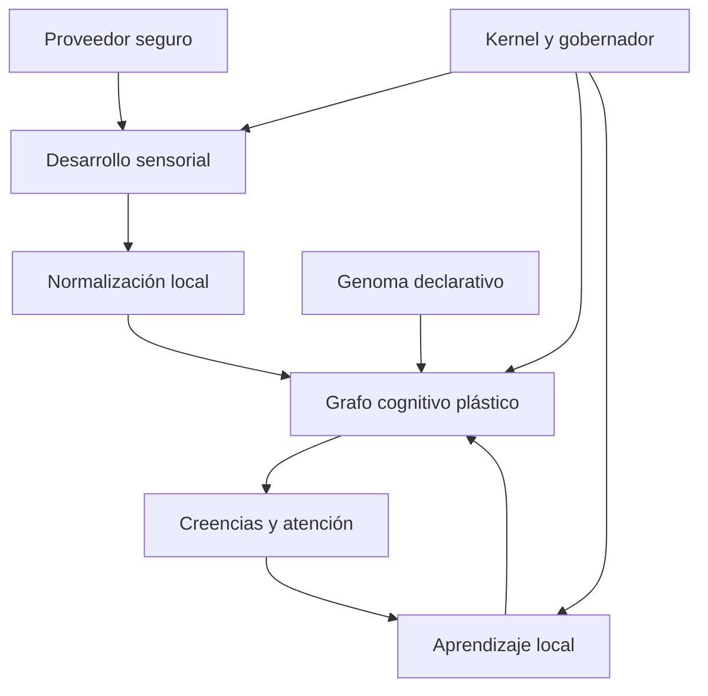
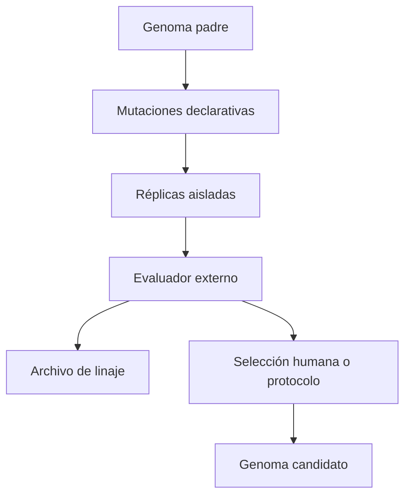

# Symbiont — diseño técnico de plasticidad endógena

<!-- markdownlint-disable MD025 -->

> Consolidated from: endogenous-plasticity.md, biological-memory-consolidation.md, canonical-birth-cognition.md
>
> Note: the first absorbed document ("Symbiont — diseño
> técnico de plasticidad endógena") and the second absorbed document
> (further down, "Biological memory consolidation — v0.59.5 design") each
> use independent `## N.` numbered headings starting from 1 (`## 1.` …
> `## 20.` and `## 1.` … `## 26.` respectively) — they are NOT a single
> continuous sequence. `§N` citations in source code (e.g.
> `weight_stability.py` §11, `consolidated_baseline.py` §10.2/§16,
> `consolidation.py`, `test_checkpoint.py` §16, `test_cli.py` §16) refer to
> the second document's numbering, not the first `## 1.` in this file. The
> third absorbed document ("Canonical birth cognition", further below
> still) does not use numbered headings and is unaffected.

**Estado:** propuesta implementable  
**Base analizada:** `main` en `924eff9e26a3b4b1aaa361984b467459b4e6f4cb` — Symbiont Lab v0.52.0  
**Fecha:** 14 de septiembre de 2026  
**Ámbito:** autoajuste de parámetros, red cognitiva plástica, plasticidad estructural y evolución entre generaciones  

## 1. Decisión ejecutiva

Symbiont no modificará su código Python residente. Su capacidad de autoprogramación se implementará como **plasticidad de datos bajo un kernel inmutable**:

```text
kernel gobernado e inmutable
        ↓ define límites
genoma declarativo y versionado
        ↓ configura el nacimiento
fenotipo plástico del individuo
        ↓ aprende durante su vida
estado dinámico por tick
```

El resultado será funcionalmente comparable a una red neuronal pequeña, recurrente, dispersa e interpretable, pero no será una red neuronal convencional. Aprenderá pesos, sesgos, umbrales, tasas de aprendizaje y estructura; podrá crear, debilitar, consolidar y podar conexiones. No podrá inventar operaciones ejecutables, abrir permisos, ampliar fuentes de observación ni alterar las reglas de seguridad.

La frontera esencial es:

> Symbiont puede cambiar **qué aprende, cuánto aprende y cómo organiza su cognición**, pero no puede cambiar **qué está autorizado a hacer**.

## 2. Objetivos y no objetivos

### Objetivos

1. Permitir que dos organismos con el mismo genoma desarrollen fenotipos distintos en entornos distintos.
2. Ajustar parámetros internos usando solo experiencia causalmente disponible para el organismo.
3. Construir una red dispersa entre sentidos, conceptos y estados internos.
4. Crear y podar estructura sin crecimiento ilimitado.
5. Separar aprendizaje durante la vida de evolución entre generaciones.
6. Mantener cada decisión explicable, reproducible y reversible.
7. Preservar checkpoints abstractos, acotados y sin telemetría cruda.
8. Medir utilidad fuera del organismo, sin filtrar verdad experimental hacia su cognición.

### No objetivos

- Generar, editar, importar o ejecutar Python, shell, WASM o bytecode.
- Escribir en el sistema operativo salvo el checkpoint autorizado y los registros ya aprobados.
- Aprender permisos, proveedores, rutas, comandos, destinos de red o acciones reales.
- Usar etiquetas del simulador, métricas del evaluador o juicio del operador como verdad directa.
- Sustituir el gobierno de consentimiento o recursos mediante parámetros aprendidos.
- Añadir propagación, descubrimiento de pares, control del host o remediación autónoma.
- Prometer equivalencia matemática con un transformer o una red profunda de propósito general.

## 3. Encaje con la arquitectura actual

La propuesta extiende lo existente en vez de crear un segundo organismo.

| Capacidad actual | Reutilización | Extensión propuesta |
| --- | --- | --- |
| `AdaptiveSenseModel` | Estados sensoriales, relaciones, tiers y límites | Convierte sentidos seleccionados en nodos de entrada y aporta señales de utilidad/fiabilidad |
| `OrganismRuntime` | Ciclo cognitivo único | Inserta activación, aprendizaje y consolidación en fases deterministas |
| `HostAcclimation` / `RhythmModel` | Normalidad y contexto | Producen errores de predicción locales, no etiquetas |
| `DriftAwareBaseline` | Cambio y régimen | Alimenta sorpresa y estabilidad del aprendizaje |
| Atención / second look | Presupuesto causal | Define qué nodos pueden actualizarse con evidencia adicional |
| `GovernedOrganism` | Consentimiento, frecuencia y ticks | Mantiene límites duros fuera del espacio aprendible |
| Checkpoint atómico | Persistencia segura | Añade genoma, grafo y metaparámetros con migración y cuotas |
| `symbiont_lab` | Evaluación externa | Ejecuta selección evolutiva sin importar desde `symbiont` |
| Observatory | Inspección pasiva | Visualiza activaciones, plasticidad y linaje sin enviar comandos |

La antigua rama sintética basada en `Observation` y cinco features semánticas debe mantenerse por compatibilidad experimental, pero no será la base del nuevo cerebro residente. La plasticidad residente consumirá nombres opacos `sense_*` y derivados internos.

## 4. Arquitectura lógica



### 4.1 Kernel inmutable

Código revisado que implementa:

- validación de genomas y checkpoints;
- catálogo cerrado de tipos de nodo y operadores;
- orden de ejecución;
- cuotas de CPU, memoria, nodos, aristas y mutaciones;
- consentimiento y capacidades permitidas;
- rollback y modo seguro;
- serialización, migración y auditoría;
- imposibilidad estructural de ejecutar código generado.

El kernel no forma parte del genoma y ningún peso puede alterar sus límites.

### 4.2 Genoma declarativo

Configuración heredable y mutable entre generaciones. Define rangos y predisposiciones, no decisiones concretas:

- límites iniciales de nodos y aristas;
- distribución inicial de pesos;
- tasa base y límites de plasticidad;
- ventanas de elegibilidad;
- umbrales de crecimiento, consolidación y poda;
- presupuesto de conceptos latentes;
- intensidad de homeostasis y olvido;
- probabilidad y magnitud de mutación generacional.

Un genoma es JSON validado contra esquema cerrado. No contiene rutas, importaciones, expresiones, callbacks ni texto ejecutable.

### 4.3 Fenotipo plástico

Estado aprendido del individuo:

- nodos activos;
- aristas y pesos;
- sesgos y umbrales;
- trazas de elegibilidad;
- estabilidad y edad;
- conceptos creados;
- metaparámetros aprendidos;
- historial agregado de mutaciones estructurales.

### 4.4 Estado dinámico

Activaciones del tick actual, errores de predicción y deltas pendientes. Es efímero y no se persiste como lectura histórica.

## 5. Modelo de red cognitiva

### 5.1 Tipos de nodo — catálogo cerrado

| Tipo | Entrada | Función | Persistencia |
| --- | --- | --- | --- |
| `SENSE` | Percepto opaco normalizado | Entrada sensorial | Sí, sin último valor |
| `CONCEPT` | Otros nodos | Representación latente emergente | Sí |
| `STATE` | Señales internas permitidas | Incertidumbre, novedad, estabilidad, energía cognitiva | Sí |
| `PREDICTOR` | Contexto previo | Predice una activación futura | Sí |
| `GATE` | Estado/atención | Modula paso de señal | Sí |
| `READOUT` | Conceptos/estado | Alimenta atención, creencias o narrativa | Sí |

No existe un nodo `ACTION`. Los readouts producen únicamente datos internos o recomendaciones ya gobernadas por el circuito consultivo existente.

### 5.2 Tipos de arista

- `EXCITATORY`: contribución positiva.
- `INHIBITORY`: contribución negativa.
- `PREDICTIVE`: de $t$ a una predicción de $t+1$.
- `GATING`: modulación acotada de otra activación.

Cada arista contiene:

```python
@dataclass(slots=True)
class PlasticEdge:
    source_id: str
    target_id: str
    kind: EdgeKind
    weight: float             # [-2.0, 2.0]
    plasticity: float         # [0.0, 1.0]
    eligibility: float        # estado efímero o cuantizado
    support: int
    age_ticks: int
    stable_ticks: int
    last_use_tick: int        # tiempo relativo, no real
```

### 5.3 Activación

Para cada nodo no sensorial:

$$
u_j(t)=b_j+\sum_i g_{ij}(t)\,w_{ij}\,a_i(t-d_{ij})
$$

$$
a_j(t)=\tanh\left(\frac{u_j(t)}{\tau_j}\right)
$$

Donde $g$ está acotado a $[0,1]$, $w$ a $[-2,2]$, el retardo inicial solo puede ser 0 o 1 tick y $\tau$ tiene rango validado. La actualización usa doble buffer para que el resultado no dependa del orden de los diccionarios.

### 5.4 Normalización sensorial

Los valores crudos nunca entran directamente en el grafo. Cada sentido produce una activación robusta relativa a su propia historia:

$$
z_i(t)=\operatorname{clip}\left(\frac{x_i(t)-\mu_i}{\max(\sigma_i,\epsilon)},-z_{max},z_{max}\right)
$$

$$
a_i(t)=\tanh(z_i(t)/s)
$$

El checkpoint guarda estadística agregada suficientemente protegida, no $x_i(t)$ ni la activación del último tick.

## 6. Aprendizaje durante la vida

El organismo aprende sin una etiqueta externa mediante tres señales locales.

### 6.1 Error de predicción

Cada predictor intenta anticipar un sentido o concepto a un tick:

$$e_j(t)=a_j(t)-\hat a_j(t)$$

Pérdida local robusta:

$$L_{pred}=\operatorname{Huber}(e_j)$$

La sorpresa es informativa, pero no equivale a amenaza ni a utilidad.

### 6.2 Plasticidad hebbiana estabilizada

Las aristas descriptivas actualizan con una variante Oja acotada:

$$
\Delta w_{ij}=\eta_{ij}\,m(t)\,[a_i a_j-a_j^2 w_{ij}]
$$

$m(t)$ combina disponibilidad, calidad, atención y salud perceptual. Nunca contiene ground truth.

### 6.3 Trazas de elegibilidad

Para no atribuir un cambio futuro a cualquier señal pasada:

$$
q_{ij}(t)=\lambda q_{ij}(t-1)+a_i(t-1)a_j(t)
$$

Solo las aristas observadas dentro de la ventana causal y seleccionadas por atención pueden recibir una actualización completa. Esto conserva el principio actual de causalidad por prefijo.

### 6.4 Objetivo interno compuesto

No se optimiza un único número global oculto. El kernel calcula un vector observable:

```text
prediction_error      ↓
representation_cost  ↓
instability          ↓
information_retained ↑
calibration          ↑
```

Las decisiones de ajuste usan dominancia de Pareto o reglas explícitas; una mejora de predicción no puede justificar un crecimiento descontrolado.

### 6.5 Metaplasticidad

Los siguientes parámetros pueden aprenderse lentamente dentro de rangos fijados por el genoma:

- `learning_rate` por familia de aristas;
- `forgetting_rate`;
- `activation_temperature`;
- `attention_novelty_weight`;
- `attention_uncertainty_weight`;
- `consolidation_threshold`;
- `pruning_threshold`;
- `exploration_fraction`.

Cada parámetro mantiene valor, rango, velocidad máxima de cambio y evidencia acumulada. La actualización sigue una comparación contrafactual local de dos ventanas —antes/después— y se revierte si empeora estabilidad o coste sin mejora suficiente.

No son aprendibles: consentimiento, rutas autorizadas, máximos duros, intervalo mínimo, advisory consent, operadores permitidos, formatos de persistencia ni fronteras de paquetes.

## 7. Plasticidad estructural

### 7.1 Creación de aristas

Una arista candidata aparece solo si:

1. ambos nodos existen y están sanos;
2. han co-activado o mostrado precedencia al menos `min_candidate_support` veces;
3. la relación aporta información condicional respecto a aristas existentes;
4. hay presupuesto estructural;
5. no duplica una arista ya consolidada;
6. pasa el enfriamiento de mutaciones.

Nace como `tentative`, con peso pequeño y vida limitada. Solo se consolida si reduce error fuera de la ventana que la creó.

### 7.2 Creación de conceptos

Un `CONCEPT` puede nacer al detectar un conjunto estable de dos a cuatro nodos que:

- co-varían de manera repetida;
- no son meramente redundantes;
- mejoran la compresión o predicción;
- aparecen en más de un contexto temporal.

El concepto recibe un ID opaco derivado de un identificador aleatorio persistente —no del contenido ni de rutas— y conexiones iniciales normalizadas. No recibe una etiqueta semántica inventada. La narrativa puede llamarlo `concept_7f3a` y describir sus relaciones observadas.

### 7.3 Poda

Una arista se poda cuando combina bajo uso, bajo peso, baja contribución y suficiente edad. Un nodo se poda solo si no está protegido y queda sin contribución útil. La poda es gradual:

```text
active → weak → quarantined → removed
```

`quarantined` deja una ventana de recuperación y permite rollback. Los sentidos conocidos no se eliminan del modelo sensorial por la poda cognitiva; vuelven a la política dormant/probing existente.

### 7.4 Consolidación y sueño computacional

No habrá ejecución clandestina en segundo plano. La consolidación es una fase explícita y acotada al final de ciertos ticks autorizados. Usa únicamente acumuladores agregados y estado plástico, nunca replays de telemetría cruda.

Máximos iniciales recomendados:

| Recurso | Límite inicial |
| --- | ---: |
| Nodos totales | 128 |
| Conceptos | 32 |
| Aristas | 1.024 |
| Aristas tentativas | 128 |
| Mutaciones estructurales por consolidación | 8 |
| Consolidaciones | 1 cada 32 ticks |
| Retardo de arista | 0–1 tick |
| Memoria del checkpoint plástico | 2 MiB |

## 8. Evolución entre generaciones

La evolución pertenece a `symbiont_lab`, no al organismo residente. Un individuo no se reproduce ni se despliega a sí mismo.

### 8.1 Flujo



### 8.2 Mutaciones admitidas

- perturbación pequeña de valores continuos;
- activación/desactivación de predisposiciones opcionales;
- cambio acotado de presupuestos blandos;
- duplicación o retirada de una plantilla de concepto inicial;
- cambio de probabilidades de crecimiento/poda.

No puede mutarse el esquema, catálogo de operadores, máximos absolutos, política de permisos ni kernel.

### 8.3 Evaluación multientorno

Cada genoma se prueba con semillas emparejadas en varios regímenes y se mide externamente:

- error predictivo posterior al calentamiento;
- adaptación a cambio de régimen;
- retención tras ausencia y rediscovery;
- calibración de incertidumbre;
- coste de muestreo y cómputo;
- tamaño/rotación del grafo;
- diversidad fenotípica;
- resistencia a ruido, señales constantes y señales señuelo;
- estabilidad de checkpoint/restart.

La selección nunca alimenta al individuo con la etiqueta de si “ganó”. Produce un nuevo genoma para otro nacimiento.

## 9. Ciclo exacto de un tick

1. `GovernedOrganism` comprueba consentimiento, frecuencia y presupuesto.
2. El proveedor descubre/muestrea únicamente superficies autorizadas.
3. `AdaptiveSenseModel` actualiza salud, relaciones y plan de muestreo.
4. Se normalizan lecturas seleccionadas a activaciones opacas.
5. El grafo ejecuta propagación con el estado de $t-1$ y doble buffer.
6. Se generan predicciones, estados y readouts internos.
7. Atención decide investigación dentro de su presupuesto.
8. Si procede, second look aporta evidencia autorizada.
9. Se actualizan trazas y pesos locales.
10. Se actualizan metaparámetros solo si ha vencido su ventana.
11. Si corresponde, consolidación propone y valida mutaciones estructurales.
12. Se construyen creencias/narrativa y snapshot pasivo.
13. Se incrementa el tick.
14. El servicio residente guarda checkpoint atómico según su política explícita.

Si cualquier fase excede cuota o falla validación, se descarta el delta completo del tick plástico; el estado anterior permanece válido.

## 10. Contratos Python propuestos

```python
class CognitiveGraph:
    def activate(self, inputs: Mapping[str, float], context: TickContext) -> GraphFrame: ...
    def learn(self, frame: GraphFrame, evidence: LocalEvidence) -> LearningDelta: ...
    def apply(self, delta: LearningDelta, limits: PlasticityLimits) -> None: ...

class StructuralPlasticity:
    def propose(self, state: PlasticState, summary: LearningSummary) -> tuple[Mutation, ...]: ...
    def validate(self, mutation: Mutation, limits: StructuralLimits) -> ValidationResult: ...

class MetaPlasticity:
    def propose(self, windows: MetaWindows, genome: Genome) -> tuple[ParameterDelta, ...]: ...

class GenomeCodec:
    def load(self, payload: Mapping[str, object]) -> Genome: ...
    def validate(self, genome: Genome, kernel_limits: KernelLimits) -> None: ...

class PlasticCheckpointCodec:
    def export(self, state: PlasticState) -> dict[str, object]: ...
    def restore(self, payload: Mapping[str, object]) -> PlasticState: ...
```

Nuevos módulos sugeridos:

```text
src/symbiont/cognition/
  graph.py
  activation.py
  learning.py
  structure.py
  metaplasticity.py
  genome.py
  limits.py
  checkpoint.py

src/symbiont_lab/evolution/
  mutation.py
  evaluation.py
  selection.py
  lineage.py
```

`symbiont/cognition` no importa `symbiont_lab`; la regla AST existente debe ampliarse para demostrarlo.

## 11. Esquema de genoma

Ejemplo ilustrativo:

```json
{
  "schema_version": 1,
  "genome_id": "genome_018f...",
  "parent_ids": [],
  "kernel_compatibility": ">=0.55,<0.60",
  "development": {
    "initial_concepts": 4,
    "soft_node_budget": 64,
    "soft_edge_budget": 384,
    "consolidation_interval_ticks": 32
  },
  "plasticity": {
    "learning_rate": {"initial": 0.02, "min": 0.001, "max": 0.08},
    "forgetting_rate": {"initial": 0.0005, "min": 0.0, "max": 0.005},
    "eligibility_decay": 0.92
  },
  "structure": {
    "grow_threshold": 0.18,
    "prune_threshold": 0.01,
    "minimum_support": 16,
    "tentative_lifetime_ticks": 128
  },
  "mutation_policy": {
    "continuous_sigma": 0.05,
    "max_fields_per_generation": 3
  }
}
```

La compatibilidad es validada por código; no se interpreta como una expresión ejecutable. Los IDs no contienen identidad del host.

## 12. Checkpoint y privacidad

El checkpoint pasa a esquema v3 mediante migración explícita y contiene:

- tick relativo;
- estado agregado actual ya permitido;
- hash e identidad del genoma;
- nodos persistentes sin activación reciente;
- aristas con pesos cuantizados, soporte, edad y estabilidad;
- metaparámetros y evidencia agregada por ventana;
- contadores de estructura y versión del kernel.

No contiene:

- última lectura o activación exacta;
- historial por tick;
- rutas, nombres de dispositivo o identificadores de host;
- timestamps reales de las muestras;
- deltas reversibles que permitan reconstruir una secuencia;
- etiquetas del evaluador.

Para reducir reconstrucción indirecta, medias y pesos se cuantizan a precisión declarada, los acumuladores con soporte insuficiente no se exportan y se prueba empíricamente que dos secuencias distintas no puedan recuperarse del payload más allá de las estadísticas publicadas. El límite de 2 MiB se valida antes de la escritura atómica.

## 13. Gobierno y seguridad

### Invariantes no negociables

1. El kernel define máximos duros compilados/configurados por propietario.
2. Todo cambio plástico es un delta de datos validado y transaccional.
3. Ningún campo aprendido se usa como ruta, nombre de módulo, comando o permiso.
4. El grafo solo puede invocar operadores puros del catálogo cerrado.
5. El organismo no puede crear threads, procesos, sockets ni timers.
6. La residencia sigue siendo visible, revocable y user-owned.
7. Observatory consume snapshots y nunca publica órdenes.
8. Ante checkpoint inválido se falla de forma visible; no se reinicia silenciosamente.
9. Tres fallos plásticos consecutivos activan `safe_mode`: red congelada, percepción y checkpoint básico continúan.
10. Rollback conserva el último checkpoint validado y una única versión anterior —con cuota fija.

### Amenazas específicas y mitigación

| Riesgo | Mitigación |
| --- | --- |
| Explosión de nodos/aristas | Cuotas duras, mutaciones por lote y coste de complejidad |
| Oscilación de pesos | Oja, clipping, temperatura mínima y detector de inestabilidad |
| Catastrophic forgetting | Consolidación, ritmos, rehearsal agregado y tasa máxima de olvido |
| Ceguera por poda temprana | Estados dormant/probing y cuarentena antes de borrar |
| Atajo hacia una señal espuria | Evaluación por ventanas futuras y diversidad de contextos |
| Fuga de ground truth | Frontera de paquetes y tests AST/data-flow |
| Reconstrucción de telemetría | Sin últimas muestras, cuantización, soporte mínimo y auditoría diferencial |
| Genoma hostil o corrupto | Esquema cerrado, firma opcional, rangos y kernel compatibility |
| Fitness hacking | Métricas múltiples, escenarios ocultos al genoma y selección externa |
| Cambio que degrada al individuo | Deltas transaccionales, canary interno y rollback |

## 14. Observabilidad

El snapshot del Observatory incorporará datos agregados:

- tamaño del grafo y ocupación de cuotas;
- nodos por tipo y estado;
- aristas creadas, consolidadas, en cuarentena y podadas;
- distribución de pesos en bins;
- error predictivo EWMA;
- estabilidad y tasa de cambio;
- metaparámetros actuales con rango permitido;
- conceptos dominantes por activación cuantizada;
- diferencias respecto al genoma de nacimiento;
- modo normal, frozen o safe mode;
- linaje en experimentos generacionales.

No se emitirán lecturas crudas ni activaciones precisas por sentido. Para el replay se guardan snapshots de observatorio ya minimizados, no el estado cognitivo privado completo.

## 15. Estrategia de pruebas

### Unitarias

- activación determinista y orden-independiente;
- clipping y ausencia de NaN/inf;
- actualización Oja y trazas;
- creación, consolidación, cuarentena y poda;
- rangos de metaparámetros;
- validación exhaustiva de genoma;
- serialización y migración v2→v3.

### Propiedades e invariantes

- para cualquier entrada finita, todo estado permanece finito y acotado;
- nodos, aristas, memoria y mutaciones nunca superan cuotas;
- cambiar el orden de nodos/aristas no cambia el resultado;
- restaurar y continuar equivale a una ejecución ininterrumpida desde el punto seguro;
- el mismo genoma, mundo y semillas produce el mismo digest;
- variar solo la semilla de mutación no altera el mundo;
- ningún payload contiene valores o identificadores prohibidos.

### Integración

- `OrganismRuntime` completo con red vacía y red madura;
- retirada y reaparición de sentidos;
- cambio de régimen prolongado;
- fallo durante aplicación de un delta;
- checkpoint en límite de tamaño;
- safe mode y recuperación explícita;
- Observatory acepta snapshots nuevos y antiguos.

### Integridad experimental

- `symbiont` nunca importa `symbiont_lab`;
- evaluador y etiquetas no son alcanzables desde cognición;
- streams RNG separados para mundo, inicialización, exploración y mutación;
- seeds emparejadas entre genomas;
- prefijo causal: alterar el futuro no cambia decisiones pasadas;
- ninguna métrica de fitness aparece en checkpoints del individuo.

### Ensayos adversarios

- señal constante, ruido blanco, contador enorme y overflow;
- 256 señales redundantes;
- alternancia diseñada para provocar crecimiento/poda;
- checkpoint antiguo, truncado, sobredimensionado y con tipos maliciosos;
- genoma con valores extremos, claves desconocidas y profundidad excesiva;
- 100.000 ticks sintéticos verificando memoria constante y deriva estructural acotada.

## 16. Métricas de éxito

| Dimensión | Métrica | Criterio inicial |
| --- | --- | --- |
| Aprendizaje | Error predictivo vs baseline no plástico | Mejora mediana ≥10% en regímenes aprendibles |
| Adaptación | Recuperación tras regime shift | Vuelve al rango estable sin reset |
| Diferenciación | Distancia de grafos entre hosts | Mayor entre entornos distintos que entre réplicas iguales |
| Estabilidad | Tasa de churn estructural madura | <2% de aristas por 1.000 ticks |
| Eficiencia | Tiempo por tick | p95 bajo presupuesto configurado |
| Memoria | Tamaño residente/checkpoint | Siempre bajo cuotas |
| Robustez | Seeds sin NaN, overflow o violación | 100% |
| Privacidad | Lecturas exactas reconstruibles | Ninguna fuera de estadística declarada |
| Reproducibilidad | Digest repetido | Igual bit a bit en plataforma compatible |

Una red más grande no cuenta como éxito. La mejora debe persistir fuera de la ventana que provocó el cambio y pagar su coste de complejidad.

## 17. Plan de versiones y PRs

### Prerrequisitos ya previstos

| Versión | Entrega |
| --- | --- |
| v0.53 | Automodelo de coste, salud y confianza perceptual |
| v0.54 | Maduración larga: envejecimiento, olvido y rediscovery acotados |

### Nuevo Milestone — Plasticidad endógena

| Versión | PR principal | Resultado verificable |
| --- | --- | --- |
| v0.55 | Kernel de genoma | Esquema cerrado, límites, codec, identidad y checkpoint v3 |
| v0.56 | Grafo cognitivo | Nodos/aristas, activación recurrente determinista y readouts internos |
| v0.57 | Aprendizaje sin etiqueta | Predicción local, Oja, elegibilidad y adaptación de pesos |
| v0.58 | Metaplasticidad y estructura | Parámetros lentos, conceptos emergentes, consolidación, poda y rollback |
| v0.59 | Evolución de laboratorio | Mutación generacional, evaluación multientorno, linaje y visualización |

Cada versión debe ser útil de forma aislada. No se fusionará una red “vacía” que solo cobre sentido al final: v0.56 tendrá inicialización determinista y observabilidad; v0.57 demostrará aprendizaje de pesos antes de permitir crecimiento estructural.

### Orden detallado recomendado

1. ADR: kernel fijo, genoma declarativo y frontera no ejecutable.
2. Tipos, límites y validador de genoma.
3. Checkpoint v3 y migración, antes de producir nuevo estado.
4. Grafo estático con activación y snapshots.
5. Predictor local y benchmark contra baseline.
6. Plasticidad de pesos con rollback.
7. Metaparámetros dentro de rangos.
8. Aristas tentativas y consolidación.
9. Conceptos emergentes y poda.
10. Safe mode y pruebas de larga residencia.
11. Mutación/selección exclusivamente en laboratorio.
12. Observatory de fenotipo y linaje.

## 18. Criterios de aceptación del milestone

El milestone se considera cerrado solo si:

1. Dos individuos con el mismo genoma y experiencias diferentes terminan con grafos diferentes de manera reproducible.
2. Un individuo reduce error predictivo o coste en al menos un protocolo preregistrado sin recibir etiquetas externas.
3. Puede crear y podar estructura, y el uso de memoria permanece constante respecto al tiempo.
4. Todo parámetro aprendido permanece dentro de límites no aprendibles.
5. Ninguna mutación modifica permisos, proveedores o comportamiento real del host.
6. Checkpoint/restart conserva el fenotipo sin conservar la última lectura.
7. Un fallo de plasticidad revierte el tick y puede activar safe mode sin perder el organismo básico.
8. Observatory explica qué cambió y por qué con evidencia agregada.
9. La evolución ocurre solo en ejecuciones de laboratorio explícitas.
10. Las suites de integridad demuestran que ground truth, fitness y juicios humanos no entran en cognición.

## 19. Decisiones abiertas antes de implementar

Solo quedan cuatro decisiones de producto, no bloqueos técnicos:

1. **Identidad:** si el genoma debe considerarse especie, familia o simplemente configuración de nacimiento.
2. **Herencia:** si una nueva generación hereda solo genoma o también una pequeña estructura consolidada. Recomendación: primero solo genoma; añadir herencia de estructura después de demostrar que no transmite atajos espurios.
3. **Selección:** automática por protocolo Pareto o aprobación humana de cada nuevo genoma. Recomendación: archivo automático, activación humana.
4. **Narrativa:** si el Observatory puede asignar alias humanos locales a conceptos opacos. Recomendación: alias solo en el aparato, nunca dentro del organismo.

## 20. Recomendación final

La primera implementación debe detenerse en **autoprogramación declarativa**, no en autoedición de código. Es suficiente para que Symbiont cambie profundamente su comportamiento, desarrolle una arquitectura cognitiva propia y funcione como una red adaptativa. Además conserva lo más valioso del proyecto: podemos inspeccionar de dónde salió cada capacidad, medirla sin contaminarla y apagarla sin perder el control del sistema.

La secuencia correcta es:

```text
v0.53 automodelo
→ v0.54 maduración
→ v0.55 genoma seguro
→ v0.56 grafo recurrente
→ v0.57 aprendizaje de pesos
→ v0.58 estructura y metaplasticidad
→ v0.59 evolución en laboratorio
→ v0.60 cooperación entre individuos
```

Así, cuando llegue la cooperación, no intercambiarán instancias idénticas con distinta memoria. Interactuarán individuos con fenotipos realmente distintos, nacidos de la misma especie técnica pero desarrollados por su propia experiencia.

---

# Biological memory consolidation — v0.59.5 design

Status: **approved design, not yet implemented**

Scope: resident individual only. No network, peer exchange, new permissions, identifying data, user content, autonomous actions or executable self-modification.

## 1. Purpose

Symbiont currently persists much of its learned state as a durable checkpoint. v0.59.4 hardened that checkpoint — bounded size, stricter validation, quantized cognitive weights, restart continuity — but the persistence model is still fundamentally a serialization model: several subsystems write precise aggregate state whenever `OrganismRuntime.checkpoint()` is called.

That leaves two problems.

1. **Checkpoint differencing.** Two precise aggregate checkpoints taken close together can reveal information about the observations between them. For a cumulative `(count, mean)` pair, a one-observation difference can algebraically recover that observation. The current host checkpoint documents this limitation explicitly.
2. **Wrong memory abstraction.** `eligibility`, `previous_frame`, precise recent statistics and other short-lived state are operational working state. Treating all of them as durable identity makes restart closer to restoring a process image than restoring an organism's long-term memory.

v0.59.5 changes the persistence model from **serialize learned state** to **persist consolidated memory**.

The biological analogy is architectural rather than literal: recent experience first changes a labile working state; only selected, sufficiently supported or sufficiently salient changes become durable. A single exceptionally strong event may create a durable trace, while statistical generalization still requires repeated independent evidence. Saving or shutting down never forces immature memory to consolidate.

## 2. Core invariant

> **A durable checkpoint must contain only bounded consolidated abstractions. No durable field may change in a form that attributes the change to one ordinary raw observation.**

The invariant has one deliberate exception in semantics, not in raw data: a single highly salient event may create a durable **abstract event trace**. That trace records that an exceptional transition occurred, never the exact source reading that caused it.

This design does **not** use differential-privacy noise. Privacy comes from state separation, aggregation, coarse classes, support gating and the fact that checkpoint timing is decoupled from consolidation timing.

## 2.1 Supersedes PR #76's microstate-continuity guarantee

> v0.59.5 supersedes the resident microstate-continuity guarantee introduced by PR #76.
> PR #76 was correct under the previous persistence model; v0.59.5 intentionally changes
> that model. Long-term learned identity survives restart, transient dynamical continuity
> does not.

PR #76 (`fix: preserve resident cognition continuity`) added exact, quantized restart
continuity for `previous_frame` (delayed activation), `StructuralPlasticity` candidate
support/cooldown state, and `SelfModel` exact recency metadata. It was the correct
solution to the requirement of its time: *a restart should preserve the phenotype and
its recent dynamics*. v0.59.5 changes that requirement to a stronger one: *a checkpoint
must represent consolidated memory and must not let a restart reconstruct recent
experience*. These two requirements are incompatible for transient dynamical state.
Privacy and consolidated-memory semantics win consciously.

This is a deliberate design decision, not a discovered defect in #76, and not an
accidental regression. `previous_frame`, `eligibility` and immature structural
candidates are working state, not memory. Seeding them from a coarse consolidated class
on restart was considered and rejected: for a graph with delays and predictors, an
approximate starting activation would manufacture prediction error, eligibility and
structural signal that never actually occurred — synthetic microstate is worse than no
continuity. Cold/resting state has clean semantics: *after restart I do not claim to
remember my immediately-prior dynamical state*. See §16a for the explicit reacclimation
period this implies, and P11 (§21) for the property this section establishes.

## 3. Current implementation boundary

The change is deliberately built around existing classes rather than introducing a parallel runtime.

### 3.1 `OrganismRuntime`

Current behavior:

- samples/discovers senses;
- updates `AdaptiveSenseModel`, acclimation, rhythm, drift and `SelfModel` every tick;
- allocates attention;
- invokes `CognitiveBridge.tick()`;
- writes all exportable subsystem state from `checkpoint()`;
- writes that checkpoint atomically from `save()`.

v0.59.5 keeps the tick lifecycle, but inserts an explicit consolidation boundary before persistence.

### 3.2 `CognitiveBridge`

Current volatile state includes:

- live graph weights;
- edge eligibility traces;
- sensory normalizers;
- previous activation frame;
- structural-plasticity candidate state;
- safety state;
- topology revision.

Today `export_checkpoint()` includes both `eligibility` and `previous_frame`. v0.59.5 reclassifies both as labile.

### 3.3 Host models

Current durable host state includes exact aggregate statistics in multiple places:

- `HostAcclimation`: count/mean/variance;
- `RhythmModel`: count/mean/variance;
- `DriftAwareBaseline`: count/mean/variance;
- `AdaptiveSenseModel`: exact sample counts, means, second moments and relation accumulators;
- `SelfModel`: already mostly quantized classes, but still contains exact relative tick metadata.

These models remain precise in RAM. Their durable representation becomes a separate consolidated projection.

## 4. Three memory layers

```text
real observation
      |
      v
+-----------------------------+
| LABILE / WORKING MEMORY     |
| exact bounded runtime state |
| RAM only                    |
+-------------+---------------+
              |
        consolidation
              |
              v
+-----------------------------+
| CONSOLIDATION BUFFER        |
| evidence + salience         |
| bounded, RAM only           |
+-------------+---------------+
              |
    commit when eligible
              |
              v
+-----------------------------+
| CONSOLIDATED MEMORY         |
| coarse, stable abstractions |
| checkpointable              |
+-----------------------------+
```

A checkpoint request serializes **only consolidated memory plus durable immutable/configuration state**. It does not itself run consolidation.

## 5. Memory kinds

Different kinds of learning must not share one universal repetition threshold.

### 5.1 Statistical memory

Examples:

- sensory center/spread;
- rhythm;
- availability;
- correlations;
- learned edge strength;
- long-run self-model characteristics.

Rule: **slow consolidation**. It requires enough independent support and/or a stable accumulated consolidation score. One ordinary observation cannot update the durable statistical representation.

### 5.2 Salient event memory

Examples in Symbiont terms:

- an unusually large, reliable prediction error;
- an abrupt regime transition;
- a strong contradiction between an established belief and newly gathered evidence;
- a rare transition strongly selected by attention and observed through a healthy sense.

Rule: **one-shot consolidation is allowed**, but the durable form is categorical and abstract.

A one-shot event may establish:

```text
"an exceptional transition of this abstract pattern occurred"
```

It may not establish:

```text
"the raw sensor value was 97.3812"
```

### 5.3 Structural memory

Examples:

- new cognitive edge;
- new concept node;
- pruning/removal;
- durable topology revision.

Rule: structural change remains the most conservative class. Existing structural support/cooldown/lifecycle rules continue to apply; salience alone must **not** create or prune structure from one event.

### 5.4 Safety state

`SafetyState` is not biological memory. It is kernel/runtime protection. Its durable semantics remain explicit and may persist immediately because it does not encode host telemetry.

## 6. Consolidation signal

There is no external label such as `important=True`. Consolidation strength is derived only from signals the organism already produces.

Introduce:

```python
@dataclass(slots=True, frozen=True)
class ConsolidationSignal:
    novelty: float       # [0, 1]
    surprise: float      # [0, 1]
    attention: float     # [0, 1]
    reliability: float   # [0, 1]
    coherence: float     # [0, 1]
```

All fields are bounded and finite.

### 6.1 Novelty

Derived from already-existing descriptive state, never a threat label.

Candidate inputs:

- `DriftObservation.kind`;
- bounded absolute z-score class when available;
- first appearance / rediscovery of a developed sense;
- distance from the current consolidated class, not exact durable mean.

Suggested initial mapping:

```text
NONE          -> 0.00
GRADUAL       -> 0.35
CREEP         -> 0.50
ISOLATED      -> 0.70
REGIME_SHIFT  -> 0.90
```

This is a kernel mapping, not learned from host labels.

### 6.2 Surprise

Derived from cognition's own prediction error.

For each `PredictionError.loss`, transform into a bounded class using the same principle as Observatory's loss classes. A loss above the top threshold saturates at `1.0`; exact loss is never persisted as part of event memory.

No predictor means surprise contributes zero rather than being fabricated.

### 6.3 Attention

A sense selected by the bounded `AttentionBudget` contributes `1.0`; an unselected sense contributes `0.0` for fast consolidation. Statistical slow consolidation may still accumulate weak support from ordinary observations so attention does not permanently blind long-term learning.

Future implementations may use a graduated fraction of budget, but v0.59.5 should start binary because current allocation already exposes selected/not-selected semantics cleanly.

### 6.4 Reliability

Use the existing self-model and adaptive sense state:

```text
reliability = clamp(health * availability, 0, 1)
```

This mirrors the modulation already passed from `OrganismRuntime` into `CognitiveBridge` after v0.59.4. A broken or unavailable sense cannot manufacture a one-shot durable memory merely by producing a huge numerical deviation.

### 6.5 Coherence

Coherence means support from prior independent experience, not repetition count alone.

Initial implementation:

- `0.0` for a first unsupported pattern;
- rises by support **epochs**, not raw samples;
- repeated samples inside the same epoch contribute diminishing/no new independent support;
- reappearance after an epoch boundary contributes again;
- relation support from a distinct established sense may add one bounded corroboration increment.

The exact independence model is intentionally simple in v0.59.5: tick spacing + distinct supporting senses. It must not attempt semantic causal reasoning.

## 7. Consolidation score and two-speed path

Use a bounded weighted sum, with kernel-owned weights:

```text
score =
    0.20 * novelty
  + 0.30 * surprise
  + 0.20 * attention
  + 0.20 * reliability
  + 0.10 * coherence
```

The weights are **not organism-learnable in v0.59.5**. They define persistence/privacy behavior and therefore belong to the immutable kernel side of the boundary.

Two paths:

```text
if score >= FAST_CONSOLIDATION_THRESHOLD
and reliability >= FAST_MIN_RELIABILITY:
    create/update abstract salient event trace
else:
    accumulate slow consolidation evidence
```

Initial constants:

```text
FAST_CONSOLIDATION_THRESHOLD = 0.80
FAST_MIN_RELIABILITY         = 0.60
SLOW_SUPPORT_EPOCHS          = 4
CONSOLIDATION_EPOCH_TICKS    = 8
```

These are deliberately **not** equivalent to "observe eight times".

An ordinary pattern generally needs support spread across at least four consolidation epochs. A sufficiently novel/surprising/reliable attended event can pass the fast threshold on its first occurrence.

The constants are implementation defaults to be preregistered and tested, not claims about human memory.

## 8. Independence and spacing

A single noisy burst must not masquerade as repeated independent evidence.

Introduce a per-memory-key epoch id:

```python
epoch_id = tick // CONSOLIDATION_EPOCH_TICKS
```

For slow statistical consolidation, at most one support increment per `(memory_key, epoch_id)` is counted.

Corroboration from another established sense may contribute separately but remains capped. This provides a minimal spacing effect without storing a history of observations.

Persisted memory never stores the list of epochs. Only the resulting maturity class is durable.

## 9. New runtime components

Add `src/symbiont/core/consolidation.py`.

### 9.1 `MemoryKind`

```python
class MemoryKind(StrEnum):
    STATISTICAL = "statistical"
    SALIENT_EVENT = "salient_event"
    STRUCTURAL = "structural"
```

### 9.2 `MemoryKey`

A closed internal key identifying the abstract thing being consolidated. It must use already-safe organism identifiers (`sense_*`, node ids, relation ids), never filesystem paths, provider names or host identity.

### 9.3 `ConsolidationCandidate`

```python
@dataclass(slots=True)
class ConsolidationCandidate:
    key: str
    kind: MemoryKind
    support_epochs: int
    last_support_epoch: int
    strength: float
    latest_signal: ConsolidationSignal
```

Bounded by `KernelLimits.max_consolidation_candidates`.

No raw observations are stored here.

### 9.4 `ConsolidatedMemory`

Owns the durable projection. It does not own live learning objects.

Conceptually:

```python
@dataclass(slots=True)
class ConsolidatedMemory:
    sensory: dict[str, ConsolidatedSensoryState]
    rhythms: dict[str, ConsolidatedRhythmState]
    drift: dict[str, ConsolidatedDriftState]
    cognition: ConsolidatedCognitionState
    salient_events: deque[SalientEventTrace]
```

Everything is bounded by kernel limits.

### 9.5 `MemoryConsolidator`

Responsibilities:

1. receive already-derived runtime/cognition signals;
2. update bounded candidates;
3. decide fast vs slow eligibility;
4. project live state into coarse durable classes only when eligible;
5. perform homeostatic projection for cognitive weights before durable quantization;
6. expose `export_checkpoint()` / `restore_checkpoint()`;
7. never sample the host itself;
8. never receive raw file paths, provider identity or external labels.

## 10. Durable representation

### 10.1 Maturity classes

Exact counts are not durable.

Use eight classes:

```text
0  trace
1  emerging
2  young
3  established
4  mature
5  stable
6  entrenched
7  saturated
```

The mapping from internal support to class is monotone and coarse. No exact sample count can be reconstructed from it.

### 10.2 Sensory statistics

Live RAM keeps exact statistics.

Durable state uses bounded classes relative to the sense's own learned scale. v0.59.5 must not persist an exact dequantized raw-unit center merely under a different field name.

Persist, for example:

```json
{
  "center_class": 17,
  "spread_class": 6,
  "motion_class": 4,
  "availability_class": 13,
  "maturity_class": 5
}
```

Recommended classes:

```text
center          32
spread          16
motion          16
availability    16
maturity         8
```

The center class is defined against a durable scale/anchor class, not an exact raw host value. Implementation must test that two checkpoints cannot be used as a one-equation recovery of a single new observation.

### 10.3 Cognitive graph

Durable:

- node identity/kind/bounded declarative parameters;
- topology;
- **consolidated** edge weight class;
- edge plasticity class or current bounded declarative value if it is not derived from a raw observation;
- coarse lifecycle/maturity metadata required for structural continuity;
- topology revision;
- safety state.

Labile only:

- `edge.eligibility`;
- current activation;
- `previous_frame`;
- pending prediction errors;
- per-tick Oja delta.

On restore:

```text
eligibility = 0
previous_frame = {}
activations = resting/cold state
```

This means a restart intentionally loses immediate temporal context while retaining learned structure and consolidated weights.

### 10.4 Structural-plasticity state

Do not persist raw recent coactivation detail merely to preserve an in-progress structural candidate.

Persist only candidates that have themselves crossed the slow structural consolidation threshold, using coarse support/maturity classes. Immature candidates disappear on restart.

### 10.5 Salient event trace

Bounded record:

```python
@dataclass(slots=True, frozen=True)
class SalientEventTrace:
    pattern_id: str
    novelty_class: int       # 0..15
    surprise_class: int      # 0..15
    reliability_class: int   # 0..15
    context_class: int       # coarse organism-relative context, no wall clock
    recurrence_class: int    # coarse re-encounter count/maturity
```

No raw reading, exact z-score, exact prediction error, timestamp or provider identity.

Cap with a small kernel limit, initially 64 traces. Eviction is deterministic: least-recently-reinforced durable trace, with ties by `pattern_id`. "Recent" uses coarse organism-relative consolidation epoch, not wall-clock time.

A fast one-shot trace is therefore possible without making one raw observation reconstructible.

## 11. Homeostatic weight consolidation

The live graph may adapt continuously; durable weights should represent a stable phenotype, not every latest Oja micro-update.

**Owner decision (2026-09-14): edge weights consolidate by epoch-spaced class
stability, not perceptual salience.** `novelty`/`surprise`/`attention`/
`reliability` are experience/percept concepts; an Oja delta is already an
internal consequence of learning, and reinterpreting it as "surprise" or
"novelty" would mix levels the memory-kind taxonomy (§5) deliberately keeps
separate. Weight consolidation therefore does **not** go through
`ConsolidationSignal`/`MemoryConsolidator` at all. It uses its own tracker:

```text
live weight
   |
   v
quantized weight_class
   |
   v
same class in a new independent epoch?
   |-- yes -> support_epochs += 1
   `-- no  -> candidate_class = new class; support_epochs = 1
   |
   v
support_epochs >= slow_support_epochs
   |
   v
candidate becomes consolidated
   |
   v
homeostatic L1 normalization (node-level, see below)
   |
   v
final durable quantization
```

`WeightStabilityTracker` (one instance per `CognitiveBridge`, RAM-only) owns
this. Two rules pin the exact semantics:

1. **Epoch-spaced, not tick-spaced.** Support is sampled once per
   `(edge_key, epoch_id)` -- an edge oscillating many times within one epoch
   contributes at most one class observation for that epoch, using the
   edge's quantized class at the point it is sampled (end of tick processing
   for that epoch, same epoch boundary as `MemoryConsolidator`'s
   `consolidation_epoch_ticks`).
2. **No partial credit across a class change.** If the sampled class differs
   from the tracker's current candidate class, support resets to `1` for the
   new class rather than decaying or averaging:

   ```text
   class 7 -> 7 -> 7 -> 8
   support 1    2    3    reset -> 1
   ```

Homeostatic normalization is **not** applied to one candidate edge in
isolation, and it is **not** applied to a partial subset of a node's incoming
edges either -- both would let a normalization pass distort or indirectly
modify a sibling edge's durable weight that never itself consolidated.
Owner-corrected rule (2026-09-14):

**Edge eligibility is individual; node consolidation is atomic.** For each
incoming edge `e` of node `N`, call `e` *changed* if its stability-tracker
candidate class differs from `e`'s current durable class (an edge with no
durable class yet is changed relative to its construction class, §11 point
1 above). Node `N` commits only when **every changed incoming edge of `N`
is individually ready** (`support_epochs >= slow_support_epochs`):

```text
A changed + ready
B unchanged
C changed + ready
        |
        v
full candidate vector -> L1 normalization -> quantization -> atomic node commit


A changed + ready
B changed + NOT ready
C unchanged
        |
        v
NO COMMIT -- B blocks N entirely; A and C keep accumulating, unconsolidated,
until B is also ready (or itself reverts to unchanged)
```

The candidate vector fed to normalization is:

```python
for edge in incoming_plastic_edges(N):
    candidate[edge] = stable_candidate_weight(edge) if edge.changed else durable_weight(edge)
```

so an unchanged sibling contributes its own already-durable value (never its
live value) and is otherwise left untouched -- no edge's durable weight is
ever written without that edge itself having been part of a fully-ready
commit. This is P13 (§21): homeostatic consolidation is node-atomic, never
partial.

Recommended normalization rule, still simple and deterministic:

```text
if L1 norm of incoming plastic weights > target budget:
    scale all plastic incoming weights proportionally to the budget
```

The target budget is `KernelLimits.max_incoming_consolidated_weight_norm`
(§19). Gating/non-plastic semantics must not be silently reinterpreted.

This projection affects the **durable representation**, not necessarily the live graph in the same tick. The organism may continue to explore labile weight changes between consolidations.

See P12 (§21) for the adversarial property this section establishes.

## 12. Checkpoint semantics

### 12.1 Saving is not consolidation

`OrganismRuntime.checkpoint()` becomes a pure export of the latest consolidated state.

It must **not** call `consolidate()`.

Therefore:

```text
observe -> checkpoint -> checkpoint -> checkpoint
```

without a consolidation transition produces no progressively more precise durable view of that observation.

### 12.2 Shutdown is not a bypass

A clean `SIGTERM`/resident shutdown persists only what had already consolidated. It does not lower thresholds or force pending candidates through.

Labile experience may be lost on restart. That is intentional.

### 12.3 Consolidation occurs in the tick lifecycle

At the end of a successful cognitive tick, after attention/evidence/cognition outputs are known:

```text
sample
  -> perceive
  -> drift
  -> attend
  -> cognition
  -> second look / evidence revision
  -> derive consolidation signals
  -> MemoryConsolidator.observe_tick(...)
  -> possibly commit eligible memory
  -> return RuntimeTickResult
```

Checkpoint timing is orthogonal.

## 13. Runtime API changes

### 13.1 `OrganismRuntime.__init__`

Add:

```python
memory_consolidator: MemoryConsolidator | None = None
```

If absent, create one from kernel defaults.

### 13.2 `RuntimeTickResult`

Optionally expose bounded introspection:

```python
memory: MemoryConsolidationResult | None
```

with only:

- candidates_considered;
- statistical_commits;
- salient_commits;
- structural_commits;
- durable_revision.

No raw values.

This can later feed Observatory without exposing labile memory.

### 13.3 `checkpoint()`

New top-level durable shape:

```json
{
  "schema_version": 6,
  "saved_at_tick": 12345,
  "genome": {...},
  "memory": {
    "schema_version": 1,
    "revision": 42,
    "sensory": {...},
    "rhythms": [...],
    "drift": {...},
    "self_model": {...},
    "dissent": {...},
    "cognition": {...},
    "salient_events": [...]
  }
}
```

Legacy top-level exact aggregate namespaces are no longer emitted by v6.

`saved_at_tick` may remain exact because it is organism-relative process age, not a host reading; however it must not be used as the consolidation support counter.

## 14. Migration from checkpoint schema v5 to v6

Migration is the hardest compatibility point because old v5 contains information that v6 deliberately refuses to continue persisting exactly.

The v5->v6 migration therefore performs a **privacy-reducing projection**, not a lossless migration.

Rules:

1. load and validate v5 exactly as today;
2. convert mature exact aggregates into coarse consolidated classes;
3. discard `previous_frame`;
4. restore all edge eligibility as zero;
5. quantize/normalize durable edge weights into the new consolidated representation;
6. convert exact counts into maturity classes;
7. drop immature structural candidates;
8. preserve topology, genome identity, safety state and abstract dissent continuity;
9. write future saves only as v6.

The migration must never re-export the exact v5 aggregate after it has crossed into v6.

A v5 checkpoint can therefore start a v0.59.5 organism with slightly less precise internal state than before. This is intentional and should be documented as **memory consolidation on upgrade**, not corruption.

## 15. Adaptive sensory model changes

`AdaptiveSenseModel` may continue using exact Welford accumulators in RAM.

Its existing `export()` should stop being the durable checkpoint format. Split the responsibilities:

```text
AdaptiveSenseModel.export_runtime_state()       # if ever needed for tests only; not durable
MemoryConsolidator.project_sensory_memory(...)  # durable path
```

Production checkpoint code must have no route to persist `SenseState.mean`, `m2`, exact `samples`, exact `available_samples` or exact `PairAccumulator` moments.

Durable sensory relations contain:

- correlation sign/strength class;
- lag-direction class;
- maturity class;
- stable/dormant relation class if needed.

No exact accumulator state.

## 16. Acclimation, rhythm and drift after restart

A durable coarse memory cannot simply be stuffed back into `CapabilityBaseline(count, mean, variance)` and pretended to be exact history.

Introduce explicit seeded restore semantics:

```python
HostAcclimation.seed_from_consolidated(...)
RhythmModel.seed_from_consolidated(...)
DriftAwareBaseline.seed_from_consolidated(...)
```

A seed creates a prior/anchor, not fabricated samples.

After restart:

- models know the broad learned regime;
- confidence/maturity starts from the durable maturity class;
- new exact runtime statistics accumulate afresh around that prior;
- no fake exact count is invented;
- early post-restart observations can adjust the live model without retroactively revealing the old aggregate.

This distinction is mandatory. Do not encode `maturity_class=5` as an arbitrary fake `count=128` and feed it into existing exact formulas.

## 16a. Restart and reacclimation

Cold dynamical state on restart (§10.3, §2.1) is not itself risk-free: the very first
ticks after a restart are, by construction, novel and surprising relative to the fresh
`previous_frame = {}`/`eligibility = 0` state. Without a guard, restart itself could be
misread as an extraordinary event and trigger fast one-shot consolidation or structural
mutation from an artifact of the persistence model rather than real host experience.

Startup sequence:

```text
restart
  |
  v
durable identity restored (topology, consolidated weights, genome)
  |
  v
dynamic state = resting/cold (previous_frame={}, eligibility=0)
  |
  v
reacclimation period (bounded, observable)
  |
  v
normal cognition resumes
```

During the reacclimation period (`REACCLIMATION_TICKS`, a new kernel limit, §19):

- `MemoryConsolidator` computes signals and candidates normally (statistical slow
  consolidation is unaffected — it already requires spaced independent support, so a
  handful of cold-start ticks contribute at most their normal, capped share);
- fast-path salient-event consolidation is disabled;
- structural consolidation (new edges/nodes) is disabled;
- this is a consolidation-only gate — perception, cognition and labile plasticity are
  unaffected, matching the existing principle that persistence-projection failure and
  cognition are separate failure domains (§20).

The reacclimation period is itself bounded and counted from `saved_at_tick`/tick zero,
never from wall-clock time, so it stays consistent with the rest of the kernel's
organism-relative-only time model.

## 17. Self-model

`SelfModel` is already closer to the target design because cost/health/confidence/maturity are quantized before persistence.

v0.59.5 closes the one remaining open point: exact `last_observed_tick` is replaced by
a coarse `RecencyClass`, never a reconstructed or fabricated tick offset.

```python
class RecencyClass(IntEnum):
    CURRENT    = 0  # observed this tick or very recently
    SHORT_IDLE = 1
    IDLE       = 2
    LONG_IDLE  = 3
    DORMANT    = 4
```

Restore takes the class directly, never an exact tick to subtract from `saved_at_tick`:

```python
self_model.restore_consolidated(recency_class=RecencyClass.IDLE, ...)
```

not:

```python
last_observed_tick = saved_at_tick - 37  # rejected: fabricates an exact chronology
```

Each class maps to an initial confidence/decay starting point for that sense, not to a
synthetic tick count. Other v0.59.5 changes:

- preserve established cost/health/confidence classes;
- do not reconstruct exact attempt/success counts;
- restore as a seeded mature state with an explicit `restored_from_memory` path rather than inventing counts that happen to satisfy `established`.

This removes another place where durable class state currently expands back into fabricated exact history.

## 18. Dissent memory

v0.59.4 already moved dissent toward bounded abstract persistence. Keep it abstract.

A contradiction itself is naturally salient and may use the fast path when:

- the prior belief was established;
- new evidence is reliable;
- disagreement exceeds the existing conflict rule.

Persist that a contradiction occurred and its coarse strength/maturity, not the exact evidence mean or exact z-score.

## 19. Kernel limits

Add immutable limits to `KernelLimits`:

```python
max_consolidation_candidates: int = 256
max_salient_event_traces: int = 64
consolidation_epoch_ticks: int = 8
slow_support_epochs: int = 4
fast_consolidation_threshold: float = 0.80
fast_min_reliability: float = 0.60
max_incoming_consolidated_weight_norm: float = 8.0
reacclimation_ticks: int = 32
```

All must be validated finite/positive/in-range as appropriate and must not be learnable or genome-mutable in v0.59.5.

The genome may later evolve bounded consolidation tendencies only after a separate design proves that this cannot learn around the privacy boundary. That is explicitly out of scope now.

## 20. Failure semantics

Consolidation must be transactional.

If projection/validation fails:

- live labile learning for the tick is not destroyed;
- durable memory remains at the previous revision;
- `MemoryConsolidator` records one bounded failure counter;
- checkpoint still exports the last valid consolidated memory;
- repeated consolidation failures may freeze **consolidation** without freezing perception/cognition.

Do not reuse `SafetyState.frozen` blindly: cognition plasticity failure and persistence-projection failure are different failure domains. Introduce a small `ConsolidationSafetyState` if needed.

## 21. Privacy properties to test

The implementation is accepted only if these adversarial properties hold.

### P1 — checkpoint spam does not increase temporal resolution

One ordinary observation followed by 100 checkpoint calls produces the same durable statistical memory until a genuine consolidation event occurs.

### P2 — one ordinary observation is not algebraically recoverable

Given checkpoint A, one ordinary new observation, and checkpoint B, there is no exact count/mean/variance update pair from which the observation can be solved.

### P3 — one-shot memory does not contain the raw event

A fast salient event may change durable memory after one tick, but persisted fields are only bounded categorical classes and safe ids.

### P4 — shutdown cannot force consolidation

A pending weak candidate remains absent after `save()` or clean resident shutdown.

### P5 — labile cognition resets

After restart:

```text
eligibility == 0
previous_frame == {}
```

while topology and consolidated weight classes survive.

### P6 — burst repetition is not independent support

Many identical observations in one consolidation epoch produce at most one slow-support increment.

### P7 — spaced recurrence can consolidate

The same coherent pattern across enough distinct epochs eventually becomes durable even if no single event crosses the fast threshold.

### P8 — unreliable surprise cannot create one-shot memory

Huge prediction error from a low-health/unavailable sense fails the fast reliability gate.

### P9 — structural one-shot mutation is impossible

One salient event may create a salient trace but cannot by itself add/remove a graph edge or node.

### P10 — memory remains bounded forever

Candidates, salient traces and all durable projections respect kernel limits under arbitrarily long synthetic runs.

### P11 — no fabricated continuity

After restart, no transient dynamical state (`previous_frame`, `eligibility`, pending
prediction state, immature structural candidates) may be reconstructed, approximated or
synthesized in a way that appears to continue the tick immediately before the restart.
This is the property established by §2.1/§16a: it must hold now and must not be
reintroduced later as a "seed from consolidated class" convenience for any of these
fields.

### P12 — weight persistence requires temporal stability

An edge whose quantized weight class oscillates between epochs cannot become durable no
matter how many raw updates it receives within a single epoch. Established by §11's
`WeightStabilityTracker`: support resets to `1` on any class change, and only
epoch-spaced, class-stable observations accumulate toward `slow_support_epochs`.

### P13 — homeostatic consolidation is node-atomic

No durable incoming weight vector may be partially normalized or committed while another
*changed* incoming edge of that node remains individually immature. A node either commits
all of its changed-and-ready edges together (unchanged siblings contribute their existing
durable value, untouched) or it commits nothing. This rules out order-dependence, indirect
modification of a sibling's durable weight, and durable vectors that never existed as a
coherent state.

## 22. Functional tests

Add deterministic tests around three canonical scenarios.

### Scenario A — "flame"

Synthetic sense is stable, then produces one reliable attended transition with top-class novelty and surprise.

Expected:

- one `SalientEventTrace` is committed immediately;
- no raw value appears anywhere in checkpoint JSON;
- statistical center/spread memory does not jump to encode that single sample;
- no structural mutation occurs solely because of this event.

### Scenario B — "street name"

Moderate coherent pattern reappears once per consolidation epoch, with ordinary surprise.

Expected:

- no fast trace on first observation;
- slow support grows once per epoch;
- durable statistical memory commits only after `SLOW_SUPPORT_EPOCHS`;
- repeated observations inside one epoch do not accelerate it.

### Scenario C — "noisy sensor"

Large deviations come from a sense whose self-model health/availability is below the reliability threshold.

Expected:

- no one-shot trace;
- weak/failed support does not poison durable memory;
- normal runtime learning can continue according to existing attention/plasticity rules.

## 23. Integration sequence

Implement as small reviewable steps.

### PR 1 — memory kernel, types and executable invariants

- `core/consolidation.py` types and bounded candidate store;
- kernel limits, including `reacclimation_ticks`;
- salience calculation;
- deterministic fast/slow decision tests;
- **P1, P2, P6, P7 and P10 written and passing here**, against the standalone
  `MemoryConsolidator` (no `OrganismRuntime`/checkpoint wiring yet). This makes privacy a
  constraint every later PR must keep green, rather than an audit performed once at the
  end;
- no checkpoint changes yet.

### PR 2 — cognitive labile/durable split

- remove eligibility and previous frame from the new durable projection;
- `WeightStabilityTracker` (§11) and node-level atomic homeostatic commit -- consolidated
  weight classes, independent of `MemoryConsolidator`/`ConsolidationSignal`;
- cold temporal state on restore (`previous_frame={}`, `eligibility=0`), and the
  reacclimation gate from §16a disabling fast/structural consolidation for
  `reacclimation_ticks`;
- topology continuity;
- **P5, P11, P12 and P13 added here**;
- the commit/PR description explicitly states this PR supersedes PR #76's
  `previous_frame`/structural-candidate continuity guarantee, and why (§2.1) — not a
  silent behavior change.

### PR 3 — host consolidated projection

- sensory/acclimation/rhythm/drift coarse memory;
- seeded restore APIs;
- `SelfModel` restore via `RecencyClass` (§17) — `restore_consolidated(recency_class=...)`,
  never a reconstructed `last_observed_tick`;
- no exact aggregate statistics in production checkpoint path.

### PR 4 — schema v6 and migration

- v5->v6 privacy-reducing migration;
- `OrganismRuntime.checkpoint()` exports consolidated memory only;
- shutdown/save cannot force consolidation;
- checkpoint byte bound retained.

### PR 5 — adversarial integration and Observatory

- remaining properties: P3, P4, P8, P9, plus full-system re-verification of P1/P2/P5/
  P6/P7/P10/P11 end to end through `OrganismRuntime`;
- long-run boundedness test;
- optional Observatory projection of memory commit counts/classes only;
- docs/roadmap/status update.

GitHub Actions are not a merge gate while private-repository minutes are exhausted; use deterministic local/structural review under the repository's existing merge policy.

## 24. Explicit non-goals

v0.59.5 does not add:

- human-like episodic narrative memory;
- semantic labels for host signals;
- fear/reward/pain concepts;
- external importance labels;
- reinforcement learning from operator approval;
- wall-clock autobiographical history;
- raw-event persistence;
- generated code;
- network sharing;
- autonomous action;
- learned privacy thresholds.

"Flame" and "street name" are test metaphors only. Symbiont's actual salience remains label-free and derived from its own novelty, prediction, attention, reliability and coherence signals.

## 25. Exit conditions for v0.59.5

The release is complete when all are true:

1. checkpoint v6 persists consolidated memory rather than precise runtime aggregates;
2. ordinary single-observation checkpoint differencing is no longer algebraically reversible;
3. a single reliable, highly salient event can produce an abstract durable trace;
4. ordinary statistical memory requires spaced/coherent support rather than a universal raw repetition count;
5. eligibility, previous activation and pending prediction state are RAM-only;
6. restart retains topology and consolidated phenotype but begins with cold temporal dynamics;
7. structural learning still requires repeated support and cannot one-shot mutate topology;
8. checkpoint/save/shutdown never forces immature memory to consolidate;
9. memory use remains kernel-bounded over indefinite residence;
10. no new permission, network, identity, user-content or action boundary is introduced;
11. restart never fabricates or approximates transient dynamical continuity (P11); a
    bounded reacclimation period (§16a) prevents restart itself from being misread as a
    salient or structural event; `SelfModel` restores via `RecencyClass`, never a
    reconstructed exact tick.

## 26. Resulting organism model

After v0.59.5, Symbiont's durable identity is no longer "whatever happened to be in RAM at save time".

It becomes:

```text
perception
  -> working state
  -> attention + prediction + evidence
  -> labile plasticity
  -> salience/support evaluation
  -> selective consolidation
  -> bounded long-term memory
  -> checkpoint
```

A restart therefore behaves like interruption of short-term activity, not resurrection of the exact previous microstate: immediate context is lost, while sufficiently consolidated structure, tendencies and exceptional abstract memories survive.

---

# Canonical birth cognition

## Decision

Every owner-facing resident Symbiont has cognition.

The canonical birth contract is:

```text
canonical genome      inherited developmental rules
        +
empty germinal graph  no owner-authored semantics
        ↓
developed opaque senses become SENSE nodes
        ↓
experience creates latent structure
        ↓
reversible homeostasis preserves developmental viability
        ↓
checkpoint             individual phenotype
```

The two packaged resources are:

- `src/symbiont/cognition/defaults/base-genome.json`
- `src/symbiont/cognition/defaults/base-graph.json`

They are package data and are loaded through `symbiont.cognition.birth` rather
than by repository-relative filesystem paths.

## Genome v1

`genome_symbiont_base_v1` deliberately contains developmental dispositions,
not host semantics:

- zero initial concepts;
- soft budget of 64 total graph nodes and 384 edges;
- at most 32 cognitive SENSE nodes at once;
- disconnected SENSE retention of 256 ticks before normal stale eviction;
- structural consolidation every 32 ticks;
- bounded Oja learning rate and eligibility decay;
- growth evidence threshold 0.18;
- minimum structural support 16;
- prune threshold 0.01;
- tentative lifetime 128 ticks;
- small bounded generational mutation policy.

The dedicated SENSE budget is intentionally smaller than the total node
budget. Sensory discovery can still range over the host's full bounded signal
surface; graph SENSE nodes are the current cognitive interface, not an
append-only archive of every sense ever selected. The remaining node capacity
is therefore available for latent cognition.

Hard safety/resource ceilings remain `KernelLimits`; a genome can only be more
restrictive than the kernel, never less.

The compatibility range is intentionally restricted to the current 0.59
kernel series (`>=0.59,<0.60`). A future kernel series must explicitly review
and revise the birth genome rather than inheriting compatibility by accident.

## Germinal graph

The canonical graph is exactly:

```json
{"nodes": [], "edges": []}
```

It contains no `system_load`, `storage_pressure`, human-labelled concept,
readout meaning, path, provider identity or host ontology.

The examples under `examples/cognition/` remain useful owner-authored fixtures;
they are not the resident's natural birth topology.

## Development from an empty graph

`CognitiveBridge` treats an empty graph as germinal and enables endogenous
sense admission. Percept names already developed by the governed
`AdaptiveSenseModel` may then become `SENSE` nodes. In native resident mode
these names are opaque `sense_*` identities. Admission is bounded by
`development.sense_node_budget`, the total soft node budget and
`KernelLimits.max_nodes`.

A non-empty owner-authored graph is closed to implicit sense admission by
default. It receives only nodes the owner declared, preserving the meaning and
reproducibility of explicit cognition fixtures. This mode is persisted in the
cognitive checkpoint so a germinal graph that has already grown SENSE nodes
continues developing after restart instead of being mistaken for a closed
owner graph.

Sense admission is a routing boundary, not a learned structural mutation: the
sensory subsystem has already decided that the percept exists. The topology
revision still advances because Observatory must see the structural change.

Repeated co-activation of opaque SENSE nodes accumulates RAM-only concept
candidate support. SENSE↔SENSE evidence is not placed in the generic edge pool,
because a SENSE can never be the target of a cognitive edge. At a normal
consolidation boundary, a supported pair may create a latent `CONCEPT`. The
first concept also creates the semantics-free `readout_core`, and the concept
is connected to it with a small tentative delayed edge. No human meaning is
assigned to either node. Generated latent IDs are opaque and deterministic
with respect to existing graph occupancy, preserving laboratory reproducibility
without encoding host content.

Generic edge support is based on real transmitted contribution, not on the
destination node already exceeding the global node-activity threshold. This
allows a newly born weak edge to accumulate evidence while its target is still
below the activation level used for higher-level coactivation decisions.

Growth is bounded by:

- `development.sense_node_budget`;
- `development.soft_node_budget`;
- `development.soft_edge_budget`;
- `structure.grow_threshold`;
- `structure.minimum_support`;
- the hard per-consolidation mutation cap;
- all existing `CognitiveGraph` validation and kernel ceilings.

New edges are immediately seeded into the durable weight-stability tracker so
a checkpoint taken directly after structural growth is valid and cannot expose
an unconsolidated live weight by accident. If an edge is later removed, its
RAM-only stability evidence is discarded; an edge recreated with the same
endpoint tuple starts a fresh synaptic lifetime.

## Reversible structural lifecycle

A germinal graph is not append-only. Its consolidation cycle is:

```text
observe / learn
      ↓
prune expired edges
      ↓
GC orphan CONCEPT / READOUT nodes
      ↓
evict stale disconnected SENSE nodes
      ↓
recompute free capacity
      ↓
grow concepts, then legal generic edges
      ↓
commit the complete batch atomically
```

`remove_node` is a kernel-validated structural mutation. A node may be removed
only after all of its incident edges have already been removed in the projected
batch. This keeps graph reconstruction atomic and prevents dangling topology.

A germinal SENSE has a `last_seen_tick` lease. Disconnected SENSE nodes may be
reclaimed after `sense_retention_ticks`, and excess disconnected SENSE nodes
are reclaimed when an older checkpoint exceeds the current sensory budget.
Connected SENSE nodes are not silently detached merely to satisfy a lease.

A born concept records durable structural provenance as
`ConceptLineage {concept_id, parent_ids, born_tick}`. The lineage remains
available even if its current edges later disappear, so concept identity does
not accidentally depend on transient wiring. If a CONCEPT or READOUT remains
isolated beyond the structural grace period, it becomes eligible for node GC
and releases its slot.

Candidate evidence that has not crossed a structural consolidation boundary
remains working memory rather than durable topology.

## Developmental viability and recovery

`CognitiveGraph` validity answers whether each node, edge, delay and bound is
legal. Germinal viability additionally asks whether the individual can still
develop. The bridge therefore derives a topology-health state:

- `GERMINAL` — no latent cognitive structure yet;
- `DEVELOPING` — latent structure exists but no complete SENSE→READOUT path;
- `CONNECTED` — at least one structural SENSE→READOUT path exists;
- `ADAPTIVE` — at least one such path consists of established supported edges;
- `DEGENERATE` — a germinal topology is syntactically valid but trapped by a
  zero-edge latent structure, exhausted node budget, or excess sensory
  occupancy without a viable path;
- `RECOVERING` — bounded maintenance is reclaiming a previously degenerate
  topology.

Checkpoint restore classifies the topology before new growth. A legacy
worker-3-style graph that is full, contains orphan latent nodes and has zero
edges enters recovery without reconstructing any lost edge or inventing
missing lineage. Normal reacclimation remains in force; when structural
maintenance resumes, recovery removes only structure whose current topology
proves reclaimable and proceeds under the ordinary mutation cap.

Observatory receives the derived topology-health class and recovery flag as
bounded cognition telemetry. It still receives structural topology separately
and never receives raw learned weights through this state contract.

Owner-authored graphs (`develop_senses == false`) are explicitly excluded from
automatic node GC, sensory eviction and recovery. Health may describe them,
but the germinal lifecycle does not rewrite owner-declared structure.

## Continuity and legacy adoption

A checkpoint that already carries a genome and cognitive bridge always wins.
The canonical birth files are never re-applied on restart and therefore never
reset a learned phenotype.

Owner-facing resident restore paths (`symbiont-lab organism ...` and
`observatory/resident.py`) also adopt the canonical genome and empty graph when
loading a legacy checkpoint written before cognition existed. Existing
acclimation, sensory development, self-model, evidence and tick continuity are
restored first; only the absent cognitive layer is supplied. The next
checkpoint makes that adoption durable.

Generic `OrganismRuntime.from_checkpoint()` deliberately retains exact
historical behavior and does **not** adopt cognition automatically. This keeps
laboratory reproduction of old genome-less individuals possible.

## Owner overrides

`--genome-file` replaces the canonical genome for a first birth.
`--graph-file` replaces the germinal graph and requires an explicit
`--genome-file`. Existing checkpoints ignore birth overrides because the
individual's persisted phenotype has precedence.

A non-empty override graph is treated as owner-authored and does not
spontaneously acquire undeclared SENSE nodes. An explicitly empty override
graph retains germinal behavior and may develop opaque SENSE nodes.

## Invariant

> Genome is inheritance. The germinal graph is tabula rasa. The checkpoint is
> the individual. Structural forgetting must never destroy the ability to
> learn again.

Two organisms can therefore start from the same canonical birth and develop
different topologies solely because their experienced opaque signals differ,
while failed structural hypotheses can release capacity for later development.
