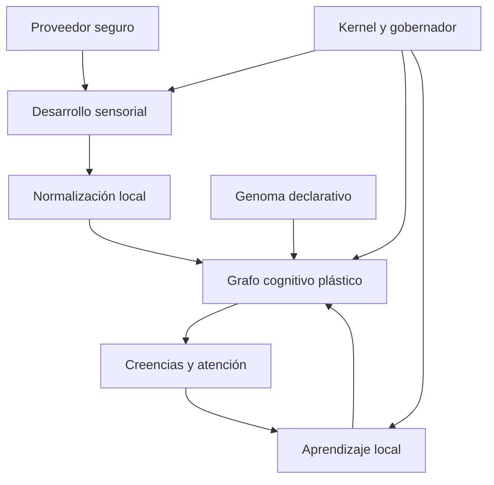
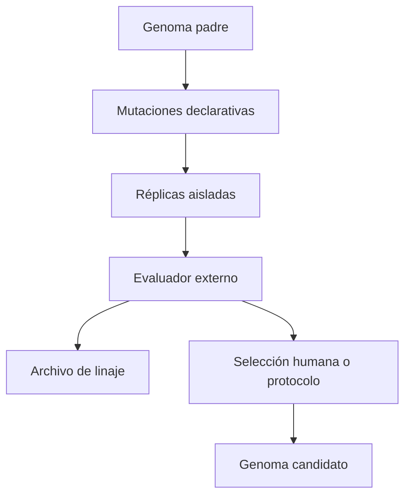

# Symbiont — diseño técnico de plasticidad endógena

**Estado:** propuesta implementable  
**Base analizada:** `main` en `924eff9e26a3b4b1aaa361984b467459b4e6f4cb` — Symbiont Lab v0.52.0  
**Fecha:** 14 de septiembre de 2026  
**Ámbito:** autoajuste de parámetros, red cognitiva plástica, plasticidad estructural y evolución entre generaciones  

## 1. Decisión ejecutiva

Symbiont no modificará su código Python residente. Su capacidad de autoprogramación se implementará como **plasticidad de datos bajo un kernel inmutable**:

```text
kernel gobernado e inmutable
        ↓ define límites
genoma declarativo y versionado
        ↓ configura el nacimiento
fenotipo plástico del individuo
        ↓ aprende durante su vida
estado dinámico por tick
```

El resultado será funcionalmente comparable a una red neuronal pequeña, recurrente, dispersa e interpretable, pero no será una red neuronal convencional. Aprenderá pesos, sesgos, umbrales, tasas de aprendizaje y estructura; podrá crear, debilitar, consolidar y podar conexiones. No podrá inventar operaciones ejecutables, abrir permisos, ampliar fuentes de observación ni alterar las reglas de seguridad.

La frontera esencial es:

> Symbiont puede cambiar **qué aprende, cuánto aprende y cómo organiza su cognición**, pero no puede cambiar **qué está autorizado a hacer**.

## 2. Objetivos y no objetivos

### Objetivos

1. Permitir que dos organismos con el mismo genoma desarrollen fenotipos distintos en entornos distintos.
2. Ajustar parámetros internos usando solo experiencia causalmente disponible para el organismo.
3. Construir una red dispersa entre sentidos, conceptos y estados internos.
4. Crear y podar estructura sin crecimiento ilimitado.
5. Separar aprendizaje durante la vida de evolución entre generaciones.
6. Mantener cada decisión explicable, reproducible y reversible.
7. Preservar checkpoints abstractos, acotados y sin telemetría cruda.
8. Medir utilidad fuera del organismo, sin filtrar verdad experimental hacia su cognición.

### No objetivos

- Generar, editar, importar o ejecutar Python, shell, WASM o bytecode.
- Escribir en el sistema operativo salvo el checkpoint autorizado y los registros ya aprobados.
- Aprender permisos, proveedores, rutas, comandos, destinos de red o acciones reales.
- Usar etiquetas del simulador, métricas del evaluador o juicio del operador como verdad directa.
- Sustituir el gobierno de consentimiento o recursos mediante parámetros aprendidos.
- Añadir propagación, descubrimiento de pares, control del host o remediación autónoma.
- Prometer equivalencia matemática con un transformer o una red profunda de propósito general.

## 3. Encaje con la arquitectura actual

La propuesta extiende lo existente en vez de crear un segundo organismo.

| Capacidad actual | Reutilización | Extensión propuesta |
| --- | --- | --- |
| `AdaptiveSenseModel` | Estados sensoriales, relaciones, tiers y límites | Convierte sentidos seleccionados en nodos de entrada y aporta señales de utilidad/fiabilidad |
| `OrganismRuntime` | Ciclo cognitivo único | Inserta activación, aprendizaje y consolidación en fases deterministas |
| `HostAcclimation` / `RhythmModel` | Normalidad y contexto | Producen errores de predicción locales, no etiquetas |
| `DriftAwareBaseline` | Cambio y régimen | Alimenta sorpresa y estabilidad del aprendizaje |
| Atención / second look | Presupuesto causal | Define qué nodos pueden actualizarse con evidencia adicional |
| `GovernedOrganism` | Consentimiento, frecuencia y ticks | Mantiene límites duros fuera del espacio aprendible |
| Checkpoint atómico | Persistencia segura | Añade genoma, grafo y metaparámetros con migración y cuotas |
| `symbiont_lab` | Evaluación externa | Ejecuta selección evolutiva sin importar desde `symbiont` |
| Observatory | Inspección pasiva | Visualiza activaciones, plasticidad y linaje sin enviar comandos |

La antigua rama sintética basada en `Observation` y cinco features semánticas debe mantenerse por compatibilidad experimental, pero no será la base del nuevo cerebro residente. La plasticidad residente consumirá nombres opacos `sense_*` y derivados internos.

## 4. Arquitectura lógica



### 4.1 Kernel inmutable

Código revisado que implementa:

- validación de genomas y checkpoints;
- catálogo cerrado de tipos de nodo y operadores;
- orden de ejecución;
- cuotas de CPU, memoria, nodos, aristas y mutaciones;
- consentimiento y capacidades permitidas;
- rollback y modo seguro;
- serialización, migración y auditoría;
- imposibilidad estructural de ejecutar código generado.

El kernel no forma parte del genoma y ningún peso puede alterar sus límites.

### 4.2 Genoma declarativo

Configuración heredable y mutable entre generaciones. Define rangos y predisposiciones, no decisiones concretas:

- límites iniciales de nodos y aristas;
- distribución inicial de pesos;
- tasa base y límites de plasticidad;
- ventanas de elegibilidad;
- umbrales de crecimiento, consolidación y poda;
- presupuesto de conceptos latentes;
- intensidad de homeostasis y olvido;
- probabilidad y magnitud de mutación generacional.

Un genoma es JSON validado contra esquema cerrado. No contiene rutas, importaciones, expresiones, callbacks ni texto ejecutable.

### 4.3 Fenotipo plástico

Estado aprendido del individuo:

- nodos activos;
- aristas y pesos;
- sesgos y umbrales;
- trazas de elegibilidad;
- estabilidad y edad;
- conceptos creados;
- metaparámetros aprendidos;
- historial agregado de mutaciones estructurales.

### 4.4 Estado dinámico

Activaciones del tick actual, errores de predicción y deltas pendientes. Es efímero y no se persiste como lectura histórica.

## 5. Modelo de red cognitiva

### 5.1 Tipos de nodo — catálogo cerrado

| Tipo | Entrada | Función | Persistencia |
| --- | --- | --- | --- |
| `SENSE` | Percepto opaco normalizado | Entrada sensorial | Sí, sin último valor |
| `CONCEPT` | Otros nodos | Representación latente emergente | Sí |
| `STATE` | Señales internas permitidas | Incertidumbre, novedad, estabilidad, energía cognitiva | Sí |
| `PREDICTOR` | Contexto previo | Predice una activación futura | Sí |
| `GATE` | Estado/atención | Modula paso de señal | Sí |
| `READOUT` | Conceptos/estado | Alimenta atención, creencias o narrativa | Sí |

No existe un nodo `ACTION`. Los readouts producen únicamente datos internos o recomendaciones ya gobernadas por el circuito consultivo existente.

### 5.2 Tipos de arista

- `EXCITATORY`: contribución positiva.
- `INHIBITORY`: contribución negativa.
- `PREDICTIVE`: de $t$ a una predicción de $t+1$.
- `GATING`: modulación acotada de otra activación.

Cada arista contiene:

```python
@dataclass(slots=True)
class PlasticEdge:
    source_id: str
    target_id: str
    kind: EdgeKind
    weight: float             # [-2.0, 2.0]
    plasticity: float         # [0.0, 1.0]
    eligibility: float        # estado efímero o cuantizado
    support: int
    age_ticks: int
    stable_ticks: int
    last_use_tick: int        # tiempo relativo, no real
```

### 5.3 Activación

Para cada nodo no sensorial:

$$
u_j(t)=b_j+\sum_i g_{ij}(t)\,w_{ij}\,a_i(t-d_{ij})
$$

$$
a_j(t)=\tanh\left(\frac{u_j(t)}{\tau_j}\right)
$$

Donde $g$ está acotado a $[0,1]$, $w$ a $[-2,2]$, el retardo inicial solo puede ser 0 o 1 tick y $\tau$ tiene rango validado. La actualización usa doble buffer para que el resultado no dependa del orden de los diccionarios.

### 5.4 Normalización sensorial

Los valores crudos nunca entran directamente en el grafo. Cada sentido produce una activación robusta relativa a su propia historia:

$$
z_i(t)=\operatorname{clip}\left(\frac{x_i(t)-\mu_i}{\max(\sigma_i,\epsilon)},-z_{max},z_{max}\right)
$$

$$
a_i(t)=\tanh(z_i(t)/s)
$$

El checkpoint guarda estadística agregada suficientemente protegida, no $x_i(t)$ ni la activación del último tick.

## 6. Aprendizaje durante la vida

El organismo aprende sin una etiqueta externa mediante tres señales locales.

### 6.1 Error de predicción

Cada predictor intenta anticipar un sentido o concepto a un tick:

$$e_j(t)=a_j(t)-\hat a_j(t)$$

Pérdida local robusta:

$$L_{pred}=\operatorname{Huber}(e_j)$$

La sorpresa es informativa, pero no equivale a amenaza ni a utilidad.

### 6.2 Plasticidad hebbiana estabilizada

Las aristas descriptivas actualizan con una variante Oja acotada:

$$
\Delta w_{ij}=\eta_{ij}\,m(t)\,[a_i a_j-a_j^2 w_{ij}]
$$

$m(t)$ combina disponibilidad, calidad, atención y salud perceptual. Nunca contiene ground truth.

### 6.3 Trazas de elegibilidad

Para no atribuir un cambio futuro a cualquier señal pasada:

$$
q_{ij}(t)=\lambda q_{ij}(t-1)+a_i(t-1)a_j(t)
$$

Solo las aristas observadas dentro de la ventana causal y seleccionadas por atención pueden recibir una actualización completa. Esto conserva el principio actual de causalidad por prefijo.

### 6.4 Objetivo interno compuesto

No se optimiza un único número global oculto. El kernel calcula un vector observable:

```text
prediction_error      ↓
representation_cost  ↓
instability          ↓
information_retained ↑
calibration          ↑
```

Las decisiones de ajuste usan dominancia de Pareto o reglas explícitas; una mejora de predicción no puede justificar un crecimiento descontrolado.

### 6.5 Metaplasticidad

Los siguientes parámetros pueden aprenderse lentamente dentro de rangos fijados por el genoma:

- `learning_rate` por familia de aristas;
- `forgetting_rate`;
- `activation_temperature`;
- `attention_novelty_weight`;
- `attention_uncertainty_weight`;
- `consolidation_threshold`;
- `pruning_threshold`;
- `exploration_fraction`.

Cada parámetro mantiene valor, rango, velocidad máxima de cambio y evidencia acumulada. La actualización sigue una comparación contrafactual local de dos ventanas —antes/después— y se revierte si empeora estabilidad o coste sin mejora suficiente.

No son aprendibles: consentimiento, rutas autorizadas, máximos duros, intervalo mínimo, advisory consent, operadores permitidos, formatos de persistencia ni fronteras de paquetes.

## 7. Plasticidad estructural

### 7.1 Creación de aristas

Una arista candidata aparece solo si:

1. ambos nodos existen y están sanos;
2. han co-activado o mostrado precedencia al menos `min_candidate_support` veces;
3. la relación aporta información condicional respecto a aristas existentes;
4. hay presupuesto estructural;
5. no duplica una arista ya consolidada;
6. pasa el enfriamiento de mutaciones.

Nace como `tentative`, con peso pequeño y vida limitada. Solo se consolida si reduce error fuera de la ventana que la creó.

### 7.2 Creación de conceptos

Un `CONCEPT` puede nacer al detectar un conjunto estable de dos a cuatro nodos que:

- co-varían de manera repetida;
- no son meramente redundantes;
- mejoran la compresión o predicción;
- aparecen en más de un contexto temporal.

El concepto recibe un ID opaco derivado de un identificador aleatorio persistente —no del contenido ni de rutas— y conexiones iniciales normalizadas. No recibe una etiqueta semántica inventada. La narrativa puede llamarlo `concept_7f3a` y describir sus relaciones observadas.

### 7.3 Poda

Una arista se poda cuando combina bajo uso, bajo peso, baja contribución y suficiente edad. Un nodo se poda solo si no está protegido y queda sin contribución útil. La poda es gradual:

```text
active → weak → quarantined → removed
```

`quarantined` deja una ventana de recuperación y permite rollback. Los sentidos conocidos no se eliminan del modelo sensorial por la poda cognitiva; vuelven a la política dormant/probing existente.

### 7.4 Consolidación y sueño computacional

No habrá ejecución clandestina en segundo plano. La consolidación es una fase explícita y acotada al final de ciertos ticks autorizados. Usa únicamente acumuladores agregados y estado plástico, nunca replays de telemetría cruda.

Máximos iniciales recomendados:

| Recurso | Límite inicial |
| --- | ---: |
| Nodos totales | 128 |
| Conceptos | 32 |
| Aristas | 1.024 |
| Aristas tentativas | 128 |
| Mutaciones estructurales por consolidación | 8 |
| Consolidaciones | 1 cada 32 ticks |
| Retardo de arista | 0–1 tick |
| Memoria del checkpoint plástico | 2 MiB |

## 8. Evolución entre generaciones

La evolución pertenece a `symbiont_lab`, no al organismo residente. Un individuo no se reproduce ni se despliega a sí mismo.

### 8.1 Flujo



### 8.2 Mutaciones admitidas

- perturbación pequeña de valores continuos;
- activación/desactivación de predisposiciones opcionales;
- cambio acotado de presupuestos blandos;
- duplicación o retirada de una plantilla de concepto inicial;
- cambio de probabilidades de crecimiento/poda.

No puede mutarse el esquema, catálogo de operadores, máximos absolutos, política de permisos ni kernel.

### 8.3 Evaluación multientorno

Cada genoma se prueba con semillas emparejadas en varios regímenes y se mide externamente:

- error predictivo posterior al calentamiento;
- adaptación a cambio de régimen;
- retención tras ausencia y rediscovery;
- calibración de incertidumbre;
- coste de muestreo y cómputo;
- tamaño/rotación del grafo;
- diversidad fenotípica;
- resistencia a ruido, señales constantes y señales señuelo;
- estabilidad de checkpoint/restart.

La selección nunca alimenta al individuo con la etiqueta de si “ganó”. Produce un nuevo genoma para otro nacimiento.

## 9. Ciclo exacto de un tick

1. `GovernedOrganism` comprueba consentimiento, frecuencia y presupuesto.
2. El proveedor descubre/muestrea únicamente superficies autorizadas.
3. `AdaptiveSenseModel` actualiza salud, relaciones y plan de muestreo.
4. Se normalizan lecturas seleccionadas a activaciones opacas.
5. El grafo ejecuta propagación con el estado de $t-1$ y doble buffer.
6. Se generan predicciones, estados y readouts internos.
7. Atención decide investigación dentro de su presupuesto.
8. Si procede, second look aporta evidencia autorizada.
9. Se actualizan trazas y pesos locales.
10. Se actualizan metaparámetros solo si ha vencido su ventana.
11. Si corresponde, consolidación propone y valida mutaciones estructurales.
12. Se construyen creencias/narrativa y snapshot pasivo.
13. Se incrementa el tick.
14. El servicio residente guarda checkpoint atómico según su política explícita.

Si cualquier fase excede cuota o falla validación, se descarta el delta completo del tick plástico; el estado anterior permanece válido.

## 10. Contratos Python propuestos

```python
class CognitiveGraph:
    def activate(self, inputs: Mapping[str, float], context: TickContext) -> GraphFrame: ...
    def learn(self, frame: GraphFrame, evidence: LocalEvidence) -> LearningDelta: ...
    def apply(self, delta: LearningDelta, limits: PlasticityLimits) -> None: ...

class StructuralPlasticity:
    def propose(self, state: PlasticState, summary: LearningSummary) -> tuple[Mutation, ...]: ...
    def validate(self, mutation: Mutation, limits: StructuralLimits) -> ValidationResult: ...

class MetaPlasticity:
    def propose(self, windows: MetaWindows, genome: Genome) -> tuple[ParameterDelta, ...]: ...

class GenomeCodec:
    def load(self, payload: Mapping[str, object]) -> Genome: ...
    def validate(self, genome: Genome, kernel_limits: KernelLimits) -> None: ...

class PlasticCheckpointCodec:
    def export(self, state: PlasticState) -> dict[str, object]: ...
    def restore(self, payload: Mapping[str, object]) -> PlasticState: ...
```

Nuevos módulos sugeridos:

```text
src/symbiont/cognition/
  graph.py
  activation.py
  learning.py
  structure.py
  metaplasticity.py
  genome.py
  limits.py
  checkpoint.py

src/symbiont_lab/evolution/
  mutation.py
  evaluation.py
  selection.py
  lineage.py
```

`symbiont/cognition` no importa `symbiont_lab`; la regla AST existente debe ampliarse para demostrarlo.

## 11. Esquema de genoma

Ejemplo ilustrativo:

```json
{
  "schema_version": 1,
  "genome_id": "genome_018f...",
  "parent_ids": [],
  "kernel_compatibility": ">=0.55,<0.60",
  "development": {
    "initial_concepts": 4,
    "soft_node_budget": 64,
    "soft_edge_budget": 384,
    "consolidation_interval_ticks": 32
  },
  "plasticity": {
    "learning_rate": {"initial": 0.02, "min": 0.001, "max": 0.08},
    "forgetting_rate": {"initial": 0.0005, "min": 0.0, "max": 0.005},
    "eligibility_decay": 0.92
  },
  "structure": {
    "grow_threshold": 0.18,
    "prune_threshold": 0.01,
    "minimum_support": 16,
    "tentative_lifetime_ticks": 128
  },
  "mutation_policy": {
    "continuous_sigma": 0.05,
    "max_fields_per_generation": 3
  }
}
```

La compatibilidad es validada por código; no se interpreta como una expresión ejecutable. Los IDs no contienen identidad del host.

## 12. Checkpoint y privacidad

El checkpoint pasa a esquema v3 mediante migración explícita y contiene:

- tick relativo;
- estado agregado actual ya permitido;
- hash e identidad del genoma;
- nodos persistentes sin activación reciente;
- aristas con pesos cuantizados, soporte, edad y estabilidad;
- metaparámetros y evidencia agregada por ventana;
- contadores de estructura y versión del kernel.

No contiene:

- última lectura o activación exacta;
- historial por tick;
- rutas, nombres de dispositivo o identificadores de host;
- timestamps reales de las muestras;
- deltas reversibles que permitan reconstruir una secuencia;
- etiquetas del evaluador.

Para reducir reconstrucción indirecta, medias y pesos se cuantizan a precisión declarada, los acumuladores con soporte insuficiente no se exportan y se prueba empíricamente que dos secuencias distintas no puedan recuperarse del payload más allá de las estadísticas publicadas. El límite de 2 MiB se valida antes de la escritura atómica.

## 13. Gobierno y seguridad

### Invariantes no negociables

1. El kernel define máximos duros compilados/configurados por propietario.
2. Todo cambio plástico es un delta de datos validado y transaccional.
3. Ningún campo aprendido se usa como ruta, nombre de módulo, comando o permiso.
4. El grafo solo puede invocar operadores puros del catálogo cerrado.
5. El organismo no puede crear threads, procesos, sockets ni timers.
6. La residencia sigue siendo visible, revocable y user-owned.
7. Observatory consume snapshots y nunca publica órdenes.
8. Ante checkpoint inválido se falla de forma visible; no se reinicia silenciosamente.
9. Tres fallos plásticos consecutivos activan `safe_mode`: red congelada, percepción y checkpoint básico continúan.
10. Rollback conserva el último checkpoint validado y una única versión anterior —con cuota fija.

### Amenazas específicas y mitigación

| Riesgo | Mitigación |
| --- | --- |
| Explosión de nodos/aristas | Cuotas duras, mutaciones por lote y coste de complejidad |
| Oscilación de pesos | Oja, clipping, temperatura mínima y detector de inestabilidad |
| Catastrophic forgetting | Consolidación, ritmos, rehearsal agregado y tasa máxima de olvido |
| Ceguera por poda temprana | Estados dormant/probing y cuarentena antes de borrar |
| Atajo hacia una señal espuria | Evaluación por ventanas futuras y diversidad de contextos |
| Fuga de ground truth | Frontera de paquetes y tests AST/data-flow |
| Reconstrucción de telemetría | Sin últimas muestras, cuantización, soporte mínimo y auditoría diferencial |
| Genoma hostil o corrupto | Esquema cerrado, firma opcional, rangos y kernel compatibility |
| Fitness hacking | Métricas múltiples, escenarios ocultos al genoma y selección externa |
| Cambio que degrada al individuo | Deltas transaccionales, canary interno y rollback |

## 14. Observabilidad

El snapshot del Observatory incorporará datos agregados:

- tamaño del grafo y ocupación de cuotas;
- nodos por tipo y estado;
- aristas creadas, consolidadas, en cuarentena y podadas;
- distribución de pesos en bins;
- error predictivo EWMA;
- estabilidad y tasa de cambio;
- metaparámetros actuales con rango permitido;
- conceptos dominantes por activación cuantizada;
- diferencias respecto al genoma de nacimiento;
- modo normal, frozen o safe mode;
- linaje en experimentos generacionales.

No se emitirán lecturas crudas ni activaciones precisas por sentido. Para el replay se guardan snapshots de observatorio ya minimizados, no el estado cognitivo privado completo.

## 15. Estrategia de pruebas

### Unitarias

- activación determinista y orden-independiente;
- clipping y ausencia de NaN/inf;
- actualización Oja y trazas;
- creación, consolidación, cuarentena y poda;
- rangos de metaparámetros;
- validación exhaustiva de genoma;
- serialización y migración v2→v3.

### Propiedades e invariantes

- para cualquier entrada finita, todo estado permanece finito y acotado;
- nodos, aristas, memoria y mutaciones nunca superan cuotas;
- cambiar el orden de nodos/aristas no cambia el resultado;
- restaurar y continuar equivale a una ejecución ininterrumpida desde el punto seguro;
- el mismo genoma, mundo y semillas produce el mismo digest;
- variar solo la semilla de mutación no altera el mundo;
- ningún payload contiene valores o identificadores prohibidos.

### Integración

- `OrganismRuntime` completo con red vacía y red madura;
- retirada y reaparición de sentidos;
- cambio de régimen prolongado;
- fallo durante aplicación de un delta;
- checkpoint en límite de tamaño;
- safe mode y recuperación explícita;
- Observatory acepta snapshots nuevos y antiguos.

### Integridad experimental

- `symbiont` nunca importa `symbiont_lab`;
- evaluador y etiquetas no son alcanzables desde cognición;
- streams RNG separados para mundo, inicialización, exploración y mutación;
- seeds emparejadas entre genomas;
- prefijo causal: alterar el futuro no cambia decisiones pasadas;
- ninguna métrica de fitness aparece en checkpoints del individuo.

### Ensayos adversarios

- señal constante, ruido blanco, contador enorme y overflow;
- 256 señales redundantes;
- alternancia diseñada para provocar crecimiento/poda;
- checkpoint antiguo, truncado, sobredimensionado y con tipos maliciosos;
- genoma con valores extremos, claves desconocidas y profundidad excesiva;
- 100.000 ticks sintéticos verificando memoria constante y deriva estructural acotada.

## 16. Métricas de éxito

| Dimensión | Métrica | Criterio inicial |
| --- | --- | --- |
| Aprendizaje | Error predictivo vs baseline no plástico | Mejora mediana ≥10% en regímenes aprendibles |
| Adaptación | Recuperación tras regime shift | Vuelve al rango estable sin reset |
| Diferenciación | Distancia de grafos entre hosts | Mayor entre entornos distintos que entre réplicas iguales |
| Estabilidad | Tasa de churn estructural madura | <2% de aristas por 1.000 ticks |
| Eficiencia | Tiempo por tick | p95 bajo presupuesto configurado |
| Memoria | Tamaño residente/checkpoint | Siempre bajo cuotas |
| Robustez | Seeds sin NaN, overflow o violación | 100% |
| Privacidad | Lecturas exactas reconstruibles | Ninguna fuera de estadística declarada |
| Reproducibilidad | Digest repetido | Igual bit a bit en plataforma compatible |

Una red más grande no cuenta como éxito. La mejora debe persistir fuera de la ventana que provocó el cambio y pagar su coste de complejidad.

## 17. Plan de versiones y PRs

### Prerrequisitos ya previstos

| Versión | Entrega |
| --- | --- |
| v0.53 | Automodelo de coste, salud y confianza perceptual |
| v0.54 | Maduración larga: envejecimiento, olvido y rediscovery acotados |

### Nuevo Milestone — Plasticidad endógena

| Versión | PR principal | Resultado verificable |
| --- | --- | --- |
| v0.55 | Kernel de genoma | Esquema cerrado, límites, codec, identidad y checkpoint v3 |
| v0.56 | Grafo cognitivo | Nodos/aristas, activación recurrente determinista y readouts internos |
| v0.57 | Aprendizaje sin etiqueta | Predicción local, Oja, elegibilidad y adaptación de pesos |
| v0.58 | Metaplasticidad y estructura | Parámetros lentos, conceptos emergentes, consolidación, poda y rollback |
| v0.59 | Evolución de laboratorio | Mutación generacional, evaluación multientorno, linaje y visualización |

Cada versión debe ser útil de forma aislada. No se fusionará una red “vacía” que solo cobre sentido al final: v0.56 tendrá inicialización determinista y observabilidad; v0.57 demostrará aprendizaje de pesos antes de permitir crecimiento estructural.

### Orden detallado recomendado

1. ADR: kernel fijo, genoma declarativo y frontera no ejecutable.
2. Tipos, límites y validador de genoma.
3. Checkpoint v3 y migración, antes de producir nuevo estado.
4. Grafo estático con activación y snapshots.
5. Predictor local y benchmark contra baseline.
6. Plasticidad de pesos con rollback.
7. Metaparámetros dentro de rangos.
8. Aristas tentativas y consolidación.
9. Conceptos emergentes y poda.
10. Safe mode y pruebas de larga residencia.
11. Mutación/selección exclusivamente en laboratorio.
12. Observatory de fenotipo y linaje.

## 18. Criterios de aceptación del milestone

El milestone se considera cerrado solo si:

1. Dos individuos con el mismo genoma y experiencias diferentes terminan con grafos diferentes de manera reproducible.
2. Un individuo reduce error predictivo o coste en al menos un protocolo preregistrado sin recibir etiquetas externas.
3. Puede crear y podar estructura, y el uso de memoria permanece constante respecto al tiempo.
4. Todo parámetro aprendido permanece dentro de límites no aprendibles.
5. Ninguna mutación modifica permisos, proveedores o comportamiento real del host.
6. Checkpoint/restart conserva el fenotipo sin conservar la última lectura.
7. Un fallo de plasticidad revierte el tick y puede activar safe mode sin perder el organismo básico.
8. Observatory explica qué cambió y por qué con evidencia agregada.
9. La evolución ocurre solo en ejecuciones de laboratorio explícitas.
10. Las suites de integridad demuestran que ground truth, fitness y juicios humanos no entran en cognición.

## 19. Decisiones abiertas antes de implementar

Solo quedan cuatro decisiones de producto, no bloqueos técnicos:

1. **Identidad:** si el genoma debe considerarse especie, familia o simplemente configuración de nacimiento.
2. **Herencia:** si una nueva generación hereda solo genoma o también una pequeña estructura consolidada. Recomendación: primero solo genoma; añadir herencia de estructura después de demostrar que no transmite atajos espurios.
3. **Selección:** automática por protocolo Pareto o aprobación humana de cada nuevo genoma. Recomendación: archivo automático, activación humana.
4. **Narrativa:** si el Observatory puede asignar alias humanos locales a conceptos opacos. Recomendación: alias solo en el aparato, nunca dentro del organismo.

## 20. Recomendación final

La primera implementación debe detenerse en **autoprogramación declarativa**, no en autoedición de código. Es suficiente para que Symbiont cambie profundamente su comportamiento, desarrolle una arquitectura cognitiva propia y funcione como una red adaptativa. Además conserva lo más valioso del proyecto: podemos inspeccionar de dónde salió cada capacidad, medirla sin contaminarla y apagarla sin perder el control del sistema.

La secuencia correcta es:

```text
v0.53 automodelo
→ v0.54 maduración
→ v0.55 genoma seguro
→ v0.56 grafo recurrente
→ v0.57 aprendizaje de pesos
→ v0.58 estructura y metaplasticidad
→ v0.59 evolución en laboratorio
→ v0.60 cooperación entre individuos
```

Así, cuando llegue la cooperación, no intercambiarán instancias idénticas con distinta memoria. Interactuarán individuos con fenotipos realmente distintos, nacidos de la misma especie técnica pero desarrollados por su propia experiencia.
