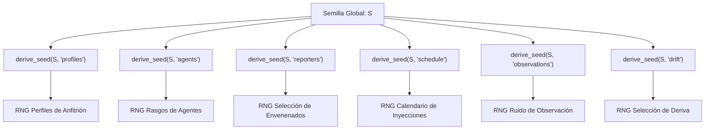

# Epistemological Fundamentals and Mathematical Framework of Symbiont

> **Status:** IMPLEMENTED  
> **Type:** FORMAL SPECIFICATION OF BOUNDARIES AND CODE IDENTITIES  
> **Related modules:** [`symbiont.core.model`](../../src/symbiont/core/foundation/model.py), [`symbiont.environment.rng`](../../src/symbiont/environment/rng.py), [`symbiont.environment.world`](../../src/symbiont/environment/world.py)

---

## 1. Introduction and Epistemological Philosophy

The **Symbiont** project approaches adaptive cognition and synthetic ecology under a fundamental design constraint: **cognition must operate in complete absence of direct ground truth labels about its environment**.

Unlike classical paradigms of supervised learning or reinforcement learning with precalculated extrinsic rewards, the organism in Symbiont:

1. Does not receive labels that classify events as benign or pathogenic.
2. Does not have access to loss functions that compare its internal states with the global state of the simulator or the operating system.
3. Does not possess actuators that execute modifications on the host system.

The purpose of this mathematical framework is to formalize how an adaptive system constructs consistent representations, detects anomalies, allocates finite attention budgets, and coordinates collectively based solely on local, descriptive, and resource-limited statistical signals.

---

## 2. Formal Definition of Spaces and Variables

### 2.1 Environment / Host Signal Space ($\mathcal{X}$)

Let $\mathcal{X} \subseteq \mathbb{R}^D$ be the space of observable signals from the environment or host. For the canonical synthetic case ($D=5$), the observation vector at time $t$ is defined in [`Observation`](../../src/symbiont/core/foundation/model.py):

$$\mathbf{x}(t) = \begin{pmatrix} x_{\text{cpu}}(t) \\ x_{\text{net}}(t) \\ x_{\text{file}}(t) \\ x_{\text{proc}}(t) \\ x_{\text{persist}}(t) \end{pmatrix} \in [0, 1]^5$$

For the real host case ([`symbiont.host`](../../src/symbiont/host)), the space is composed of a dynamic and open set of capabilities $C = \{c_1, c_2, \dots, c_K\}$, where each capability produces readings $x_{c_k}(t) \in \mathbb{R} \cup \{\emptyset\}$ associated with physical units and declarative privacy policies.

### 2.2 Percept Space and Opaque Names ($\mathcal{S}$)

Cognition does not interact directly with file system paths, process names, or semantic platform identifiers. There is a measurable projection:

$$\phi: \mathcal{X} \to \mathcal{S}$$

where $\mathcal{S} \subseteq [-1, 1]^M$ is the space of normalized percepts. In the adaptive discovery subsystem, identifiers are transformed into opaque labels through a truncated deterministic hash:

$$\text{sense\_id} = \operatorname{SHA-256}(\text{"symbiont-sense:"} \parallel c_k)_{[0:12]}$$

> **Security and Cryptography Note (Design Heuristic):**  
> Truncating SHA-256 to 12 hexadecimal characters (48 bits of entropy) **does not constitute a mathematical guarantee of anonymization in itself**. If the space of known capabilities is small (for example, standard `/proc` metrics), a dictionary attack can reverse the mapping. Its function in the architecture is to generate opaque identifiers to decouple the host's semantics from the organism's reasoning rules. True privacy protection comes from the isolation boundaries of the reading provider ([`symbiont.host.contracts`](../../src/symbiont/host/contracts.py)), which restricts which observation surfaces can be queried.

### 2.3 Epistemic States and Belief Space ($\mathcal{B}$)

The local belief state space for a sensory pattern is defined as a bounded manifold:

$$\mathcal{B} = \left\{ (p, e, c) \in [0, 1] \times [0, E_{\max}] \times [0, 1] \right\}$$

where:

- $p \in [0, 1]$ is the subjective probability assigned to the pattern.
- $e \in [0, E_{\max}]$ is the accumulated evidence mass ($E_{\max} = 32.0$).
- $c \in [0, 1]$ is the exponential memory of historical conflict and inconsistency.

### 2.4 Evaluator Ground Truth Space ($\mathcal{Y}^*$)

Exclusive to the simulator and the experimental laboratory ([`symbiont_lab`](../../src/symbiont_lab) and [`symbiont.simulation`](../../src/symbiont/simulation)):

$$\mathcal{Y}^* = \{0, 1\} \times \Omega_{\text{fam}}$$

where $y^* \in \{0, 1\}$ indicates whether the event is objectively a synthetic threat or benign, and $\omega \in \Omega_{\text{fam}}$ describes the generating ontological family (e.g., `benign:backup`, `pathogen:ransom_sim`).

---

## 3. Structural Invariant of Epistemological Non-Interference

> **Classification:** PROPOSITION / ARCHITECTURAL INVARIANT ENFORCED BY AST

Unlike a classical probabilistic theorem, Symbiont's isolation is a **deterministic property of non-interference and structural measurability**.

### 3.1 Formalization by Projections of Sequential Histories

Let a complete history of the experimental universe up to tick $t$ be a **temporally ordered sequence**:

$$h = \big( e(0), e(1), \dots, e(t) \big) \in \mathcal{H}_{\text{sim}}(t)$$

where each element of the sequence $e(\tau) = \big(o_{\text{org}}(\tau), u_{\text{sim}}(\tau)\big)$ decomposes the tuple of step $\tau$ into:

- The observations accessible to the organism: $o_{\text{org}}(\tau) = \big(\mathbf{x}(\tau), \mathbf{r}_{\text{coll}}(\tau)\big)$ (local sensor readings and received collective reports).
- The latent variables exclusive to the simulator: $u_{\text{sim}}(\tau) = \big(y^*(\tau), \omega(\tau), \theta_{\text{world}}(\tau)\big)$ (ground truth, ontological families, and synthetic generator dynamics).

Let $\pi_{\text{org}}: \mathcal{H}_{\text{sim}}(t) \to \mathcal{H}_{\text{org}}(t)$ be the canonical projection that extracts the observable subsequence:

$$\pi_{\text{org}}(h) = \big( o_{\text{org}}(0), o_{\text{org}}(1), \dots, o_{\text{org}}(t) \big)$$

**Definition (Deterministic Epistemological Non-Interference):**  
Let the following be fixed identically:

1. The initial internal state of the organism $s_0 \in \mathcal{S}_{\text{org}}$,
2. The configuration hyperparameter vector $\theta_{\text{cfg}}$,
3. The seed and internal pseudorandom stream of the organism $\omega_{\text{org}} \in \Omega_{\text{org}}$.

The organism's global decision function at time $t$, $D_t: \mathcal{H}_{\text{sim}}(t) \to \mathcal{A}$, is defined as the composition:

$$D_t(h) = f_t\Big( \pi_{\text{org}}(h); \; s_0, \theta_{\text{cfg}}, \omega_{\text{org}} \Big)$$

where $f_t: \mathcal{H}_{\text{org}}(t) \to \mathcal{A}$ is the organism's deterministic internal update and policy function. Consequently, for any pair of global simulation histories $h_1, h_2 \in \mathcal{H}_{\text{sim}}(t)$:

$$\pi_{\text{org}}(h_1) = \pi_{\text{org}}(h_2) \implies D_t(h_1) = D_t(h_2)$$

Regardless of how the simulator's hidden ground truth ($u_{\text{sim}}$) differs, if the projection of readings and reports reaching the sensory boundary is identical step by step, the trajectory of beliefs, neural activations, and attention decisions is identical bit by bit.

```text
  ┌────────────────────────────────────────────────────────┐
  │                 SIMULADOR / ENTORNO                    │
  │  Ground Truth: y* ∈ {0, 1}, Etiquetas, Parámetros      │
  └───────────────────────────┬────────────────────────────┘
                              │ Emite únicamente
                              ▼
  ┌────────────────────────────────────────────────────────┐
  │              SUPERFICIE SENSORIAL (READ-ONLY)          │
  │  Lecturas crudas desacopladas: x_i(t)                   │
  └───────────────────────────┬────────────────────────────┘
                              │ Proyección π_org
                              ▼
  ┌────────────────────────────────────────────────────────┐
  │                 ORGANISMO (symbiont)                   │
  │  Perceptos: s_i(t) = tanh(z_clip / s)                  │
  │  Creencias: P(θ) basadas solo en consistencia local    │
  │  Atención: Bounded Greedy Knapsack                     │
  │  Sin imports hacia symbiont_lab (Verificado por AST)   │
  └───────────────────────────┬────────────────────────────┘
                              │ Telemetría pasiva
                              ▼
  ┌────────────────────────────────────────────────────────┐
  │             APARATO CIENTÍFICO (symbiont_lab)          │
  │  Brier Score, ECE, Causal Selection, ROC/AUC, Tests    │
  └────────────────────────────────────────────────────────┘
```

### 3.2 Architectural Discipline and Verification in the Repository

It is necessary to distinguish between a static code check and the full mathematical property:

- **Architectural Hygiene:** The static AST dependency analysis ([`test_ground_truth_boundary.py`](../../tests/experimental_integrity/test_ground_truth_boundary.py)) verifies that the `symbiont` package never imports symbols from `symbiont_lab`. Likewise, the simulator wrappers ([`SimulatedEvent`](../../src/symbiont/environment/world.py)) unpack and deliver only `event.observation` to `agent.observe()`, discarding `truth_label`.
- **Sufficient Condition:** The static verification of imports is an indispensable defense-in-depth mechanism to preserve the architecture, but the full non-interference property additionally requires fixing the internal determinism $(s_0, \theta_{\text{cfg}}, \omega_{\text{org}})$ and guaranteeing the orthogonality of the pseudorandom number streams (§4).

---

## 4. Pseudorandom Stream Algebra and Causal Orthogonality

> **Classification:** PROPOSITION / EXPERIMENTAL DESIGN SPECIFICATION

In experimental studies, evaluating the impact of an intervention (e.g., varying the fraction of poisoned agents $\rho \in [0, 0.20]$ or introducing a drift regime) requires that the intervention **does not collaterally alter** the random number sequence assigned to other parts of the system.

If a global linear pseudorandom generator or Mersenne Twister were used:
$$X_{n+1} = f(X_n)$$
an additional draw to select poisoned agents would shift the global pointer, changing the host profiles, noise values, and subsequent observations. This would destroy experimental *pairing* and attribute differences caused by spurious random fluctuations to the treatment.

### 4.1 Deterministic Seed Derivation

Symbiont solves this problem through a cryptographic derivation tree of independent seeds ([`symbiont.environment.rng.derive_seed`](../../src/symbiont/environment/rng.py#L8-L18)):

Given an experimental seed integer $S \in \mathbb{N}$ and a textual namespace $N \in \mathcal{S}_{\text{names}}$ (e.g., `"profiles"`, `"agents"`, `"reporters"`, `"schedule"`, `"observations"`, `"drift"`):

$$S_N = \operatorname{BytesToInt}_{128}\Big( \operatorname{SHA-256}\big( \text{"symbiont-lab:"} \parallel \operatorname{str}(S) \parallel \text{":"} \parallel N \big)_{[0:16]} \Big)$$



### 4.2 Interventionist Invariance Property

**Proposition (Invariance by Stream Isolation):**  
Let two experimental replicas $R_1$ and $R_2$ be initialized with the same base seed $S$, where $R_2$ incorporates an intervention in the poisoning stream (`"reporters"`).

Since the streams `"profiles"`, `"schedule"`, and `"observations"` are instantiated from their respective derived seeds $S_{\text{profiles}}$, $S_{\text{schedule}}$, and $S_{\text{observations}}$, it identically holds that:

$$\mathbf{x}_{\text{world}}^{(R_1)}(t) = \mathbf{x}_{\text{world}}^{(R_2)}(t) \quad \forall t < t_{\text{intervención}}$$

Any divergence observed in the belief trajectories between $R_1$ and $R_2$ is attributable with total methodological certainty to the intervention, and not to a desynchronization of the simulation streams.
