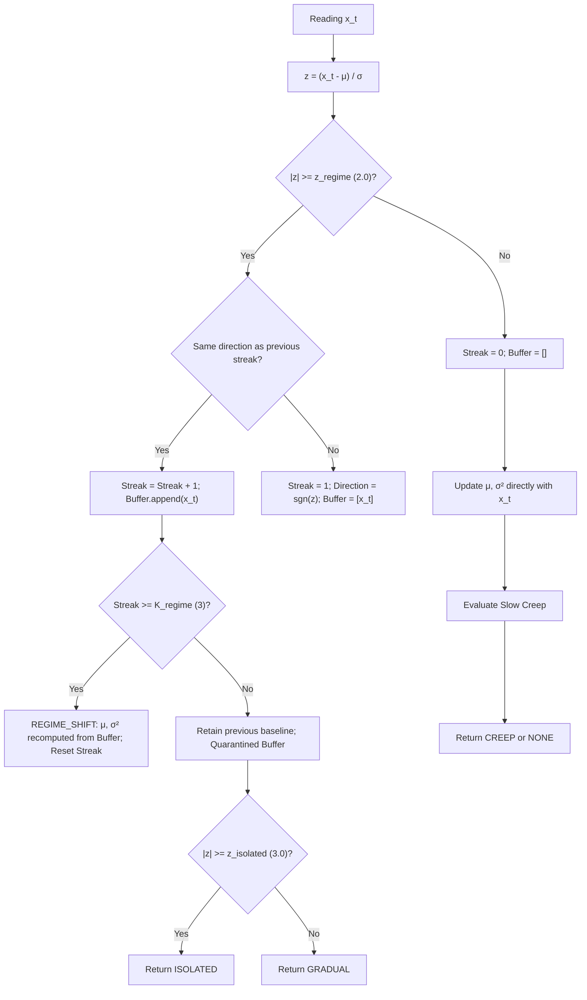

# Drift, Regime Shift, and Rhythm Modeling Detection

> **Status:** IMPLEMENTED  
> **Type:** CODE IDENTITY AND STOCHASTIC MODELING  
> **Related modules:** [`symbiont.host.drift`](../../src/symbiont/host/drift.py), [`symbiont.host.rhythms`](../../src/symbiont/host/rhythms.py)

---

## 1. The Problem of Non-Stationarity in Host Signals

In a complex operating system or synthetic environment, signals do not behave as independent and identically distributed (i.i.d.) stationary processes. Three qualitative classes of variation are observed:

1. **Isolated Spikes:** Transient deviations of high magnitude but ephemeral duration (e.g., a CPU burst due to a punctual fork). The model must resist the temptation to shift its mean towards the spike.
2. **Regime Shift:** Permanent structural modification of the activity level (e.g., startup of a database service or phase transition in the simulator). The model must discard the pre-shift history and re-center quickly on the new level.
3. **Slow Creep:** Progressive displacement with small increments per tick (e.g., a gradual resource leak) that never crosses the abrupt anomaly thresholds in an isolated step, but whose sustained accumulation transforms the normality of the system.

[`DriftAwareBaseline`](../../src/symbiont/host/drift.py) and [`RhythmModel`](../../src/symbiont/host/rhythms.py) implement the mathematical machinery to manage these dynamics.

---

## 2. Stochastic EWMA Filter for Adaptive Dispersion

> **Classification:** CODE IDENTITY / WEIGHTED DISPERSION ESTIMATOR

In the absence of active atypical deviations, the baseline is updated via an exponentially weighted moving average filter with learning rate $\lambda \in (0, 1]$ (default $\lambda = 0.10$):

$$\Delta_t = x_t - \mu_{t-1}$$
$$\mu_t = \mu_{t-1} + \lambda \cdot \Delta_t$$

### 2.1 Difference Equation of the Weighted Variance

Symbiont simultaneously tracks a quadratic dispersion measure via the recursion:

$$\sigma_t^2 = (1 - \lambda) \cdot \left( \sigma_{t-1}^2 + \lambda \cdot \Delta_t^2 \right)$$

#### 2.2 Properties and Consistency Nuance

This formulation algebraically guarantees non-negativity ($\sigma_t^2 \ge 0$) at all times if $\sigma_0^2 \ge 0$.

> **Statistical Rigor Nuance (EWMA Dispersion vs. Asymptotic Estimator):**  
> Unlike the classical Welford sample variance, this recursion computes the residuals with respect to the previous moving average $\mu_{t-1}$. Because the learning rate $\lambda \in (0, 1]$ is fixed and non-decreasing ($\sum \lambda_t = \infty, \sum \lambda_t^2 = \infty$), $\sigma_t^2$ **does not generally converge to a deterministic scalar constant** (except in the particular case $\lambda = 1$, where the recurrence identically collapses to zero variance: $\sigma_t^2 = (1-1)(\dots) = 0$) when observations come from a noisy stochastic process; in steady state for $\lambda \in (0, 1)$, $\sigma_t^2$ is a random variable that retains continuous sample fluctuations around its expected value. Furthermore, it presents a structural bias conditioned on $\lambda$ and the autocorrelation of the series. For Symbiont, it acts as a moving adaptive local dispersion scale, not as an unbiased estimator of statistical convergence.

---

## 3. Standardized Deviation Score ($Z$-Score) and Heuristic Thresholds

> **Classification:** STANDARDIZED DETECTION HEURISTIC

For each new observation $x_t$, before incorporating it into the baseline, the standardized score with respect to the previous state is calculated:

$$z(x_t) = \begin{cases}
0.0 & \text{if } \sigma_{t-1} = 0 \land x_t = \mu_{t-1} \\
+\infty & \text{if } \sigma_{t-1} = 0 \land x_t > \mu_{t-1} \\
-\infty & \text{if } \sigma_{t-1} = 0 \land x_t < \mu_{t-1} \\
\frac{x_t - \mu_{t-1}}{\sigma_{t-1}} & \text{if } \sigma_{t-1} > 0
\end{cases}$$

The classification thresholds are defined:
- $z_{\text{regime}} = 2.0$: Threshold to consider an observation a regime shift candidate.
- $z_{\text{isolated}} = 3.0$: Threshold to classify an observation as an isolated spike.
- $K_{\text{regime}} = 3$: Streak length required in the same direction.

> **Warning on Statistical Significance:**  
> In introductory texts, $z = 2.0$ is usually associated with a two-tailed significance level $\alpha \approx 0.0455$ and $z = 3.0$ with $\alpha \approx 0.0027$. These equivalences are valid **only under the assumption of strict normality, independence, and known parameters**. In real operating systems, distributions present heavy tails, multimodality, and strong autocorrelation. Therefore, the thresholds in Symbiont are **standardized heuristic decision thresholds**, not formal probabilistic significance levels.

---

## 4. Regime Shift Detection without Contamination

> **Classification:** CODE IDENTITY / CONTAMINATION ISOLATION

The greatest danger in the adaptive estimation of baselines lies in two empirically identified failure modes:

1. **Noise Floor Inflation:** If the variance is not frozen during an ongoing anomaly, an authentic regime transition inflates $\sigma_t^2$ in 1-2 ticks. As a result, subsequent readings are evaluated against an artificially corrupted floor, and the streak $K_{\text{regime}}$ is never reached.
2. **Premature Mean Drag against Isolated Spikes:** If the mean continued to update with anomalous values pending confirmation, an isolated spike would partially drag $\mu_t$. Upon the system returning to its normal level, the normal reading would appear as a negative deviation with respect to the inflated mean, triggering a false regime confirmation in the opposite direction.

Symbiont resolves both dilemmas through a **quarantine buffer with conditional branching**:

- As long as $|z(x_t)| \ge z_{\text{regime}}$, the observations are isolated in `_buffer` and the compromised baseline $(\mu, \sigma^2)$ **remains intact**.
- If the streak is interrupted before reaching $K_{\text{regime}} = 3$ (isolated spike or return to normality), the buffer is discarded entirely without ever having affected the baseline.
- If the streak reaches $K_{\text{regime}}$, the transition occurs:
  $$\mu_{\text{new}} = \frac{1}{n} \sum_{i=1}^n x_i, \quad \sigma_{\text{new}}^2 = \frac{1}{n} \sum_{i=1}^n (x_i - \mu_{\text{new}})^2$$
  The baseline is re-centered exclusively on the confirmed buffer, eliminating any residual memory of the obsolete regime.

---

## 5. Slow Creep Detection and the Frozen Floor Problem

> **Classification:** CODE IDENTITY / DIVERGENCE WITH FROZEN DENOMINATOR

### 5.1 The Sub-Threshold Creep Challenge
Consider an imperceptible linear drift ramp:

$$x_t = x_0 + c \cdot t, \quad 0 < |c| \ll z_{\text{regime}} \cdot \sigma_0$$

In each individual tick, the increment $|x_t - x_{t-1}| = |c|$ is insignificant compared to $\sigma_t$, so $|z(x_t)| < z_{\text{regime}}$ systematically. A conventional EWMA baseline would adapt its mean and its variance continuously, normalizing the pathology without generating alerts.

To detect this phenomenon, Symbiont maintains in parallel a fast moving average $\mu_{\text{fast}}$ with $\lambda_{\text{fast}} = 0.30 > \lambda = 0.10$:

$$\mu_{\text{fast}, t} = \mu_{\text{fast}, t-1} + \lambda_{\text{fast}} \big( x_t - \mu_{\text{fast}, t-1} \big)$$

Under the linear ramp $x_t = c \cdot t$, the asymptotic delay of an EWMA filter with factor $\alpha$ with respect to the input is:

$$\mathbb{E}[x_t - \mu_t] = c \left( \frac{1 - \alpha}{\alpha} \right)$$

Therefore, the asymptotic divergence between the fast mean and the compromised mean is:

$$D = \mu_{\text{fast}} - \mu = c \left( \frac{1 - \lambda}{\lambda} - \frac{1 - \lambda_{\text{fast}}}{\lambda_{\text{fast}}} \right) = c \left( \frac{0.9}{0.1} - \frac{0.7}{0.3} \right) \approx 6.667 \cdot c$$

The divergence is a **constant proportional to the slope $c$**.

### 5.2 The False Stability Loop with Live Variance
If one attempted to normalize $D$ against the live standard deviation $\sigma_{\text{live}, t}$:

In the algorithm ([`_apply_direct`](../../src/symbiont/host/drift.py#L308-L310)), the residual $\Delta_t = x_t - \mu_{t-1}$ is evaluated **before** updating the mean with the current step. For a linear ramp $x_t = c \cdot t$ with slope $c > 0$:
- The delay with respect to the updated mean is $x_t - \mu_t \longrightarrow \frac{1-\lambda}{\lambda} c = 9 c$.
- The residual with respect to the previous mean is:
  $$\Delta_t = x_t - \mu_{t-1} = (x_t - \mu_t) + (\mu_t - \mu_{t-1}) \longrightarrow 9c + c = 10 c = \frac{c}{\lambda}$$

Substituting $\Delta_t \longrightarrow 10 c$ in the difference equation of the variance $\sigma_t^2 = (1 - \lambda)(\sigma_{t-1}^2 + \lambda \Delta_t^2)$, the stationary equilibrium point satisfies:
$$\sigma_{\text{live}}^2 = (1 - \lambda) \sigma_{\text{live}}^2 + (1 - \lambda) \lambda (10 c)^2 \implies \lambda \sigma_{\text{live}}^2 = (1 - \lambda) \lambda (100 c^2) \implies \sigma_{\text{live}}^2 \longrightarrow 90 c^2$$

Therefore, the asymptotic live standard deviation is $\sigma_{\text{live}} \longrightarrow \sqrt{90} c \approx 9.4868 c$. The resulting asymptotic standardized quotient is:

$$\frac{|D|}{\sigma_{\text{live}}} \longrightarrow \frac{6.6667 \cdot c}{\sqrt{90} \cdot c} = \frac{20/3}{3\sqrt{10}} = \frac{20}{9\sqrt{10}} \approx 0.7027$$

The slope $c$ exactly cancels out in the quotient. In a stationary asymptotic regime, **the live variance auto-inflates in exact synchrony with the divergence**, imposing a strict asymptotic ceiling of $\approx 0.7027 < z_{\text{creep}} = 1.0$.

> **Nuance on Transients:**  
> This asymptotic limit demonstrates that the detector in stationary regime will never activate via live variance. However, it does not mathematically exclude that during the initial transient phase (before the variance reaches $90 c^2$) fluctuations or initial conditions could fleetingly cross the threshold; its formal purpose is to prove the structural inability of the live estimator to maintain sensitivity in a sustained regime.

### 5.3 Frozen Noise Floor
To break this vicious cycle, Symbiont normalizes the divergence against the frozen standard deviation $\sigma_{\text{creep\_stdev}}$, captured in the establishment of the baseline or after the last drift confirmation:

$$z_{\text{creep}}(t) = \frac{\mu_{\text{fast}, t} - \mu_t}{\sigma_{\text{creep\_stdev}}}$$

Since the denominator $\sigma_{\text{creep\_stdev}}$ remains frozen during the ramp:

$$\lim_{t \to \infty} z_{\text{creep}}(t) = \frac{6.667 \cdot c}{\sigma_{\text{creep\_stdev}}}$$

> **Sufficient Condition for Crossing and Detection:**  
> The asymptotic limit of $z_{\text{creep}}(t)$ does not diverge to infinity, but rather converges to the constant value $\frac{6.667 c}{\sigma_{\text{frozen}}}$.  
> Under the assumptions of the analysis:
> 1. Strictly positive frozen noise floor ($\sigma_{\text{creep\_stdev}} > 0$).
> 2. Purely sustained linear ramp $x_t = c \cdot t$.
> 3. Absence of resets or regime events (`REGIME_SHIFT`, `ISOLATED`) that interrupt the streak accumulation,
>
> the sufficient condition to guarantee that the confirmation streak ($K_{\text{creep}} = 8$ ticks) is eventually reached requires **strict inequality**:
>
> $$|c| > 0.15 \cdot \sigma_{\text{creep\_stdev}} \text{ per tick}$$
>
> In the limit case $|c| = 0.15 \sigma_{\text{frozen}}$, the statistic converges exactly **on** the threshold ($|z_{\text{creep}}| \to 1.0$); whether the trajectory approaches the threshold from below or above depends on the initial conditions and the transient phase, so equality does not guarantee strict crossing in finite time. Ramps with $|c| < 0.15 \sigma_{\text{frozen}}$ will remain asymptotically sub-threshold.

When $|z_{\text{creep}}| \ge z_{\text{creep}} = 1.0$ for $K_{\text{creep}} = 8$ consecutive ticks with the same sign:
1. `DriftKind.CREEP` is confirmed.
2. The main mean is softly re-centered: $\mu \leftarrow \mu_{\text{fast}}$.
3. The frozen noise floor is updated to the current level: $\sigma_{\text{creep\_stdev}} \leftarrow \sigma_{\text{live}}$.
4. The streak counter is reset.

---

## 6. Rhythm Modeling and Cyclic Temporal Quantization

> **Classification:** CONTEXT HEURISTIC WITHOUT ABSOLUTE TELEMETRY

To capture cyclic oscillations (e.g., diurnal vs. nocturnal load) without violating privacy by retaining real timestamps, [`RhythmModel`](../../src/symbiont/host/rhythms.py) defines a temporal partition in quadrants:

$$\psi(h) = \begin{cases}
\text{NIGHT} & \text{if } 0 \le h < 6 \\
\text{MORNING} & \text{if } 6 \le h < 12 \\
\text{AFTERNOON} & \text{if } 12 \le h < 18 \\
\text{EVENING} & \text{if } 18 \le h \le 23
\end{cases}$$

For each ordered pair $(\text{percept\_name}, \text{bucket})$, the system maintains an independent instance of [`RunningStats`](../../src/symbiont/host/acclimation.py), allowing the normality of a reading to be evaluated in relation to its corresponding diurnal phase.
