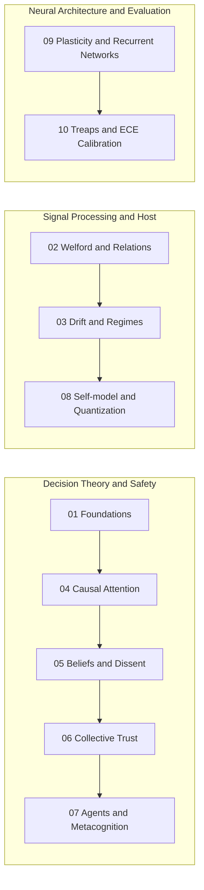

# Mathematical Compendium of Symbiont and Symbiont Lab

Welcome to the comprehensive mathematical compendium of **Symbiont** and **Symbiont Lab**.

This set of documents formalizes each algorithm, analytical deduction, statistical space, and dynamic invariant implemented in the repository. The documentation is written with professional technical rigor, preserving the pedagogical and intuitive perspective that explains **why** each formulation was selected over standard alternatives, and how these mathematical decisions protect the boundaries of safety, consent, and epistemological isolation of the system.

---

## Editorial Framework and Epistemic Taxonomy

To guarantee maximum intellectual honesty and clearly differentiate mathematical theory from engineering practice, each chapter classifies its developments under four epistemic labels:

1. **Code Identity:** Formulas, invariants, and structures that describe the execution of the software with exact arithmetic and algorithmic precision (e.g., Welford's algorithm, SplitMix64 generator, Murphy's decomposition of the Brier Score).
2. **Proposition / Structural Invariant:** Formally provable theorems and analytical properties about the state space of the system (e.g., invariant of deterministic non-interference, strict bounding of neural activations in $[-1, 1]$, budget conservation).
3. **Heuristics:** Empirical decision models, weighted multilinear scores, or pragmatic thresholds chosen for computational efficiency (e.g., greedy approximation to the 0/1 knapsack, Z thresholds in EWMA, sensor multilinear utility function).
4. **Experimental Hypothesis:** Properties of collective emergence, adaptive dynamics, or asymptotic limits that are studied empirically in the simulator through paired replicas and counterfactual analysis (e.g., trust gap $\Delta_{\text{trust}}$, resilience against hostile drift).

---

## Compendium Structure

| Chapter | Title | Main Code Modules | Key Concepts |
| --- | --- | --- | --- |
| **[01](01-fundamentos-y-epistemologia.md)** | [Epistemological Foundations and Mathematical Framework](01-fundamentos-y-epistemologia.md) | `symbiont.core.model`, `symbiont.environment.rng` | Formal spaces ($\mathcal{X}, \mathcal{S}, \mathcal{B}, \mathcal{Y}^*$), Structural invariant of deterministic non-interference, deterministic derivation of SHA-256 seeds and causal independence of replicas. |
| **[02](02-percepcion-aclimatacion-y-relaciones.md)** | [Perception, Sensory Acclimation and Algebra of Relations](02-percepcion-aclimatacion-y-relaciones.md) | `symbiont.host.acclimation`, `symbiont.host.adaptive` | Univariate and bivariate Welford online algorithms (centered co-moments), lagged temporal correlations ($a_{t-1} \to b_t$), Dynamic Utility Function $U = A(0.65V + 0.35M)$, collinearity pruning ($\lvert r \rvert \ge 0.97$) and deterministic rotation with eventual coverage. |
| **[03](03-deteccion-de-deriva-y-regimenes.md)** | [Drift Detection, Regime Break and Rhythmic Modeling](03-deteccion-de-deriva-y-regimenes.md) | `symbiont.host.drift`, `symbiont.host.rhythms` | EWMA filter with moving heuristic dispersion, jump detector with non-contaminating quarantine buffer, divergence limit with frozen noise floor $\frac{6.667 c}{\sigma_{\text{frozen}}}$ for slow creep and diurnal conditional baselines. |
| **[04](04-atencion-causal-y-presupuestos.md)** | [Causal Attention Allocation and Finite Budget Optimization](04-atencion-causal-y-presupuestos.md) | `symbiont.core.attention` | Dantzig's greedy heuristic $O(n \log n)$ for the 0/1 knapsack, dimensionless coefficient of variation $c_v = \sigma / \lvert \mu \rvert$ (relative scale dispersion), formal decoupling between ranking cost $r_i$ and physical consumption cost $k_i$, and budget invariance. |
| **[05](05-creencias-bayesianas-y-disidencia.md)** | [Bayesian Belief Dynamics, Surprise and Dissent Logging](05-creencias-bayesianas-y-disidencia.md) | `symbiont.core.beliefs`, `symbiont.core.evidence` | Bayesian update with weighted pseudo-observations, bounded evidence saturation ($E_{\max}=32$), surprise conflict filter, certainty function $(1 - e^{-E/4})(1 - 0.6C)$, reversals and Z-test of standardized batch deviation for dissent. |
| **[06](06-consenso-colectivo-y-confianza.md)** | [Collective Consensus, Trust Dynamics and Epigenetic Distillation](06-consenso-colectivo-y-confianza.md) | `symbiont.core.trust`, `symbiont.core.collective`, `symbiont.core.heritage` | Continuous hyperbolic concordance function $\frac{1}{1+z}$, Leave-One-Out population consensus without external oracle, dynamics of the trust gap ($\Delta_{\text{trust}}$) and intergenerational epigenetic filtering/attenuation. |
| **[07](07-cognicion-agentes-y-metacognicion.md)** | [Agent Cognition, Counterfactual Curiosity and Metacognition](07-cognicion-agentes-y-metacognicion.md) | `symbiont.core.model`, `symbiont.core.agent`, `symbiont.core.curiosity`, `symbiont.core.metacognition` | Ternary signatures in $\{L, M, H\}^5$, counterfactual information gain ($IG$), multilinear heuristic models of risk/suspicion decision, double threshold with adaptation hysteresis, epistemic pressure vector and self-confidence. |
| **[08](08-automodelo-y-sensores-adaptativos.md)** | [Organism Self-model, Costs and Non-Linear Quantization](08-automodelo-y-sensores-adaptativos.md) | `symbiont.core.selfmodel` | EWMA with exponential decay after grace zone ($\tau=20$), logarithmic maturity function $\frac{\ln(1+s)}{\ln(6)}$, relative cost versus moving population median, non-linear geometric quantization and representative reconstruction of latencies. |
| **[09](09-plasticidad-endogena-y-redes-recurrentes.md)** | [Endogenous Plasticity, Recurrent Cognitive Graphs and Activation Dynamics](09-plasticidad-endogena-y-redes-recurrentes.md) | `symbiont.cognition.activation`, `symbiont.cognition.graph`, `symbiont.cognition.genome` | Tangential input normalization, causal delay activation dynamics with multiplicative gates, discretized Oja's learning rule, eligibility traces and global invariant of bounding activations in $[-1, 1]$. |
| **[10](10-seleccion-causal-y-evaluacion-estadistica.md)** | [Streaming Causal Selection, Treaps and Statistical Evaluation Metrics](10-seleccion-causal-y-evaluacion-estadistica.md) | `symbiont_lab.studies.common.causal_selection`, `symbiont.simulation.metrics`, `symbiont.simulation.evaluation` | Online selection with ex-ante known horizon using Treap (SplitMix64) in expected $O(\log n)$, Brier Score and Murphy's decomposition, Expected Calibration Error (ECE), strict decoupling of confusion matrices (Attention vs Classification) and safety metrics. |

---

## Recommended Pedagogical Paths

Depending on the objective of the reader, the following itineraries are recommended:

- **For Designers of Agents and Epistemic Models:** Follow **Itinerary A** (Chapters 1, 4, 5, 6 and 7), paying special attention to how Bayesian beliefs handle conflict and how selective attention is decoupled from value judgments.
- **For Systems and Observability Engineers in Hosts:** Follow **Itinerary B** (Chapters 2, 3 and 8), delving into the numerical stability of Welford, the prevention of variance collapse in creep detection and the latency quantization of the self-model.
- **For Researchers of Plastic Learning and Experimental Methodology:** Follow **Itinerary C** (Chapters 9 and 10), examining the strict bounding of activations in recurrent graphs and the causal selection in streaming through Treaps without retrospective bias.

---

## Glossary of Canonical Constants and Fundamental Symbols

| Symbol | Type | Canonical Value | Module | Mathematical Meaning |
| --- | --- | --- | --- | --- |
| $B$ | Scalar | $1.0$ | `attention.py` | Hard attention budget per tick. |
| $N_{\min}$ | Integer | $5$ (or $4$ in adaptive) | `acclimation.py`, `selfmodel.py` | Minimum samples to declare a sensor acclimated. |
| $\lambda$ | Scalar | $0.10$ | `drift.py` | Learning rate of the baseline EWMA filter. |
| $\lambda_{\text{fast}}$ | Scalar | $0.30$ | `drift.py` | Fast learning rate for slow drift detection (*creep*). |
| $z_{\text{regime}}$ | Scalar | $2.0$ | `drift.py` | Deviation threshold for regime change candidates. |
| $z_{\text{isolated}}$ | Scalar | $3.0$ | `drift.py` | Deviation threshold to classify an isolated peak. |
| $K_{\text{regime}}$ | Integer | $3$ | `drift.py` | Minimum streak of consistent observations to confirm a regime. |
| $z_{\text{creep}}$ | Scalar | $1.0$ | `drift.py` | Divergence threshold against the frozen noise floor. |
| $K_{\text{creep}}$ | Integer | $8$ | `drift.py` | Minimum streak to confirm slow creep. |
| $E_{\max}$ | Scalar | $32.0$ | `beliefs.py` | Upper bound of evidence saturation to prevent epistemic paralysis. |
| $\alpha_{\text{self}}$ | Scalar | $0.06$ | `selfmodel.py`, `activation.py` | EWMA smoothing constant for the self-model and sensory normalizer. |
| $\tau_{\text{grace}}$ | Integer | $20$ | `selfmodel.py` | Grace zone (inactivity ticks before initiating decay). |
| $\theta_{\text{red}}$ | Scalar | $0.97$ | `adaptive.py` | Pearson correlation threshold to prune redundant sensors. |
| $\theta_{\text{conflict}}$ | Scalar | $2.0$ | `evidence.py` | Batch discrepancy Z-threshold to emit a `DissentRecord`. |
| $w_{\max}, w_{\min}$ | Tuple | $[-2.0, 2.0]$ | `types.py` | Closed range of synaptic weights in the cognitive graph. |
| $\tau_{\text{node}}$ | Tuple | $[0.1, 10.0]$ | `types.py` | Admissible range of the neural activation scale parameter. |
