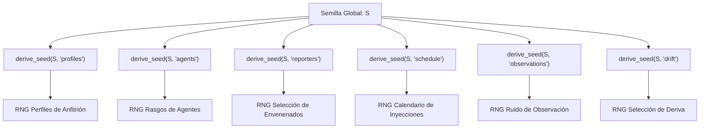

# Fundamentos Epistemológicos y Marco Matemático de Symbiont

> **Estado:** IMPLEMENTADO  
> **Tipo:** ESPECIFICACIÓN FORMAL DE LÍMITES E IDENTIDADES DEL CÓDIGO  
> **Módulos relacionados:** [`symbiont.core.model`](../../src/symbiont/core/model.py), [`symbiont.environment.rng`](../../src/symbiont/environment/rng.py), [`symbiont.environment.world`](../../src/symbiont/environment/world.py)

---

## 1. Introducción y Filosofía Epistemológica

El proyecto **Symbiont** aborda la cognición adaptativa y la ecología sintética bajo una restricción de diseño fundamental: **la cognición debe operar en completa ausencia de etiquetas directas de verdad fundamental (*ground truth*) sobre su entorno**.

A diferencia de los paradigmas clásicos de aprendizaje supervisado o aprendizaje por refuerzo con recompensas extrínsecas precalculadas, el organismo en Symbiont:

1. No recibe etiquetas que clasifiquen eventos como benignos o patógenos.
2. No tiene acceso a funciones de pérdida que comparen sus estados internos con el estado global del simulador o del sistema operativo.
3. No posee actuadores que ejecuten modificaciones en el sistema anfitrión (*host*).

El propósito de este marco matemático es formalizar cómo un sistema adaptativo construye representaciones consistentes, detecta anomalías, asigna presupuestos de atención finitos y se coordina colectivamente basándose únicamente en señales estadísticas locales, descriptivas y limitadas en recursos.

---

## 2. Definición Formal de Espacios y Variables

### 2.1 Espacio de Señales del Entorno / Anfitrión ($\mathcal{X}$)

Sea $\mathcal{X} \subseteq \mathbb{R}^D$ el espacio de señales observables del entorno o anfitrión. Para el caso sintético canónico ($D=5$), el vector de observación en el instante $t$ se define en [`Observation`](../../src/symbiont/core/model.py):

$$\mathbf{x}(t) = \begin{pmatrix} x_{\text{cpu}}(t) \\ x_{\text{net}}(t) \\ x_{\text{file}}(t) \\ x_{\text{proc}}(t) \\ x_{\text{persist}}(t) \end{pmatrix} \in [0, 1]^5$$

Para el caso del anfitrión real ([`symbiont.host`](../../src/symbiont/host)), el espacio está compuesto por un conjunto dinámico y abierto de capacidades $C = \{c_1, c_2, \dots, c_K\}$, donde cada capacidad produce lecturas $x_{c_k}(t) \in \mathbb{R} \cup \{\emptyset\}$ asociadas a unidades físicas y políticas de privacidad declarativas.

### 2.2 Espacio de Perceptos y Nombres Opacos ($\mathcal{S}$)

La cognición no interactúa directamente con rutas del sistema de archivos, nombres de procesos ni identificadores semánticos de plataforma. Existe una proyección medible:

$$\phi: \mathcal{X} \to \mathcal{S}$$

donde $\mathcal{S} \subseteq [-1, 1]^M$ es el espacio de perceptos normalizados. En el subsistema de descubrimiento adaptativo, los identificadores se transforman en etiquetas opacas mediante un hash determinista truncado:

$$\text{sense\_id} = \operatorname{SHA-256}(\text{"symbiont-sense:"} \parallel c_k)_{[0:12]}$$

> **Nota de Seguridad y Criptografía (Heurística de Diseño):**  
> El truncamiento de SHA-256 a 12 caracteres hexadecimales (48 bits de entropía) **no constituye por sí mismo una garantía matemática de anonimización**. Si el espacio de capacidades conocidas es pequeño (por ejemplo, métricas estándar de `/proc`), un análisis de diccionario puede revertir la correspondencia. Su función en la arquitectura es generar identificadores opacos para desacoplar la semántica del anfitrión de las reglas de razonamiento del organismo. La verdadera protección de privacidad proviene de las fronteras de aislamiento del proveedor de lecturas ([`symbiont.host.contracts`](../../src/symbiont/host/contracts.py)), que restringe qué superficies de observación pueden ser consultadas.

### 2.3 Espacio de Estados Epistémicos y Creencias ($\mathcal{B}$)

El espacio de estados de creencia local para un patrón sensorial se define como una variedad acotada:

$$\mathcal{B} = \left\{ (p, e, c) \in [0, 1] \times [0, E_{\max}] \times [0, 1] \right\}$$

donde:

- $p \in [0, 1]$ es la probabilidad subjetiva asignada al patrón.
- $e \in [0, E_{\max}]$ es la masa de evidencia acumulada ($E_{\max} = 32.0$).
- $c \in [0, 1]$ es la memoria exponencial de conflicto e inconsistencia histórica.

### 2.4 Espacio de Verdad Fundamental del Evaluador ($\mathcal{Y}^*$)

Exclusivo del simulador y del laboratorio experimental ([`symbiont_lab`](../../src/symbiont_lab) y [`symbiont.simulation`](../../src/symbiont/simulation)):

$$\mathcal{Y}^* = \{0, 1\} \times \Omega_{\text{fam}}$$

donde $y^* \in \{0, 1\}$ indica si el evento es objetivamente una amenaza sintética o benigno, y $\omega \in \Omega_{\text{fam}}$ describe la familia ontológica generadora (p. ej., `benign:backup`, `pathogen:ransom_sim`).

---

## 3. Invariante Estructural de No-Interferencia Epistemológica

> **Clasificación:** PROPOSICIÓN / INVARIANTE ARQUITECTÓNICO ENFORZADO POR AST

A diferencia de un teorema probabilístico clásico, el aislamiento de Symbiont es una **propiedad determinista de no-interferencia y medibilidad estructural**.

### 3.1 Formalización por Proyecciones de Historias Secuenciales

Sea una historia completa del universo experimental hasta el tick $t$ una **secuencia ordenada temporalmente**:

$$h = \big( e(0), e(1), \dots, e(t) \big) \in \mathcal{H}_{\text{sim}}(t)$$

donde cada elemento de la secuencia $e(\tau) = \big(o_{\text{org}}(\tau), u_{\text{sim}}(\tau)\big)$ descompone la tupla del paso $\tau$ en:

- Las observaciones accesibles al organismo: $o_{\text{org}}(\tau) = \big(\mathbf{x}(\tau), \mathbf{r}_{\text{coll}}(\tau)\big)$ (lecturas de sensores locales y reportes colectivos recibidos).
- Las variables latentes exclusivas del simulador: $u_{\text{sim}}(\tau) = \big(y^*(\tau), \omega(\tau), \theta_{\text{world}}(\tau)\big)$ (verdad fundamental, familias ontológicas y dinámica del generador sintético).

Sea $\pi_{\text{org}}: \mathcal{H}_{\text{sim}}(t) \to \mathcal{H}_{\text{org}}(t)$ la proyección canónica que extrae la subsecuencia observable:

$$\pi_{\text{org}}(h) = \big( o_{\text{org}}(0), o_{\text{org}}(1), \dots, o_{\text{org}}(t) \big)$$

**Definición (No-Interferencia Epistemológica Determinista):**  
Sean fijados de forma idéntica:

1. El estado interno inicial del organismo $s_0 \in \mathcal{S}_{\text{org}}$,
2. El vector de hiperparámetros de configuración $\theta_{\text{cfg}}$,
3. La semilla y flujo pseudoaleatorio interno del organismo $\omega_{\text{org}} \in \Omega_{\text{org}}$.

La función global de decisión del organismo en el instante $t$, $D_t: \mathcal{H}_{\text{sim}}(t) \to \mathcal{A}$, se define como la composición:

$$D_t(h) = f_t\Big( \pi_{\text{org}}(h); \; s_0, \theta_{\text{cfg}}, \omega_{\text{org}} \Big)$$

donde $f_t: \mathcal{H}_{\text{org}}(t) \to \mathcal{A}$ es la función determinista de actualización interna y política del organismo. En consecuencia, para cualquier par de historias globales de simulación $h_1, h_2 \in \mathcal{H}_{\text{sim}}(t)$:

$$\pi_{\text{org}}(h_1) = \pi_{\text{org}}(h_2) \implies D_t(h_1) = D_t(h_2)$$

Independientemente de cómo difiera la verdad fundamental oculta del simulador ($u_{\text{sim}}$), si la proyección de lecturas y reportes que alcanza la frontera sensorial es idéntica paso a paso, la trayectoria de creencias, activaciones neuronales y decisiones de atención es idéntica bit a bit.

```text
  ┌────────────────────────────────────────────────────────┐
  │                 SIMULADOR / ENTORNO                    │
  │  Ground Truth: y* ∈ {0, 1}, Etiquetas, Parámetros      │
  └───────────────────────────┬────────────────────────────┘
                              │ Emite únicamente
                              ▼
  ┌────────────────────────────────────────────────────────┐
  │              SUPERFICIE SENSORIAL (READ-ONLY)          │
  │  Lecturas crudas desacopladas: x_i(t)                   │
  └───────────────────────────┬────────────────────────────┘
                              │ Proyección π_org
                              ▼
  ┌────────────────────────────────────────────────────────┐
  │                 ORGANISMO (symbiont)                   │
  │  Perceptos: s_i(t) = tanh(z_clip / s)                  │
  │  Creencias: P(θ) basadas solo en consistencia local    │
  │  Atención: Bounded Greedy Knapsack                     │
  │  Sin imports hacia symbiont_lab (Verificado por AST)   │
  └───────────────────────────┬────────────────────────────┘
                              │ Telemetría pasiva
                              ▼
  ┌────────────────────────────────────────────────────────┐
  │             APARATO CIENTÍFICO (symbiont_lab)          │
  │  Brier Score, ECE, Causal Selection, ROC/AUC, Tests    │
  └────────────────────────────────────────────────────────┘
```

### 3.2 Disciplina Arquitectónica y Verificación en el Repositorio

Es necesario distinguir entre una comprobación estática de código y la propiedad matemática completa:

- **Higiene Arquitectónica:** El análisis estático de dependencias AST ([`test_ground_truth_boundary.py`](../../tests/experimental_integrity/test_ground_truth_boundary.py)) verifica que el paquete `symbiont` jamás importe símbolos de `symbiont_lab`. Asimismo, las envolventes del simulador ([`SimulatedEvent`](../../src/symbiont/environment/world.py)) desempaquetan y entregan únicamente `event.observation` a `agent.observe()`, descartando `truth_label`.
- **Condición Suficiente:** La verificación estática de imports es un mecanismo de defensa en profundidad indispensable para preservar la arquitectura, pero la propiedad completa de no-interferencia requiere además fijar el determinismo interno $(s_0, \theta_{\text{cfg}}, \omega_{\text{org}})$ y garantizar la ortogonalidad de los flujos de números pseudoaleatorios (§4).

---

## 4. Álgebra de Flujos Pseudoaleatorios y Ortogonalidad Causal

> **Clasificación:** PROPOSICIÓN / ESPECIFICACIÓN DE DISEÑO EXPERIMENTAL

En estudios experimentales, evaluar el impacto de una intervención (p. ej., variar la fracción de agentes envenenados $\rho \in [0, 0.20]$ o introducir un régimen de deriva) exige que la intervención **no altere colateralmente** la secuencia de números aleatorios asignada a otras partes del sistema.

Si se utilizara un generador pseudoaleatorio lineal o Mersenne Twister global:
$$X_{n+1} = f(X_n)$$
un sorteo adicional para seleccionar agentes envenenados desplazaría el puntero global, cambiando los perfiles de los anfitriones, los valores de ruido y las observaciones posteriores. Esto destruiría el emparejamiento (*pairing*) experimental y atribuiría al tratamiento diferencias causadas por fluctuaciones aleatorias espurias.

### 4.1 Derivación Determinista de Semillas

Symbiont resuelve este problema mediante un árbol de derivación criptográfico de semillas independientes ([`symbiont.environment.rng.derive_seed`](../../src/symbiont/environment/rng.py#L8-L18)):

Dado un entero semilla experimental $S \in \mathbb{N}$ y un espacio de nombres textual $N \in \mathcal{S}_{\text{names}}$ (p. ej., `"profiles"`, `"agents"`, `"reporters"`, `"schedule"`, `"observations"`, `"drift"`):

$$S_N = \operatorname{BytesToInt}_{128}\Big( \operatorname{SHA-256}\big( \text{"symbiont-lab:"} \parallel \operatorname{str}(S) \parallel \text{":"} \parallel N \big)_{[0:16]} \Big)$$



### 4.2 Propiedad de Invarianza Intervencionista

**Proposición (Invarianza por Aislamiento de Flujos):**  
Sean dos réplicas experimentales $R_1$ y $R_2$ inicializadas con la misma semilla base $S$, donde $R_2$ incorpora una intervención en el flujo de envenenamiento (`"reporters"`).

Puesto que los flujos `"profiles"`, `"schedule"` y `"observations"` se instancian a partir de sus respectivas semillas derivadas $S_{\text{profiles}}$, $S_{\text{schedule}}$ y $S_{\text{observations}}$, se cumple idénticamente:

$$\mathbf{x}_{\text{world}}^{(R_1)}(t) = \mathbf{x}_{\text{world}}^{(R_2)}(t) \quad \forall t < t_{\text{intervención}}$$

Cualquier divergencia observada en las trayectorias de creencia entre $R_1$ y $R_2$ es atribuible con total certeza metodológica a la intervención, y no a una desincronización de los flujos de simulación.
