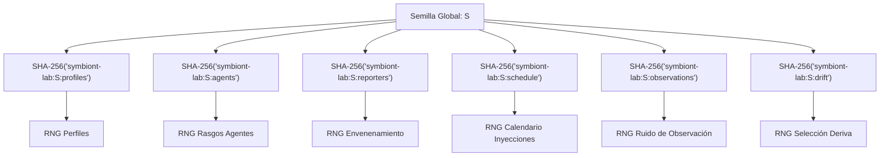

# Fundamentos Epistemológicos y Marco Matemático de Symbiont

## 1. Introducción y Filosofía Epistemológica

El proyecto **Symbiont** aborda la cognición artificial y la ecología sintética bajo un principio rector: **la cognición debe operar en completa ausencia de etiquetas directas de verdad fundamental (*ground truth*) sobre su entorno**.

A diferencia de los sistemas tradicionales de aprendizaje supervisado o aprendizaje por refuerzo con recompensas extrínsecas predefinidas, un organismo en Symbiont:

1. No recibe información sobre si una entidad es patógena o benigna.
2. No tiene acceso a funciones de pérdida que comparen sus estados internos con el estado "real" del simulador o del sistema operativo.
3. No posee operadores que ejecuten acciones arbitrarias sobre el sistema anfitrión (*host*).

Toda la estructura matemática de Symbiont está diseñada para responder a la pregunta:
> *¿Cómo puede un sistema biológicamente inspirado construir modelos consistentes, detectar anomalías genuinas, asignar recursos de atención finitos y coordinarse colectivamente basándose únicamente en señales estadísticas locales, descriptivas y limitadas en capacidad?*

---

## 2. Definición Formal de Espacios y Variables

Definimos los espacios fundamentales sobre los que opera el sistema:

### 2.1 Espacio de Señales del Entorno / Anfitrión ($\mathcal{X}$)

Sea $\mathcal{X} \subseteq \mathbb{R}^D$ el espacio de señales observables del entorno o anfitrión. Para el caso sintético clásico ($D=5$), el vector de observación en el instante $t$ se denota por:

$$\mathbf{x}(t) = \begin{pmatrix} x_{\text{cpu}}(t) \\ x_{\text{net}}(t) \\ x_{\text{file}}(t) \\ x_{\text{proc}}(t) \\ x_{\text{persist}}(t) \end{pmatrix} \in [0, 1]^5$$

Para el caso del anfitrión real (`symbiont.host`), el espacio está compuesto por un conjunto dinámico y abierto de capacidades $C = \{c_1, c_2, \dots, c_K\}$, donde cada capacidad produce lecturas $x_{c_k}(t) \in \mathbb{R} \cup \{\emptyset\}$ asociadas a unidades físicas y clases de privacidad estrictas.

### 2.2 Espacio de Perceptos y Normalización Opaca ($\mathcal{S}$)

La cognición nunca observa directamente los identificadores del sistema ni las unidades crudas. Existe una transformación medible:

$$\phi: \mathcal{X} \to \mathcal{S}$$

donde $\mathcal{S} \subseteq [-1, 1]^M$ es el espacio de perceptos normalizados u opacos. En el subsistema cognitivo, los sentidos se identifican mediante resúmenes criptográficos:

$$\text{sense\_id} = \operatorname{SHA-256}(\text{"symbiont-sense:"} \parallel c_k)_{[0:12]}$$

lo que garantiza anonimización estricta y previene cualquier filtración semántica hacia la capa de razonamiento.

### 2.3 Espacio de Estados Epistémicos y Creencias ($\mathcal{B}$)

El espacio de creencias internas de un organismo se modela como una variedad estadística:

$$\mathcal{B} = \left\{ (p, e, c) \in [0, 1] \times [0, E_{\max}] \times [0, 1] \right\}$$

donde:

- $p \in [0, 1]$ es la probabilidad subjetiva asignada a una hipótesis o categoría abstracta.
- $e \in [0, E_{\max}]$ es la masa de evidencia acumulada.
- $c \in [0, 1]$ es el grado de conflicto o inconsistencia histórica de la evidencia.

### 2.4 Espacio de Evaluación y Verdad Fundamental ($\mathcal{Y}^*$)

Exclusivo del evaluador y del simulador (`symbiont_lab` y `symbiont.simulation`):

$$\mathcal{Y}^* = \{0, 1\} \times \Omega_{\text{fam}}$$

donde $y^* \in \{0, 1\}$ indica si un evento es objetivamente una amenaza o benigno, y $\omega \in \Omega_{\text{fam}}$ denota la familia ontológica generadora (p. ej., `benign:backup`, `pathogen:ransom_sim`).

---

## 3. Teorema de Aislamiento Epistemológico (Zero Downward Knowledge)

### 3.1 Formalización de la Frontera

Sea $\mathcal{F}_{\text{org}}(t)$ la filtración (historial de información) accesible al organismo hasta el tick $t$:

$$\mathcal{F}_{\text{org}}(t) = \sigma\Big( \big\{ \mathbf{s}(\tau), \mathbf{m}(\tau), \mathbf{r}_{\text{coll}}(\tau), \mathbf{a}_{\text{alloc}}(\tau) \big\}_{\tau=0}^t \Big)$$

donde $\mathbf{s}$ son perceptos, $\mathbf{m}$ recuerdos locales, $\mathbf{r}_{\text{coll}}$ reportes colectivos y $\mathbf{a}_{\text{alloc}}$ decisiones de atención previas.

Sea $\mathcal{F}_{\text{sim}}(t)$ la filtración del simulador y evaluador:

$$\mathcal{F}_{\text{sim}}(t) = \sigma\Big( \mathcal{F}_{\text{org}}(t) \cup \big\{ y^*(\tau), \omega(\tau), \theta_{\text{world}}(\tau) \big\}_{\tau=0}^t \Big)$$

**Principio de No-Filtración (Axioma Estructural):**
Para cualquier función de decisión del organismo $\psi: \mathcal{F}_{\text{org}}(t) \to \mathcal{A}$ (donde $\mathcal{A}$ es el espacio de estados internos, asignaciones de atención o hipótesis), se cumple estrictamente:

$$\mathbb{P}\left( \psi \in \sigma\big(\mathcal{F}_{\text{sim}}(t) \setminus \mathcal{F}_{\text{org}}(t)\big) \right) = 0$$

En el código fuente, este aislamiento no es meramente probabilístico, sino **arquitectónico y forzado por AST (Abstract Syntax Tree)**:

1. El paquete [`symbiont`](file:///home/alessbarb/workspace/repos/incubating/symbiont-lab/src/symbiont) **jamás importa** a [`symbiont_lab`](file:///home/alessbarb/workspace/repos/incubating/symbiont-lab/src/symbiont_lab).
2. Los objetos [`Observation`](file:///home/alessbarb/workspace/repos/incubating/symbiont-lab/src/symbiont/core/model.py#L17-L28) y [`SensorReading`](file:///home/alessbarb/workspace/repos/incubating/symbiont-lab/src/symbiont/host/readings.py) no contienen campos para etiquetas de amenaza, funciones de recompensa o métricas de evaluador.
3. El simulador desacopla la envolvente [`SimulatedEvent`](file:///home/alessbarb/workspace/repos/incubating/symbiont-lab/src/symbiont/environment/world.py#L20-L27) entregando exclusivamente `event.observation` al organismo.

```text
  ┌────────────────────────────────────────────────────────┐
  │                 SIMULADOR / ENTORNO                    │
  │  Ground Truth: y* ∈ {0, 1}, Etiquetas, Familias        │
  └───────────────────────────┬────────────────────────────┘
                              │ Emite únicamente
                              ▼
  ┌────────────────────────────────────────────────────────┐
  │              SUPERFICIE SENSORIAL (READ-ONLY)          │
  │  Lecturas crudas desacopladas: x_i(t)                   │
  └───────────────────────────┬────────────────────────────┘
                              │ Proyecta sin semántica
                              ▼
  ┌────────────────────────────────────────────────────────┐
  │                 ORGANISMO (symbiont)                   │
  │  Perceptos opacos: s_i(t) = tanh(z_score)              │
  │  Creencias locales: P(θ) basadas solo en consistencia  │
  │  Atención: Bounded Greedy Knapsack                     │
  │  Sin acceso a labels, sin capacidad de acción externa │
  └───────────────────────────┬────────────────────────────┘
                              │ Telemetría agregada pasiva
                              ▼
  ┌────────────────────────────────────────────────────────┐
  │             APARATO CIENTÍFICO (symbiont_lab)          │
  │  Brier Score, ECE, Causal Selection, ROC/AUC, Tests    │
  └────────────────────────────────────────────────────────┘
```

---

## 4. Álgebra de Flujos Pseudoaleatorios y Separación Causal

Para que los estudios experimentales posean validez causal, las intervenciones (por ejemplo, envenenar el $8\%$ de los informantes o provocar una deriva de régimen) no deben perturbar los números pseudoaleatorios consumidos por otros generadores.

Si se utilizara un único generador secuencial congruencial lineal o Mersenne Twister global:

$$X_{n+1} = (a X_n + c) \pmod m$$

un cambio en el número de agentes envenenados adelantaría el puntero del generador, alterando la secuencia de eventos del mundo y destruyendo el emparejamiento (*pairing*) experimental.

### 4.1 Derivación Criptográfica de Semillas

Symbiont resuelve esto mediante un árbol determinista de generadores pseudoaleatorios ortogonales ([`symbiont.environment.rng`](file:///home/alessbarb/workspace/repos/incubating/symbiont-lab/src/symbiont/environment/rng.py#L8-L18)):

Dado un entero semilla global $S \in \mathbb{N}$ y un espacio de nombres textual $N \in \mathcal{S}_{\text{names}}$, la semilla derivada $S_N$ se define como:

$$S_N = \operatorname{BytesToInt}_{128}\Big( \operatorname{SHA-256}\big( \text{"symbiont-lab:"} \parallel \operatorname{str}(S) \parallel \text{":"} \parallel N \big)_{[0:16]} \Big)$$

donde $\operatorname{BytesToInt}_{128}(\cdot)$ interpreta los primeros 16 bytes (128 bits) en formato big-endian.



### 4.2 Teorema de Ortogonalidad de Flujos

Sean dos configuraciones experimentales $C_A = (S, \text{poison}=0.0)$ y $C_B = (S, \text{poison}=0.2)$.

Dado que la función hash $\operatorname{SHA-256}$ modelada como un oráculo aleatorio cumple la propiedad de avalancha:

$$\mathbb{P}\left( \operatorname{bit}_i(S_{N_1}) = \operatorname{bit}_i(S_{N_2}) \right) = \frac{1}{2} \quad \forall N_1 \neq N_2$$

los estados internos de los generadores para perfiles de anfitrión, ruido sensorial y programación temporal son idénticos bit a bit entre $C_A$ y $C_B$:

$$\mathbf{x}_{\text{world}}^{(C_A)}(t) = \mathbf{x}_{\text{world}}^{(C_B)}(t) \quad \forall t < t_{\text{intervención}}$$

Esto asegura que cualquier diferencia medida en el desempeño del organismo sea atribuible **exclusivamente al efecto causal de la intervención** y no a una desincronización espuria de los flujos de números pseudoaleatorios.
