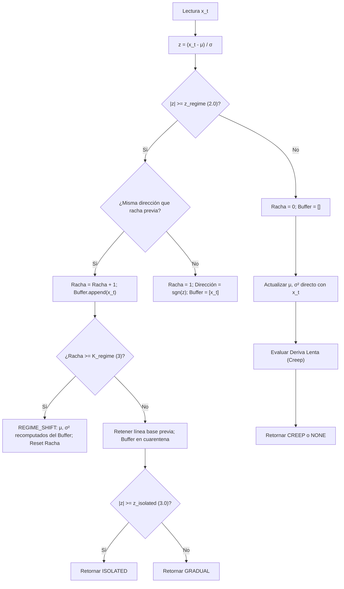

# Detección de Deriva, Ruptura de Régimen y Modelado Rítmico

> **Estado:** IMPLEMENTADO  
> **Tipo:** IDENTIDAD DEL CÓDIGO Y MODELADO ESTOCÁSTICO  
> **Módulos relacionados:** [`symbiont.host.drift`](../../src/symbiont/host/drift.py), [`symbiont.host.rhythms`](../../src/symbiont/host/rhythms.py)

---

## 1. El Problema de la No-Estacionariedad en Señales del Anfitrión

En un sistema operativo o entorno sintético complejo, las señales no se comportan como procesos estacionarios independientes e idénticamente distribuidos (i.i.d.). Se observan tres clases cualitativas de variación:

1. **Picos Aislados (*Isolated Spikes*):** Desviaciones transitorias de gran magnitud pero duración efímera (ej. una ráfaga de CPU por un fork puntual). El modelo debe resistir la tentación de desplazar su media hacia el pico.
2. **Cambio Brusco de Régimen (*Regime Shift*):** Modificación estructural permanente del nivel de actividad (ej. inicio de un servicio de base de datos o transición de fase en el simulador). El modelo debe descartar el historial pre-cambio y re-centrarse rápidamente en el nuevo nivel.
3. **Arrastre Lento (*Slow Creep*):** Desplazamiento progresivo con incrementos pequeños por tick (ej. una fuga gradual de recursos) que jamás cruza los umbrales de anomalía brusca en un paso aislado, pero cuya acumulación sostenida transforma la normalidad del sistema.

[`DriftAwareBaseline`](../../src/symbiont/host/drift.py) y [`RhythmModel`](../../src/symbiont/host/rhythms.py) implementan la maquinaria matemática para gestionar estas dinámicas.

---

## 2. Filtro EWMA Estocástico para Dispersión Adaptativa

> **Clasificación:** IDENTIDAD DEL CÓDIGO / ESTIMADOR DE DISPERSIÓN PONDERADA

En ausencia de desviaciones atípicas activas, la línea base se actualiza mediante un filtro de media móvil ponderada exponencialmente con tasa de aprendizaje $\lambda \in (0, 1]$ (por defecto $\lambda = 0.10$):

$$\Delta_t = x_t - \mu_{t-1}$$
$$\mu_t = \mu_{t-1} + \lambda \cdot \Delta_t$$

### 2.1 Ecuación en Diferencias de la Varianza Ponderada

Symbiont rastrea de forma simultánea una medida de dispersión cuadrática mediante la recursión:

$$\sigma_t^2 = (1 - \lambda) \cdot \left( \sigma_{t-1}^2 + \lambda \cdot \Delta_t^2 \right)$$

### 2.2 Propiedades y Matiz de Consistencia

Esta formulación garantiza algebraicamente la no negatividad ($\sigma_t^2 \ge 0$) en todo instante si $\sigma_0^2 \ge 0$.

> **Matiz Estadístico de Rigor:**  
> A diferencia de la varianza muestral clásica insesgada, esta recursión calcula los residuos respecto a una media móvil estimada $\mu_{t-1}$, no respecto a la media poblacional verdadera. Bajo condiciones estrictamente estacionarias, $\sigma_t^2$ converge a una **medida estable de dispersión exponencialmente ponderada**, proporcional a la varianza del proceso pero con un sesgo que depende de $\lambda$ y de la autocorrelación de la serie. Para los propósitos de Symbiont, esto es suficiente y deseable: actúa como una escala adaptativa local, no como un estimador formal para contrastes de hipótesis clásicos.

---

## 3. Puntuación de Desviación Tipificada ($Z$-Score) y Umbrales Heurísticos

> **Clasificación:** HEURÍSTICA DE DETECCIÓN ESTANDARIZADA

Para cada nueva observación $x_t$, antes de incorporarla a la línea base, se calcula la puntuación estandarizada respecto al estado previo:

$$z(x_t) = \begin{cases}
0.0 & \text{si } \sigma_{t-1} = 0 \land x_t = \mu_{t-1} \\
+\infty & \text{si } \sigma_{t-1} = 0 \land x_t > \mu_{t-1} \\
-\infty & \text{si } \sigma_{t-1} = 0 \land x_t < \mu_{t-1} \\
\frac{x_t - \mu_{t-1}}{\sigma_{t-1}} & \text{si } \sigma_{t-1} > 0
\end{cases}$$

Se definen los umbrales de clasificación:
- $z_{\text{regime}} = 2.0$: Umbral para considerar una observación candidata a cambio de régimen.
- $z_{\text{isolated}} = 3.0$: Umbral para clasificar una observación como pico aislado.
- $K_{\text{regime}} = 3$: Longitud de racha requerida en la misma dirección.

> **Advertencia sobre Significancia Estadística:**  
> En textos introductorios suele asociarse $z = 2.0$ con un nivel de significación bilateral $\alpha \approx 0.0455$ y $z = 3.0$ con $\alpha \approx 0.0027$. Estas equivalencias son válidas **únicamente bajo el supuesto de normalidad estricta, independencia y parámetros conocidos**. En sistemas operativos reales, las distribuciones presentan colas pesadas, multimodalidad y fuerte autocorrelación. Por tanto, los umbrales en Symbiont son **umbrales de decisión heurísticos estandarizados**, no niveles de significación probabilística formal.

---

## 4. Teorema de Aislamiento de Buffer y Prevención de Auto-Corrupción

> **Clasificación:** PROPOSICIÓN / IDENTIDAD DEL ALGORITMO

### 4.1 El Mecanismo de Auto-Corrupción de la Varianza
Supóngase una arquitectura ingenua que actualice $(\mu, \sigma^2)$ continuamente en cada tick incluso durante una racha de desviación.

Si se produce un salto abrupto permanente de magnitud $\Delta = 3\sigma_0$ en $t=1$:
1. En $t=1$, el error es $\Delta = 3\sigma_0$. La varianza absorbe $\lambda \Delta^2 = 0.1 \cdot 9 \sigma_0^2 = 0.9 \sigma_0^2$. La nueva desviación típica se incrementa a $\sigma_1 \approx 1.31 \sigma_0$.
2. En $t=2$, la media se ha desplazado $\mu_1 = \mu_0 + 0.1 \Delta$, reduciendo el residuo a $0.9 \Delta = 2.7 \sigma_0$. La nueva puntuación $Z$ es:
   $$z_2 = \frac{2.7 \sigma_0}{1.31 \sigma_0} \approx 2.06$$
3. En $t=3$, la varianza continúa inflándose y el residuo decrece, provocando que $z_3 < 2.0$.

**Consecuencia:** La racha se interrumpe prematuramente antes de alcanzar los 3 pasos requeridos. La línea base asimila la anomalía como "normalidad" antes de poder certificarla como cambio de régimen.

### 4.2 Solución en Symbiont: Cuarentena y Recomputación Limpia
Durante una racha anómala ($|z| \ge z_{\text{regime}}$):
1. **La línea base $(\mu, \sigma^2)$ permanece estrictamente congelada** en el estado previo a la perturbación.
2. Los valores se acumulan en un buffer de cuarentena $\mathcal{B} = [x_1, \dots, x_k]$.
3. Si la racha se interrumpe ($|z| < z_{\text{regime}}$ o inversión de signo), el buffer se descarta íntegramente: los picos aislados jamás tocan la línea base.
4. Si la racha alcanza $K_{\text{regime}} = 3$, se confirma `DriftKind.REGIME_SHIFT` y se recomputa la línea base directamente a partir del buffer:

$$\mu_{\text{new}} = \frac{1}{|\mathcal{B}|} \sum_{x \in \mathcal{B}} x, \qquad \sigma_{\text{new}}^2 = \frac{1}{|\mathcal{B}|} \sum_{x \in \mathcal{B}} (x - \mu_{\text{new}})^2$$

El modelo salta limpiamente al nuevo equilibrio sin arrastrar memoria de la distribución antigua.

---

## 5. Detección de Arrastre Lento (*Slow Creep*) y Análisis del Suelo de Ruido

> **Clasificación:** ANÁLISIS DINÁMICO / CORRECCIÓN DE LÍMITES ASINTÓTICOS

El arrastre lento ocurre cuando una señal experimenta una rampa lineal:

$$x_t = x_0 + c \cdot t, \quad \text{donde } 0 < |c| \ll z_{\text{regime}} \sigma_0$$

En cada tick individual, $|z(x_t)| < z_{\text{regime}}$, por lo que el detector de saltos bruscos clasifica la lectura como `NONE`.

### 5.1 Desacoplamiento de Dos Escalas Temporales
Para detectar este fenómeno, Symbiont mantiene en paralelo una media móvil rápida $\mu_{\text{fast}}$ con $\lambda_{\text{fast}} = 0.30 > \lambda = 0.10$:

$$\mu_{\text{fast}, t} = \mu_{\text{fast}, t-1} + \lambda_{\text{fast}} \big( x_t - \mu_{\text{fast}, t-1} \big)$$

Bajo la rampa lineal $x_t = c \cdot t$, el retardo asintótico de un filtro EWMA con factor $\alpha$ respecto a la entrada es:

$$\mathbb{E}[x_t - \mu_t] = c \left( \frac{1 - \alpha}{\alpha} \right)$$

Por tanto, la divergencia asintótica entre la media rápida y la media comprometida es:

$$D = \mu_{\text{fast}} - \mu = c \left( \frac{1 - \lambda}{\lambda} - \frac{1 - \lambda_{\text{fast}}}{\lambda_{\text{fast}}} \right) = c \left( \frac{0.9}{0.1} - \frac{0.7}{0.3} \right) \approx 6.667 \cdot c$$

La divergencia es una **constante proporcional a la pendiente $c$**.

### 5.2 El Bucle de Falsa Estabilidad con Varianza en Vivo
Si se intentara normalizar $D$ respecto a la desviación típica viva $\sigma_{\text{live}, t}$:

Los residuos de la línea base principal satisfacen $(x_t - \mu_{t-1}) \approx 9.0 \cdot c$.
En régimen asintótico, la varianza viva converge a:

$$\sigma_{\text{live}}^2 \approx (9.0 \cdot c)^2 \implies \sigma_{\text{live}} \approx 9.0 \cdot |c|$$

El cociente con varianza viva sería:

$$\frac{|D|}{\sigma_{\text{live}}} \approx \frac{6.667 \cdot |c|}{9.0 \cdot |c|} \approx 0.741$$

Nótese que la pendiente $c$ se cancela en el numerador y el denominador. **La varianza viva se auto-infla en sincronía exacta con la divergencia**, imponiendo un techo rígido de $\approx 0.741 < z_{\text{creep}} = 1.0$. Bajo varianza en vivo, el detector de creep jamás podría activarse ante ninguna rampa lineal pura.

### 5.3 Suelo de Ruido Congelado (*Frozen Noise Floor*)
Para romper este bucle vicioso, Symbiont normaliza la divergencia contra el desvío estándar congelado $\sigma_{\text{creep\_stdev}}$, capturado en el establecimiento de la línea base o tras la última confirmación de deriva:

$$z_{\text{creep}}(t) = \frac{\mu_{\text{fast}, t} - \mu_t}{\sigma_{\text{creep\_stdev}}}$$

Dado que el denominador $\sigma_{\text{creep\_stdev}}$ permanece constante durante la rampa:

$$\lim_{t \to \infty} z_{\text{creep}}(t) = \frac{6.667 \cdot c}{\sigma_{\text{creep\_stdev}}}$$

> **Corrección Matemática Fundamental:**  
> El límite de $z_{\text{creep}}(t)$ **no diverge a infinito**, sino que converge a una constante finita proporcional a la relación señal-ruido de la pendiente: $\frac{6.667 c}{\sigma_{\text{creep\_stdev}}}$.  
> Por tanto, el mecanismo de suelo congelado **no garantiza detectar cualquier pendiente arbitrariamente pequeña**, sino que garantiza detectar rampas cuya velocidad supere el umbral mínimo detectable:
>
> $$|c| \ge \frac{z_{\text{creep}} \cdot \sigma_{\text{creep\_stdev}}}{6.667} \approx 0.15 \cdot \sigma_{\text{creep\_stdev}} \text{ por tick}$$
>
> Rampas con $|c| < 0.15 \sigma_{\text{frozen}}$ permanecerán asintóticamente sub-umbral.

Cuando $|z_{\text{creep}}| \ge z_{\text{creep}} = 1.0$ durante $K_{\text{creep}} = 8$ ticks consecutivos con el mismo signo:
1. Se confirma `DriftKind.CREEP`.
2. Se re-centra suavemente la media principal: $\mu \leftarrow \mu_{\text{fast}}$.
3. Se actualiza el suelo de ruido congelado al nivel actual: $\sigma_{\text{creep\_stdev}} \leftarrow \sigma_{\text{live}}$.
4. Se resetea el contador de racha.

---

## 6. Modelado Rítmico y Cuantización Temporal Cíclica

> **Clasificación:** HEURÍSTICA DE CONTEXTO SIN TELEMETRÍA ABSOLUTA

Para capturar oscilaciones cíclicas (ej. carga diurna vs. nocturna) sin violar la privacidad reteniendo timestamps reales, [`RhythmModel`](../../src/symbiont/host/rhythms.py) define una partición temporal en cuadrantes:

$$\psi(h) = \begin{cases}
\text{NIGHT} & \text{si } 0 \le h < 6 \\
\text{MORNING} & \text{si } 6 \le h < 12 \\
\text{AFTERNOON} & \text{si } 12 \le h < 18 \\
\text{EVENING} & \text{si } 18 \le h \le 23
\end{cases}$$

Para cada par ordenado $(\text{percept\_name}, \text{bucket})$, el sistema mantiene una instancia independiente de [`RunningStats`](../../src/symbiont/host/acclimation.py), permitiendo evaluar la normalidad de una lectura en relación con su fase diurna correspondiente.
