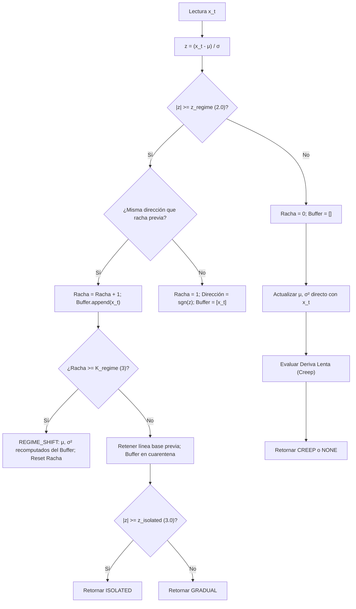

# Detección de Deriva, Ruptura de Régimen y Modelado Rítmico

> **Estado:** IMPLEMENTADO  
> **Tipo:** IDENTIDAD DEL CÓDIGO Y MODELADO ESTOCÁSTICO  
> **Módulos relacionados:** [`symbiont.host.drift`](../../src/symbiont/host/drift.py), [`symbiont.host.rhythms`](../../src/symbiont/host/rhythms.py)

---

## 1. El Problema de la No-Estacionariedad en Señales del Anfitrión

En un sistema operativo o entorno sintético complejo, las señales no se comportan como procesos estacionarios independientes e idénticamente distribuidos (i.i.d.). Se observan tres clases cualitativas de variación:

1. **Picos Aislados (*Isolated Spikes*):** Desviaciones transitorias de gran magnitud pero duración efímera (ej. una ráfaga de CPU por un fork puntual). El modelo debe resistir la tentación de desplazar su media hacia el pico.
2. **Cambio Brusco de Régimen (*Regime Shift*):** Modificación estructural permanente del nivel de actividad (ej. inicio de un servicio de base de datos o transición de fase en el simulador). El modelo debe descartar el historial pre-cambio y re-centrarse rápidamente en el nuevo nivel.
3. **Arrastre Lento (*Slow Creep*):** Desplazamiento progresivo con incrementos pequeños por tick (ej. una fuga gradual de recursos) que jamás cruza los umbrales de anomalía brusca en un paso aislado, pero cuya acumulación sostenida transforma la normalidad del sistema.

[`DriftAwareBaseline`](../../src/symbiont/host/drift.py) y [`RhythmModel`](../../src/symbiont/host/rhythms.py) implementan la maquinaria matemática para gestionar estas dinámicas.

---

## 2. Filtro EWMA Estocástico para Dispersión Adaptativa

> **Clasificación:** IDENTIDAD DEL CÓDIGO / ESTIMADOR DE DISPERSIÓN PONDERADA

En ausencia de desviaciones atípicas activas, la línea base se actualiza mediante un filtro de media móvil ponderada exponencialmente con tasa de aprendizaje $\lambda \in (0, 1]$ (por defecto $\lambda = 0.10$):

$$\Delta_t = x_t - \mu_{t-1}$$
$$\mu_t = \mu_{t-1} + \lambda \cdot \Delta_t$$

### 2.1 Ecuación en Diferencias de la Varianza Ponderada

Symbiont rastrea de forma simultánea una medida de dispersión cuadrática mediante la recursión:

$$\sigma_t^2 = (1 - \lambda) \cdot \left( \sigma_{t-1}^2 + \lambda \cdot \Delta_t^2 \right)$$

#### 2.2 Propiedades y Matiz de Consistencia

Esta formulación garantiza algebraicamente la no negatividad ($\sigma_t^2 \ge 0$) en todo instante si $\sigma_0^2 \ge 0$.

> **Matiz Estadístico de Rigor (Dispersión EWMA vs. Estimador Asintótico):**  
> A diferencia de la varianza muestral clásica de Welford, esta recursión calcula los residuos respecto a la media móvil previa $\mu_{t-1}$. Debido a que la tasa de aprendizaje $\lambda \in (0, 1]$ es fija y no decreciente ($\sum \lambda_t = \infty, \sum \lambda_t^2 = \infty$), $\sigma_t^2$ **no converge en general a una constante escalar determinista** (salvo en el caso particular $\lambda = 1$, donde la recurrencia colapsa idénticamente a varianza cero: $\sigma_t^2 = (1-1)(\dots) = 0$) cuando las observaciones provienen de un proceso estocástico ruidoso; en estado estacionario para $\lambda \in (0, 1)$, $\sigma_t^2$ es una variable aleatoria que retiene fluctuaciones muestrales continuas alrededor de su valor esperado. Además, presenta un sesgo estructural condicionado a $\lambda$ y a la autocorrelación de la serie. Para Symbiont, actúa como una escala de dispersión local móvil adaptativa, no como un estimador insesgado de convergencia estadística.

---

## 3. Puntuación de Desviación Tipificada ($Z$-Score) y Umbrales Heurísticos

> **Clasificación:** HEURÍSTICA DE DETECCIÓN ESTANDARIZADA

Para cada nueva observación $x_t$, antes de incorporarla a la línea base, se calcula la puntuación estandarizada respecto al estado previo:

$$z(x_t) = \begin{cases}
0.0 & \text{si } \sigma_{t-1} = 0 \land x_t = \mu_{t-1} \\
+\infty & \text{si } \sigma_{t-1} = 0 \land x_t > \mu_{t-1} \\
-\infty & \text{si } \sigma_{t-1} = 0 \land x_t < \mu_{t-1} \\
\frac{x_t - \mu_{t-1}}{\sigma_{t-1}} & \text{si } \sigma_{t-1} > 0
\end{cases}$$

Se definen los umbrales de clasificación:
- $z_{\text{regime}} = 2.0$: Umbral para considerar una observación candidata a cambio de régimen.
- $z_{\text{isolated}} = 3.0$: Umbral para clasificar una observación como pico aislado.
- $K_{\text{regime}} = 3$: Longitud de racha requerida en la misma dirección.

> **Advertencia sobre Significancia Estadística:**  
> En textos introductorios suele asociarse $z = 2.0$ con un nivel de significación bilateral $\alpha \approx 0.0455$ y $z = 3.0$ con $\alpha \approx 0.0027$. Estas equivalencias son válidas **únicamente bajo el supuesto de normalidad estricta, independencia y parámetros conocidos**. En sistemas operativos reales, las distribuciones presentan colas pesadas, multimodalidad y fuerte autocorrelación. Por tanto, los umbrales en Symbiont son **umbrales de decisión heurísticos estandarizados**, no niveles de significación probabilística formal.

---

## 4. Detección de Cambios de Régimen sin Contaminación

> **Clasificación:** IDENTIDAD DEL CÓDIGO / AISLAMIENTO DE CONTAMINACIÓN

El mayor peligro en la estimación adaptativa de líneas base radica en dos modos de fallo identificados empíricamente:

1. **Inflación del Suelo de Ruido:** Si la varianza no se congela ante una anomalía en curso, una auténtica transición de régimen infla $\sigma_t^2$ en 1-2 ticks. Como resultado, las lecturas posteriores se evalúan contra un suelo artificialmente corrupto y la racha $K_{\text{regime}}$ jamás se alcanza.
2. **Arrastre Prematuro de Media ante Picos Aislados:** Si la media continuara actualizándose con valores anómalos pendientes de confirmación, un pico aislado arrastraría parcialmente a $\mu_t$. Al retornar el sistema a su nivel normal, la lectura normal parecería una desviación negativa respecto a la media inflada, disparando una falsa confirmación de régimen en sentido opuesto.

Symbiont resuelve ambos dilemas mediante un **buffer de cuarentena con bifurcación condicional**:

- Mientras $|z(x_t)| \ge z_{\text{regime}}$, las observaciones se aíslan en `_buffer` y la línea base comprometida $(\mu, \sigma^2)$ **permanece intacta**.
- Si la racha se interrumpe antes de alcanzar $K_{\text{regime}} = 3$ (pico aislado o retorno a la normalidad), el buffer se descarta íntegramente sin haber afectado jamás la línea base.
- Si la racha alcanza $K_{\text{regime}}$, se produce la transición:
  $$\mu_{\text{new}} = \frac{1}{n} \sum_{i=1}^n x_i, \quad \sigma_{\text{new}}^2 = \frac{1}{n} \sum_{i=1}^n (x_i - \mu_{\text{new}})^2$$
  La línea base se re-centra exclusivamente sobre el buffer confirmado, eliminando cualquier memoria residual del régimen obsoleto.

---

## 5. Detección de Arrastre Lento (*Creep*) y el Problema del Suelo Congelado

> **Clasificación:** IDENTIDAD DEL CÓDIGO / DIVERGENCIA CON DENOMINADOR CONGELADO

### 5.1 El Desafío del Arrastre Sub-Umbral
Considérese una rampa de deriva lineal imperceptible:

$$x_t = x_0 + c \cdot t, \quad 0 < |c| \ll z_{\text{regime}} \cdot \sigma_0$$

En cada tick individual, el incremento $|x_t - x_{t-1}| = |c|$ es insignificante frente a $\sigma_t$, por lo que $|z(x_t)| < z_{\text{regime}}$ sistemáticamente. Una línea base EWMA convencional adaptaría su media y su varianza continuamente, normalizando la patología sin generar alertas.

Para detectar este fenómeno, Symbiont mantiene en paralelo una media móvil rápida $\mu_{\text{fast}}$ con $\lambda_{\text{fast}} = 0.30 > \lambda = 0.10$:

$$\mu_{\text{fast}, t} = \mu_{\text{fast}, t-1} + \lambda_{\text{fast}} \big( x_t - \mu_{\text{fast}, t-1} \big)$$

Bajo la rampa lineal $x_t = c \cdot t$, el retardo asintótico de un filtro EWMA con factor $\alpha$ respecto a la entrada es:

$$\mathbb{E}[x_t - \mu_t] = c \left( \frac{1 - \alpha}{\alpha} \right)$$

Por tanto, la divergencia asintótica entre la media rápida y la media comprometida es:

$$D = \mu_{\text{fast}} - \mu = c \left( \frac{1 - \lambda}{\lambda} - \frac{1 - \lambda_{\text{fast}}}{\lambda_{\text{fast}}} \right) = c \left( \frac{0.9}{0.1} - \frac{0.7}{0.3} \right) \approx 6.667 \cdot c$$

La divergencia es una **constante proporcional a la pendiente $c$**.

### 5.2 El Bucle de Falsa Estabilidad con Varianza en Vivo
Si se intentara normalizar $D$ respecto a la desviación típica viva $\sigma_{\text{live}, t}$:

En el algoritmo ([`_apply_direct`](../../src/symbiont/host/drift.py#L308-L310)), el residuo $\Delta_t = x_t - \mu_{t-1}$ se evalúa **antes** de actualizar la media con el paso actual. Para una rampa lineal $x_t = c \cdot t$ con pendiente $c > 0$:
- El retardo respecto a la media actualizada es $x_t - \mu_t \longrightarrow \frac{1-\lambda}{\lambda} c = 9 c$.
- El residuo respecto a la media previa es:
  $$\Delta_t = x_t - \mu_{t-1} = (x_t - \mu_t) + (\mu_t - \mu_{t-1}) \longrightarrow 9c + c = 10 c = \frac{c}{\lambda}$$

Sustituyendo $\Delta_t \longrightarrow 10 c$ en la ecuación en diferencias de la varianza $\sigma_t^2 = (1 - \lambda)(\sigma_{t-1}^2 + \lambda \Delta_t^2)$, el punto de equilibrio estacionario satisface:
$$\sigma_{\text{live}}^2 = (1 - \lambda) \sigma_{\text{live}}^2 + (1 - \lambda) \lambda (10 c)^2 \implies \lambda \sigma_{\text{live}}^2 = (1 - \lambda) \lambda (100 c^2) \implies \sigma_{\text{live}}^2 \longrightarrow 90 c^2$$

Por tanto, la desviación típica viva asintótica es $\sigma_{\text{live}} \longrightarrow \sqrt{90} c \approx 9.4868 c$. El cociente estandarizado asintótico resultante es:

$$\frac{|D|}{\sigma_{\text{live}}} \longrightarrow \frac{6.6667 \cdot c}{\sqrt{90} \cdot c} = \frac{20/3}{3\sqrt{10}} = \frac{20}{9\sqrt{10}} \approx 0.7027$$

La pendiente $c$ se cancela idénticamente en el cociente. En régimen asintótico estacionario, **la varianza viva se auto-infla en sincronía exacta con la divergencia**, imponiendo un techo asintótico estricto de $\approx 0.7027 < z_{\text{creep}} = 1.0$.

> **Matiz sobre Transitorios:**  
> Este límite asintótico demuestra que el detector en régimen estacionario jamás se activará mediante varianza viva. Sin embargo, no excluye matemáticamente que durante la fase transitoria inicial (antes de que la varianza alcance los $90 c^2$) fluctuaciones o condiciones iniciales pudieran cruzar fugazmente el umbral; su propósito formal es probar la incapacidad estructural del estimador vivo para mantener la sensibilidad en régimen sostenido.

### 5.3 Suelo de Ruido Congelado (*Frozen Noise Floor*)
Para romper este bucle vicioso, Symbiont normaliza la divergencia contra el desvío estándar congelado $\sigma_{\text{creep\_stdev}}$, capturado en el establecimiento de la línea base o tras la última confirmación de deriva:

$$z_{\text{creep}}(t) = \frac{\mu_{\text{fast}, t} - \mu_t}{\sigma_{\text{creep\_stdev}}}$$

Dado que el denominador $\sigma_{\text{creep\_stdev}}$ permanece congelado durante la rampa:

$$\lim_{t \to \infty} z_{\text{creep}}(t) = \frac{6.667 \cdot c}{\sigma_{\text{creep\_stdev}}}$$

> **Condición Suficiente de Cruce y Detección:**  
> El límite asintótico de $z_{\text{creep}}(t)$ no diverge a infinito, sino que converge al valor constante $\frac{6.667 c}{\sigma_{\text{frozen}}}$.  
> Bajo los supuestos del análisis:
> 1. Suelo de ruido congelado estrictamente positivo ($\sigma_{\text{creep\_stdev}} > 0$).
> 2. Rampa lineal $x_t = c \cdot t$ puramente sostenida.
> 3. Ausencia de reinicios o eventos de régimen (`REGIME_SHIFT`, `ISOLATED`) que interrumpan la acumulación de la racha,
>
> la condición suficiente para garantizar que la racha de confirmación ($K_{\text{creep}} = 8$ ticks) se alcance eventualmente requiere **desigualdad estricta**:

$$|c| > 0.15 \cdot \sigma_{\text{creep\_stdev}} \text{ por tick}$$

En el caso límite $|c| = 0.15 \sigma_{\text{frozen}}$, el estadístico converge exactamente **en** el umbral ($|z_{\text{creep}}| \to 1.0$); si la trayectoria se aproxima al umbral desde abajo o desde arriba depende de las condiciones iniciales y de la fase transitoria, por lo que la igualdad no garantiza el cruce estricto en tiempo finito. Rampas con $|c| < 0.15 \sigma_{\text{frozen}}$ permanecerán asintóticamente sub-umbral.

Cuando $|z_{\text{creep}}| \ge z_{\text{creep}} = 1.0$ durante $K_{\text{creep}} = 8$ ticks consecutivos con el mismo signo:
1. Se confirma `DriftKind.CREEP`.
2. Se re-centra suavemente la media principal: $\mu \leftarrow \mu_{\text{fast}}$.
3. Se actualiza el suelo de ruido congelado al nivel actual: $\sigma_{\text{creep\_stdev}} \leftarrow \sigma_{\text{live}}$.

---

## 6. Modelado Rítmico y Cuantización Temporal Cíclica

> **Clasificación:** HEURÍSTICA DE CONTEXTO SIN TELEMETRÍA ABSOLUTA

Para capturar oscilaciones cíclicas (ej. carga diurna vs. nocturna) sin violar la privacidad reteniendo timestamps reales, [`RhythmModel`](../../src/symbiont/host/rhythms.py) define una partición temporal en cuadrantes:

$$\psi(h) = \begin{cases}
\text{NIGHT} & \text{si } 0 \le h < 6 \\
\text{MORNING} & \text{si } 6 \le h < 12 \\
\text{AFTERNOON} & \text{si } 12 \le h < 18 \\
\text{EVENING} & \text{si } 18 \le h \le 23
\end{cases}$$

Para cada par ordenado $(\text{percept\_name}, \text{bucket})$, el sistema mantiene una instancia independiente de [`RunningStats`](../../src/symbiont/host/acclimation.py), permitiendo evaluar la normalidad de una lectura en relación con su fase diurna correspondiente.
