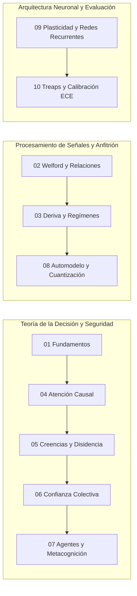

# Compendio Matemático de Symbiont y Symbiont Lab

Bienvenido al compendio matemático exhaustivo de **Symbiont** y **Symbiont Lab**.

Este conjunto de documentos formaliza cada algoritmo, deducción analítica, espacio estadístico e invariante dinámico implementado en el repositorio. La documentación está redactada con rigor técnico profesional, preservando la perspectiva pedagógica e intuitiva que explica **por qué** cada formulación fue seleccionada frente a alternativas estándar, y cómo estas decisiones matemáticas protegen los límites de seguridad, consentimiento y aislamiento epistemológico del sistema.

---

## Marco Editorial y Taxonomía Epistémica

Para garantizar la máxima honestidad intelectual y diferenciar claramente la teoría matemática de la práctica de ingeniería, cada capítulo clasifica sus desarrollos bajo cuatro etiquetas epistémicas:

1. **Identidad del Código:** Fórmulas, invariantes y estructuras que describen con exactitud aritmética y algorítmica la ejecución del software (e.g., algoritmo de Welford, generador SplitMix64, descomposición de Murphy del Brier Score).
2. **Proposición / Invariante Estructural:** Teoremas y propiedades analíticas demostrables formalmente sobre el espacio de estados del sistema (e.g., invariante de no-interferencia determinista, acotamiento estricto de activaciones neuronales en $[-1, 1]$, conservación de presupuesto).
3. **Heurística:** Modelos de decisión empíricos, puntuaciones multilineales ponderadas o umbrales pragmáticos elegidos por eficiencia computacional (e.g., aproximación voraz a la mochila 0/1, umbrales Z heurísticos en EWMA, función multilineal de utilidad de sensores).
4. **Hipótesis Experimental:** Propiedades de emergencia colectiva, dinámicas adaptativas o límites asintóticos que se estudian empíricamente en el simulador mediante réplicas pareadas y análisis contrafactual (e.g., brecha de confianza $\Delta_{\text{trust}}$, resiliencia ante deriva hostil).

---

## Estructura del Compendio

| Capítulo | Título | Módulos Principales de Código | Conceptos Clave |
| --- | --- | --- | --- |
| **[01](01-fundamentos-y-epistemologia.md)** | [Fundamentos Epistemológicos y Marco Matemático](01-fundamentos-y-epistemologia.md) | `symbiont.core.model`, `symbiont.environment.rng` | Espacios formales ($\mathcal{X}, \mathcal{S}, \mathcal{B}, \mathcal{Y}^*$), Invariante estructural de no-interferencia determinista, derivación determinista de semillas SHA-256 e independencia causal de réplicas. |
| **[02](02-percepcion-aclimatacion-y-relaciones.md)** | [Percepción, Aclimatación Sensorial y Álgebra de Relaciones](02-percepcion-aclimatacion-y-relaciones.md) | `symbiont.host.acclimation`, `symbiont.host.adaptive` | Algoritmos en línea de Welford univariado y bivariado (co-momentos centrados), correlaciones temporales desfasadas ($a_{t-1} \to b_t$), Función de Utilidad Dinámica $U = A(0.65V + 0.35M)$, poda de colinealidad ($ | r | \ge 0.97$) y rotación determinista con cobertura eventual. |
| **[03](03-deteccion-de-deriva-y-regimenes.md)** | [Detección de Deriva, Ruptura de Régimen y Modelado Rítmico](03-deteccion-de-deriva-y-regimenes.md) | `symbiont.host.drift`, `symbiont.host.rhythms` | Filtro EWMA con dispersión móvil heurística, detector de saltos con buffer de cuarentena no contaminante, límite de divergencia con suelo de ruido congelado $\frac{6.667 c}{\sigma_{\text{frozen}}}$ para arrastre lento (*creep*) y baselines condicionales diurnos. |
| **[04](04-atencion-causal-y-presupuestos.md)** | [Asignación Causal de Atención y Optimización de Presupuestos Finitos](04-atencion-causal-y-presupuestos.md) | `symbiont.core.attention` | Heurística voraz de Dantzig $O(n \log n)$ para la mochila 0/1, coeficiente de variación adimensional $c_v = \sigma/ | \mu | $ (dispersión relativa de escala), desacoplamiento formal entre costo de ranking $r_i$ y costo físico de consumo $k_i$, e invarianza de presupuesto. |
| **[05](05-creencias-bayesianas-y-disidencia.md)** | [Dinámica de Creencias Bayesianas, Sorpresa y Registro de Disidencia](05-creencias-bayesianas-y-disidencia.md) | `symbiont.core.beliefs`, `symbiont.core.evidence` | Actualización bayesiana con pseudo-observaciones ponderadas, saturación de evidencia acotada ($E_{\max}=32$), filtro de conflicto de sorpresa, función de certeza $(1 - e^{-E/4})(1 - 0.6C)$, reversiones y test Z de desviación estandarizada de lote para disidencia. |
| **[06](06-consenso-colectivo-y-confianza.md)** | [Consenso Colectivo, Dinámica de Confianza y Destilación Epigenética](06-consenso-colectivo-y-confianza.md) | `symbiont.core.trust`, `symbiont.core.collective`, `symbiont.core.heritage` | Función hiperbólica continua de concordancia $\frac{1}{1+z}$, consenso poblacional Leave-One-Out sin oráculo externo, dinámica de la brecha de confianza ($\Delta_{\text{trust}}$) y filtrado/atenuación epigenética intergeneracional. |
| **[07](07-cognicion-agentes-y-metacognicion.md)** | [Cognición de Agentes, Curiosidad Contrafactual y Metacognición](07-cognicion-agentes-y-metacognicion.md) | `symbiont.core.model`, `symbiont.core.agent`, `symbiont.core.curiosity`, `symbiont.core.metacognition` | Firmas ternarias en $\{L, M, H\}^5$, ganancia de información contrafactual ($IG$), modelos heurísticos multilineales de decisión de riesgo/sospecha, doble umbral con histéresis de adaptación, vector de presión epistémica y autoconfianza. |
| **[08](08-automodelo-y-sensores-adaptativos.md)** | [Automodelo del Organismo, Costos y Cuantización No-Lineal](08-automodelo-y-sensores-adaptativos.md) | `symbiont.core.selfmodel` | EWMA con decaimiento exponencial tras zona de gracia ($\tau=20$), función de madurez logarítmica $\frac{\ln(1+s)}{\ln(6)}$, costo relativo frente a la mediana poblacional móvil, cuantización geométrica no-lineal y reconstrucción representativa de latencias. |
| **[09](09-plasticidad-endogena-y-redes-recurrentes.md)** | [Plasticidad Endógena, Grafos Cognitivos Recurrentes y Dinámica de Activación](09-plasticidad-endogena-y-redes-recurrentes.md) | `symbiont.cognition.activation`, `symbiont.cognition.graph`, `symbiont.cognition.genome` | Normalización tangencial de entrada, dinámica de activación de retardo causal con compuertas multiplicativas, regla de aprendizaje de Oja discretizada, trazas de elegibilidad e invariante de acotamiento global de activaciones en $[-1, 1]$. |
| **[10](10-seleccion-causal-y-evaluacion-estadistica.md)** | [Selección Causal en Streaming, Treaps y Métricas de Evaluación Estadística](10-seleccion-causal-y-evaluacion-estadistica.md) | `symbiont_lab.studies.common.causal_selection`, `symbiont.simulation.metrics`, `symbiont.simulation.evaluation` | Selección en línea con horizonte conocido ex-ante mediante Treap (SplitMix64) en $O(\log n)$ esperado, Brier Score y descomposición de Murphy, Expected Calibration Error (ECE), desacoplamiento estricto de matrices de confusión (Atención vs Clasificación) y métricas de seguridad. |

---

## Rutas Pedagógicas Recomendadas

Dependiendo del objetivo del lector, se recomiendan los siguientes itinerarios:

- **Para Diseñadores de Agentes y Modelos Epistémicos:** Seguir el **Itinerario A** (Capítulos 1, 4, 5, 6 y 7), prestando especial atención a cómo las creencias bayesianas manejan el conflicto y cómo la atención selectiva se desacopla de los juicios de valor.
- **Para Ingenieros de Sistemas y Observabilidad en Hosts:** Seguir el **Itinerario B** (Capítulos 2, 3 y 8), profundizando en la estabilidad numérica de Welford, la prevención del colapso de varianza en la detección de creep y la cuantización de latencias del automodelo.
- **Para Investigadores de Aprendizaje Plástico y Metodología Experimental:** Seguir el **Itinerario C** (Capítulos 9 y 10), examinando el acotamiento estricto de activaciones en grafos recurrentes y la selección causal en streaming mediante Treaps sin sesgo retrospectivo.

---

## Glosario de Constantes Canónicas y Símbolos Fundamentales

| Símbolo | Tipo | Valor Canónico | Módulo | Significado Matemático |
| --- | --- | --- | --- | --- |
| $B$ | Escalar | $1.0$ | `attention.py` | Presupuesto duro de atención por tick. |
| $N_{\min}$ | Entero | $5$ (o $4$ en adaptive) | `acclimation.py`, `selfmodel.py` | Mínimo de muestras para declarar aclimatado un sensor. |
| $\lambda$ | Escalar | $0.10$ | `drift.py` | Tasa de aprendizaje del filtro EWMA de línea base. |
| $\lambda_{\text{fast}}$ | Escalar | $0.30$ | `drift.py` | Tasa de aprendizaje rápida para detección de arrastre lento (*creep*). |
| $z_{\text{regime}}$ | Escalar | $2.0$ | `drift.py` | Umbral de desviación para candidatos a cambio de régimen. |
| $z_{\text{isolated}}$ | Escalar | $3.0$ | `drift.py` | Umbral de desviación para clasificar un pico aislado. |
| $K_{\text{regime}}$ | Entero | $3$ | `drift.py` | Racha mínima de observaciones consistentes para confirmar régimen. |
| $z_{\text{creep}}$ | Escalar | $1.0$ | `drift.py` | Umbral de divergencia contra el suelo de ruido congelado. |
| $K_{\text{creep}}$ | Entero | $8$ | `drift.py` | Racha mínima para confirmar arrastre lento. |
| $E_{\max}$ | Escalar | $32.0$ | `beliefs.py` | Cota superior de saturación de evidencia para prevenir parálisis epistémica. |
| $\alpha_{\text{self}}$ | Escalar | $0.06$ | `selfmodel.py`, `activation.py` | Constante de alisado EWMA para el automodelo y normalizador sensorial. |
| $\tau_{\text{grace}}$ | Entero | $20$ | `selfmodel.py` | Zona de gracia (ticks de inactividad antes de iniciar decaimiento). |
| $\theta_{\text{red}}$ | Escalar | $0.97$ | `adaptive.py` | Umbral de correlación de Pearson para podar sensores redundantes. |
| $\theta_{\text{conflict}}$ | Escalar | $2.0$ | `evidence.py` | Umbral Z de discrepancia de lote para emitir un `DissentRecord`. |
| $w_{\max}, w_{\min}$ | Tupla | $[-2.0, 2.0]$ | `types.py` | Rango cerrado de pesos sinápticos en el grafo cognitivo. |
| $\tau_{\text{node}}$ | Tupla | $[0.1, 10.0]$ | `types.py` | Rango admisible de constante temporal de activación neuronal. |
