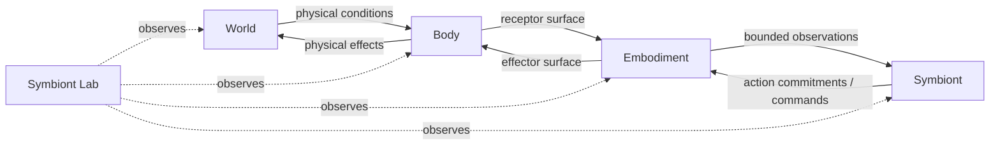

# System and boundaries

## The whole system in one view

Symbiont is best understood as a set of coupled but non-identical domains.

The arrows are not semantic shortcuts. Each crossing has a contract and a loss of information. The world does not become cognition. Physical state is sampled, filtered, transduced and represented before it can participate in internal processing.

## Symbiont

The central runtime is `src/symbiont/core/orchestration/runtime.py::OrganismRuntime`. It composes domain services rather than treating the organism as one monolithic function. The runtime currently orchestrates lifecycle, physiology, perception, cognition, memory, action, epistemic investigation, embodiment, regulation and development. Social communication is integrated after the main physiological and developmental updates of a tick.

The runtime also owns the checkpoint boundary for organism state. The checkpoint intentionally excludes save-event metadata from the organism state hash: `checkpoint_lineage` and `runtime_provenance` identify how and when a save was produced, not what the organism is.

## Body

A body is physical state plus a physical apparatus. In Physics3D, PyBullet owns physical simulation and the apparatus exposes receptors and effectors. A body has identity independent of the Symbiont that currently inhabits it. The current Physics3D runtime explicitly persists a physical `body_id` separately from the organism checkpoint.

## Embodiment

Embodiment is the relation between one Symbiont and a particular perceptual/actuator/timing contract for a bounded period. It is not just a reference to a body. The contract defines what can be sensed, what can be actuated and under what timing assumptions. Re-embodiment can therefore preserve the organism while changing the physical surface through which it acts.

## World

World is external authority for environmental state and dynamics. World data may include information that must never be injected directly into cognition. This is why the project distinguishes world ground truth from organism observations and why laboratory projections must remain passive.

## Laboratory and Observatory

`symbiont_lab` supplies experiments, world runtimes, Physics3D, observation, archival functions and evaluation. Observatory is an observer: its richer labels and derived views must not be mistaken for organism knowledge. The same rule applies to evaluator metrics such as resource distance, ground-truth classifications or experimental success criteria.

## A useful test for every boundary

For any field or event, ask four questions:

1. Who owns it?
2. Who can modify it?
3. Can Symbiont perceive it directly, indirectly or not at all?
4. Does it survive the end of the present embodiment?

Those four questions resolve most architectural ambiguity in this project.

### Principal implementation anchors

- `src/symbiont/core/orchestration/runtime.py`
- `src/symbiont/core/domains/*`
- `src/symbiont/core/embodiment/*`
- `src/symbiont_lab/physics3d/runtime.py`
- `src/symbiont_lab/observation/*`
