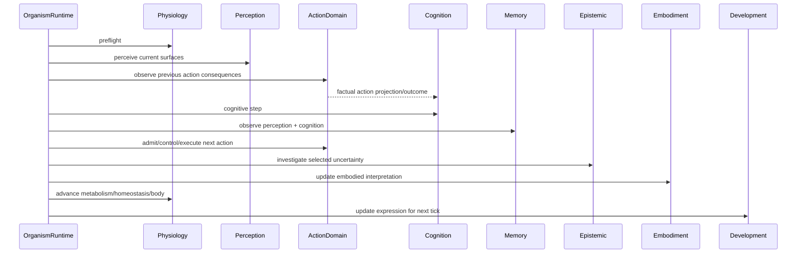

# Anatomy of a Symbiont tick

A tick is the smallest complete unit in which the current runtime can observe the present, settle consequences from the previous action, update cognition, choose a new action and advance bodily state. Its order is causal; rearranging the stages would change what information is available to later mechanisms.

The sequence below is reconstructed from `OrganismRuntime.tick()` in current `main`.

## 1. Context validation

The runtime rejects ticks after irreversible death. It then constructs or validates a `TickContext` whose `symbiont_tick` must be exactly the next organism tick and whose embodiment identity must match the active episode. This prevents state from two embodiments being accidentally advanced under one causal clock.

## 2. Reacclimation and physiological preflight

Reacclimation is advanced first. Physiology then performs preflight work: degradation handling, interoceptive preparation and computation of the plasticity gate. The result can constrain whether cognition is allowed to perform plastic updates later in the same tick.

## 3. Perception

`PerceptionDomain.step()` samples the currently available surfaces, applies adaptive sensing and sensory transduction, updates acclimation/rhythm/drift state, allocates attention and produces percepts plus signal references. Pending proprioceptive consequences from the previous action may be consumed here.

## 4. Close the previous action

This is one of the most important ordering decisions in the runtime. `ActionDomain.observe_consequences()` evaluates the real perceptual consequences of the previous action before new cognition is run. The resulting `SensorimotorTransition` can settle commitments, update competence evidence and reconcile imagined outcomes with factual body consequences.

## 5. Cognition

The action domain prepares a cognition projection, then `CognitionDomain.step()` processes perception under the current plasticity gate, self-model and generative mode. Rest selects offline generative mode; otherwise the resident generative system runs online.

## 6. Memory

`MemoryDomain.observe()` receives current perception and cognition before the next action is created. Memory therefore records the current cognitive episode without being downstream of the action that has not happened yet.

## 7. New action

`ActionDomain.act()` performs the current executive sequence: affordance resolution, prospective evaluation, arbitration, competence/control and actuator delivery. The runtime retains the resulting intent, commitment, command and transition state for later observation.

## 8. Epistemic investigation

The epistemic domain may use additional bounded sensing to investigate uncertainty. This is separate from ordinary perception so that curiosity-like evidence gathering does not silently become free perception.

## 9. Embodiment update

`EmbodimentDomain.observe()` updates body-schema and sensory-phenotype views from current cognition. This is where present experience can alter organism-owned understanding of the current sensorimotor surface.

## 10. Physiology and regulation

Memory retention and pending embodied work are charged through `PhysiologyDomain.advance()`. Metabolism, homeostasis, physiology, ontogeny and development are updated. Homeostatic action credit is then resolved, and death can release habitat/social resources.

## 11. Development for the next tick

Gene expression is updated from evidence gathered in the present tick. The code explicitly notes that evidence from tick *t* regulates the operating phenotype for *t+1*. This protects causal ordering: the phenotype does not retroactively alter the tick that generated the evidence.

## 12. Commit time and journal

The runtime assigns the new organism tick, completes the embodiment context, advances body age, records narrative/journal information, decays epigenetic priors and optionally performs bounded social communication.

## What survives the tick

The return object is observational. The organism's actual continuity lies in the mutated state of its domains: cognitive graph, sensory phenotype, evidence ledgers, action models, physiology, memory, gene-expression state and other owned structures. The exact persistence of each is described in the state-ownership reference.
