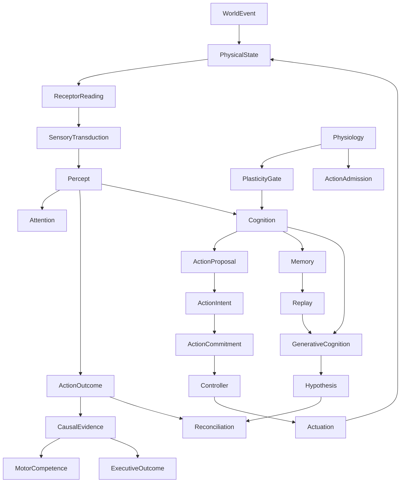

# Causal atlas — core relations

The atlas is a navigational model rather than a prose chapter. It records the major relations that should remain queryable as the project evolves.

## Relation vocabulary

- **PRODUCES** — execution creates a new state or event.
- **CONSUMES** — a process reads state as an input.
- **DERIVES_FROM** — identity or value is causally based on prior state.
- **MODIFIES** — a process mutates owned state.
- **OBSERVES** — a process receives bounded evidence without owning the source.
- **CONTROLS** — a mechanism regulates a downstream command or transition.
- **ENABLES / INHIBITS** — a condition changes whether another process is available.
- **PERSISTS_AS** — state survives a persistence boundary in another representation.
- **RESTORES** — persisted representation reconstructs live state.
- **VERIFIED_BY** — a claim is exercised by tests or study evidence.
- **OBSERVED_IN** — a phenomenon was recorded in a run or experiment.

## Mandatory causal traversals

The documentation should always permit these paths:

1. physical event → organism perception;
2. perception → cognitive change;
3. cognitive state → action admission;
4. action → bodily consequence → outcome learning;
5. learned state → persistence → restore;
6. organism state → reproduction boundary;
7. social claim → source evidence → cognitive consequence;
8. generated hypothesis → reconciliation with factual evidence.
